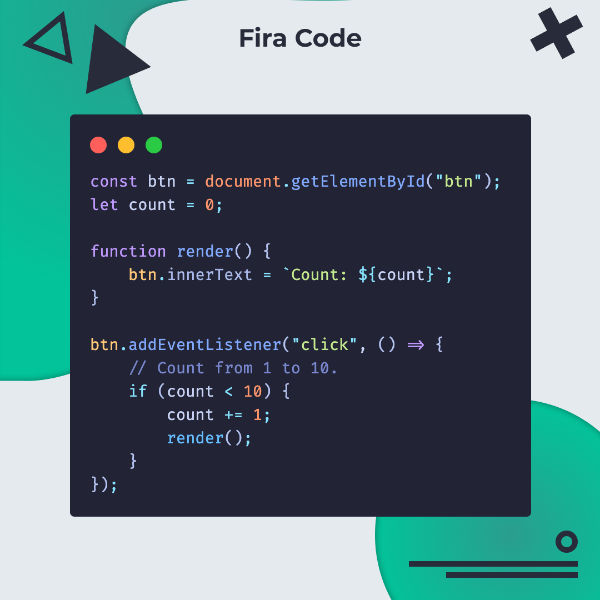
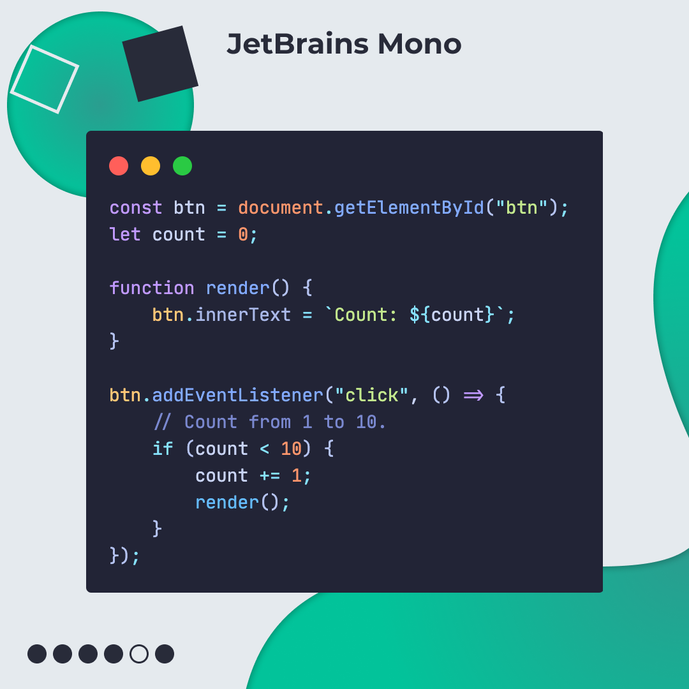
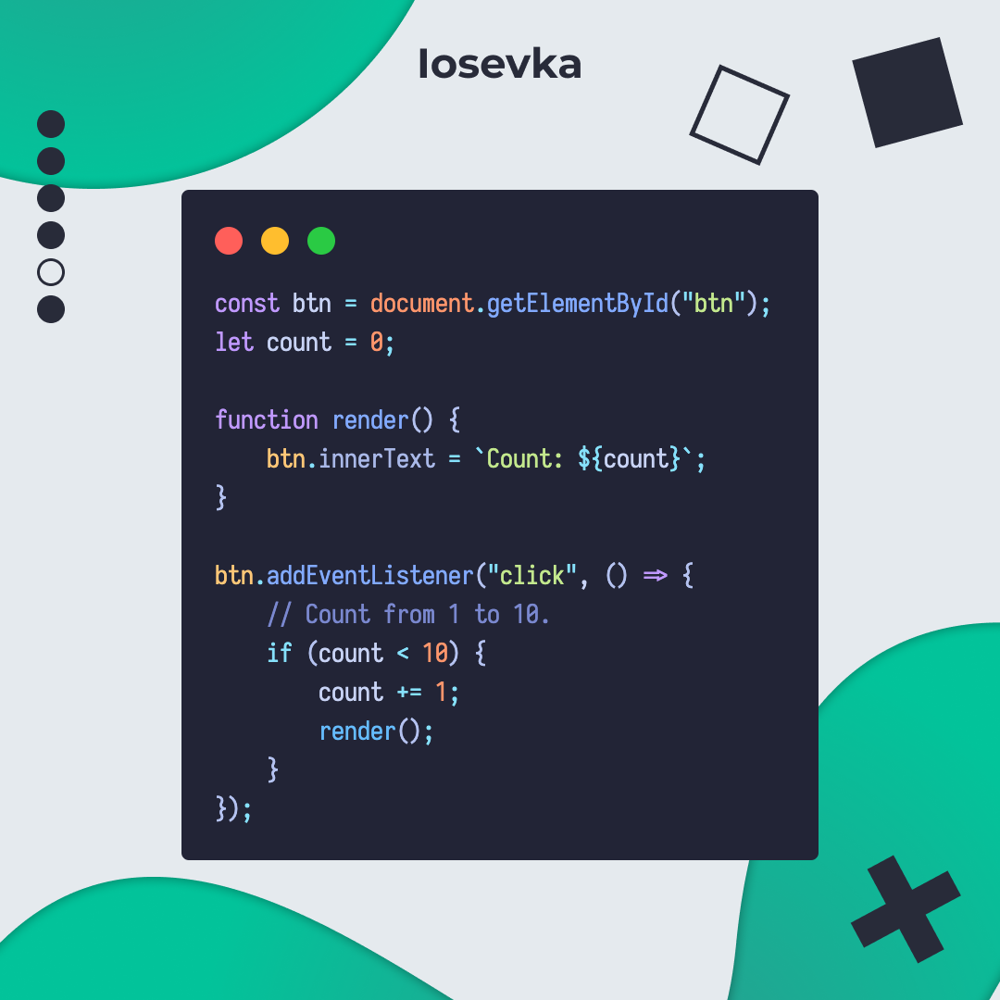
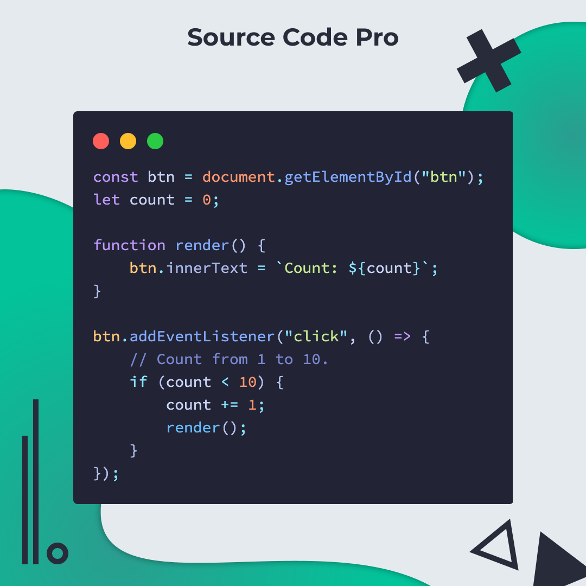
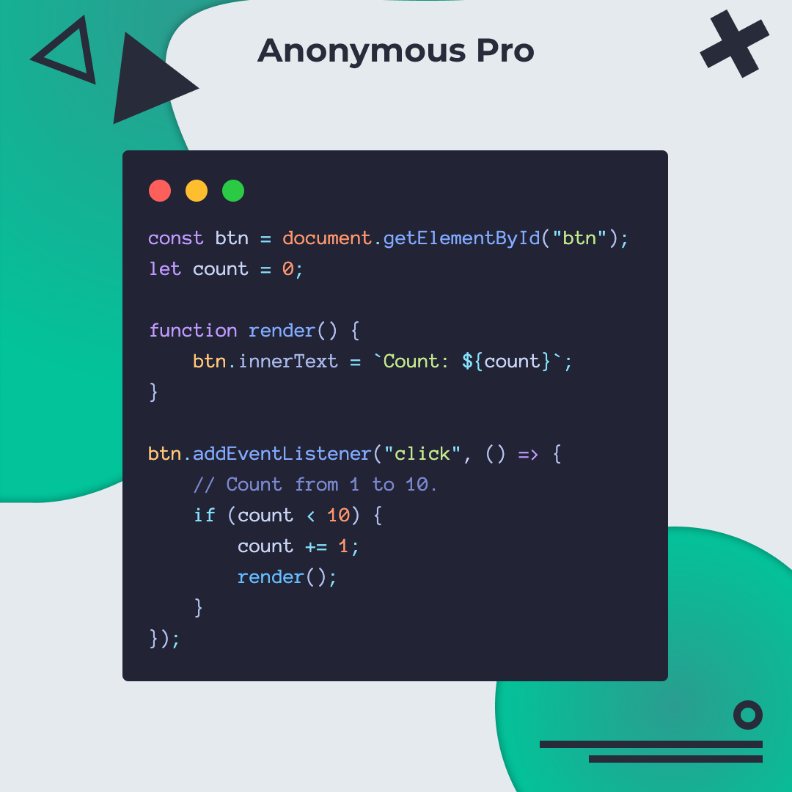
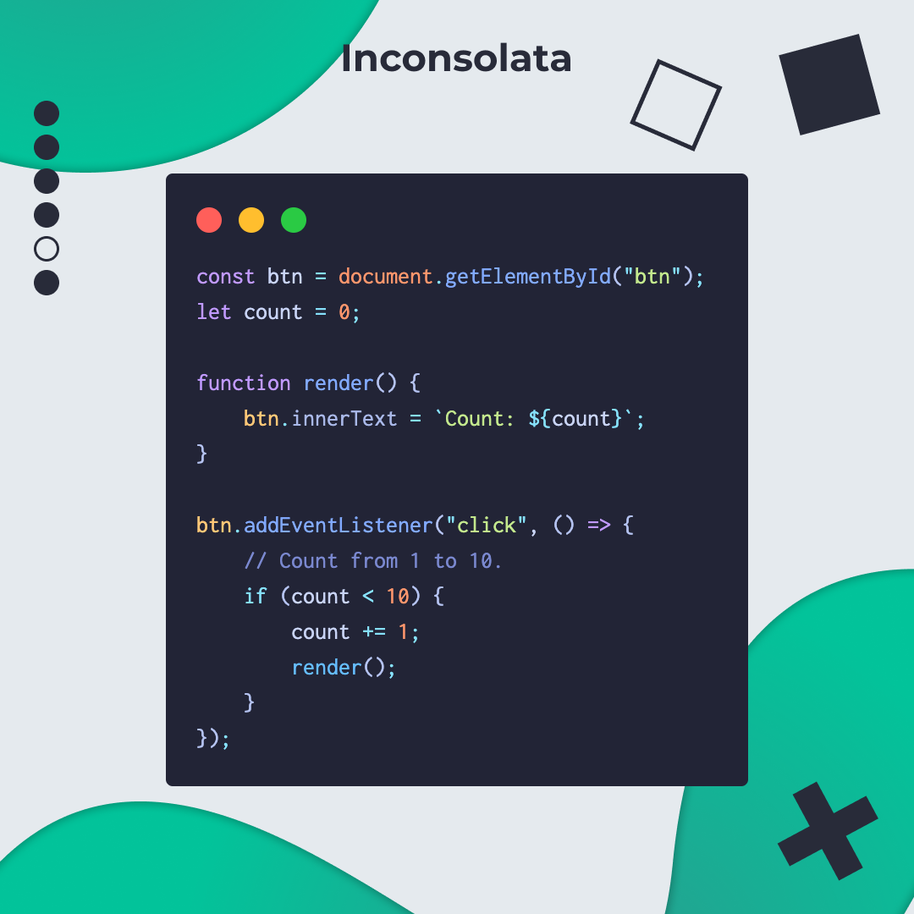
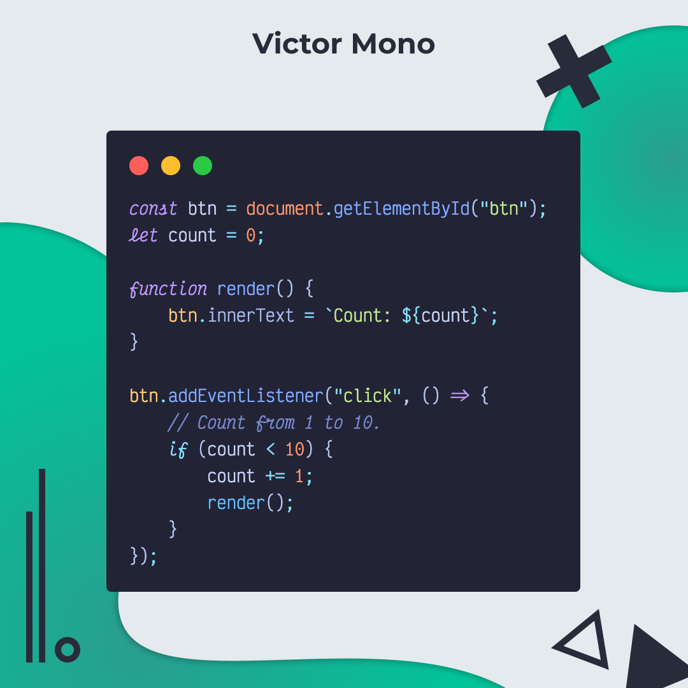

# 8 Fuentes para programar

🅰 🅱 🅲 8 Increíbles fuentes para programar.

🔥 Si eres como yo y cambias de tema o fuente en tu editor a cada momento.
Déjame presentarte 8 de mis fuentes favoritas para programar/codear, seguro que
te gusta más de una.

🤑 Todas las fuentes a continuación son totalmente gratis.

## 🤓 Aprende algo nuevo hoy

> Comparto los **bits** al menos una vez por semana.

Instagram: [@fili.santillan](https://www.instagram.com/fili.santillan/)  
Twitter: [@FiliSantillan](https://twitter.com/FiliSantillan)  
Facebook: [Fili Santillán](https://www.facebook.com/FiliSantillan96/)  
Sitio web: http://filisantillan.com
