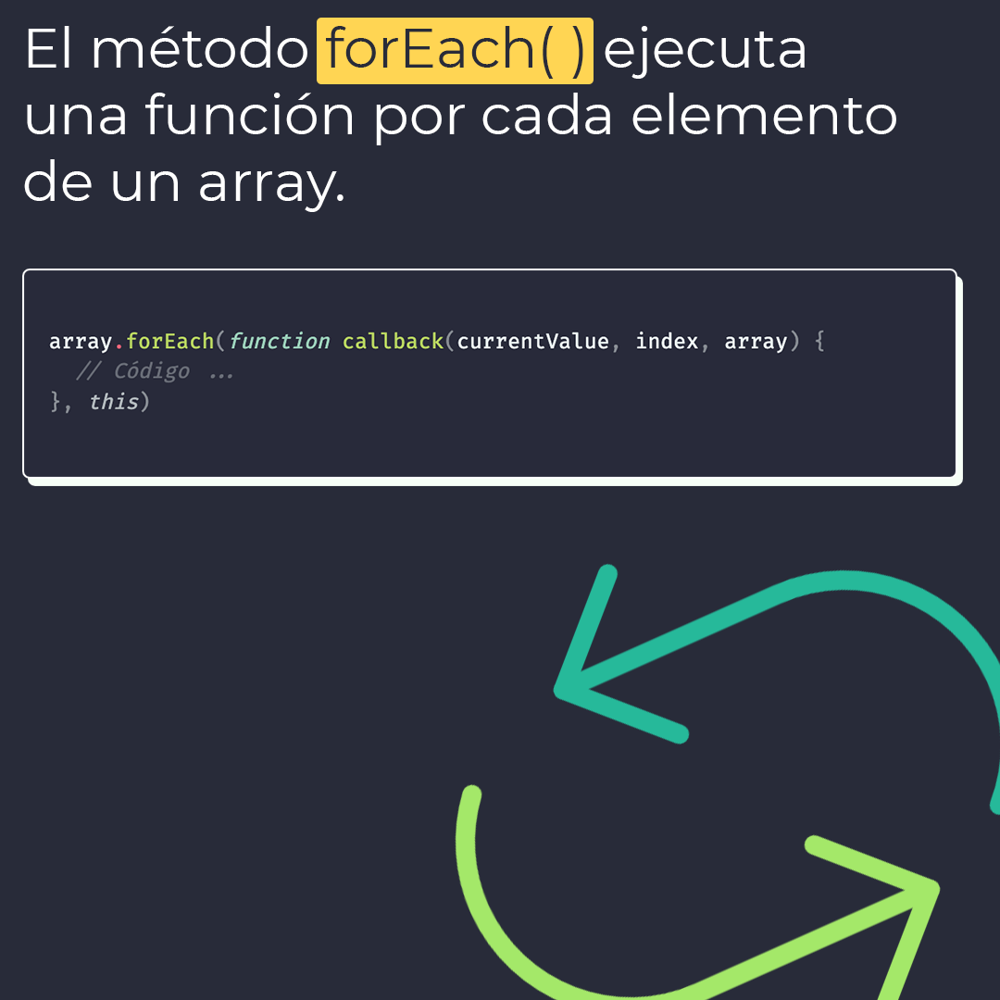
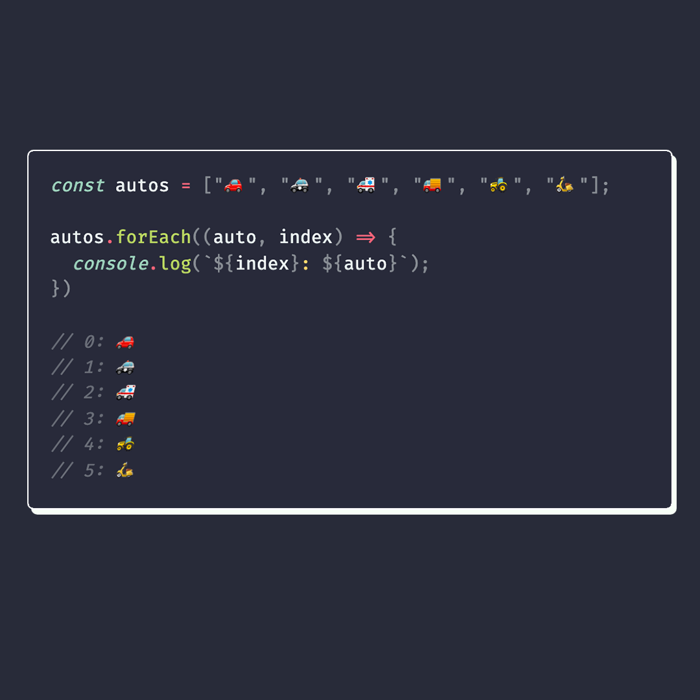

# forEach

El método `forEach()` ejecuta una función por cada elemento en un array.

> Código utilizado en los ejemplos: [forEach.js](/BitSnack/forEach/forEach.js)

## 🤓 Aprende algo nuevo hoy

> Comparto los **bits** al menos una vez por semana.

Instagram: [@fili.santillan](https://www.instagram.com/fili.santillan/)  
Twitter: [@FiliSantillan](https://twitter.com/FiliSantillan)  
Facebook: [Fili Santillán](https://www.facebook.com/FiliSantillan96/)  
Sitio web: http://filisantillan.com  

## 📚 Recursos

- [MDN forEach](https://developer.mozilla.org/en-US/docs/Web/JavaScript/Reference/Global_Objects/Array/forEach)
- Icono: [Smashicons](https://www.flaticon.es/autores/smashicons) 