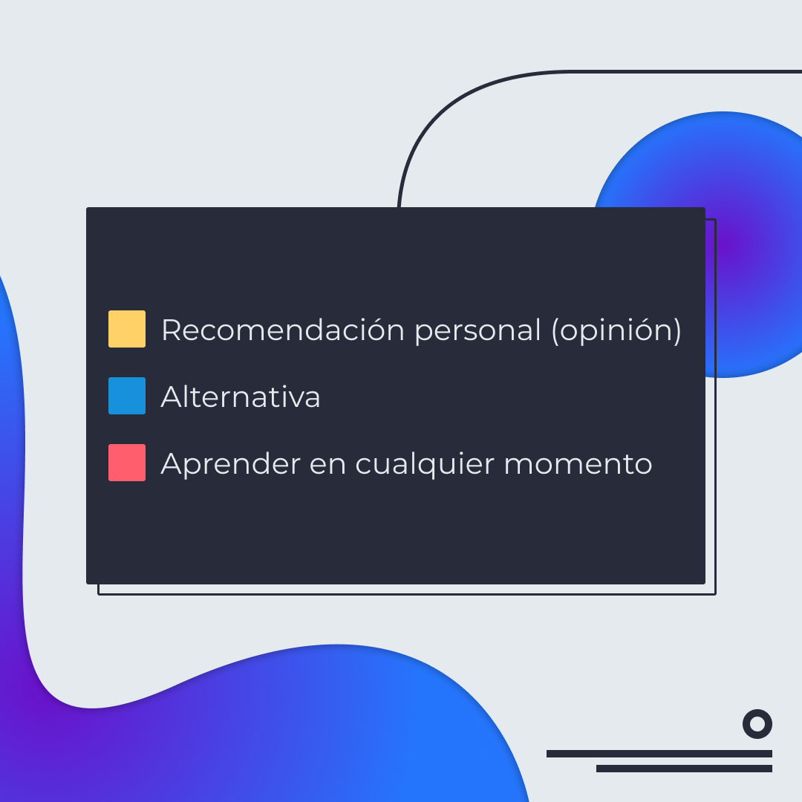
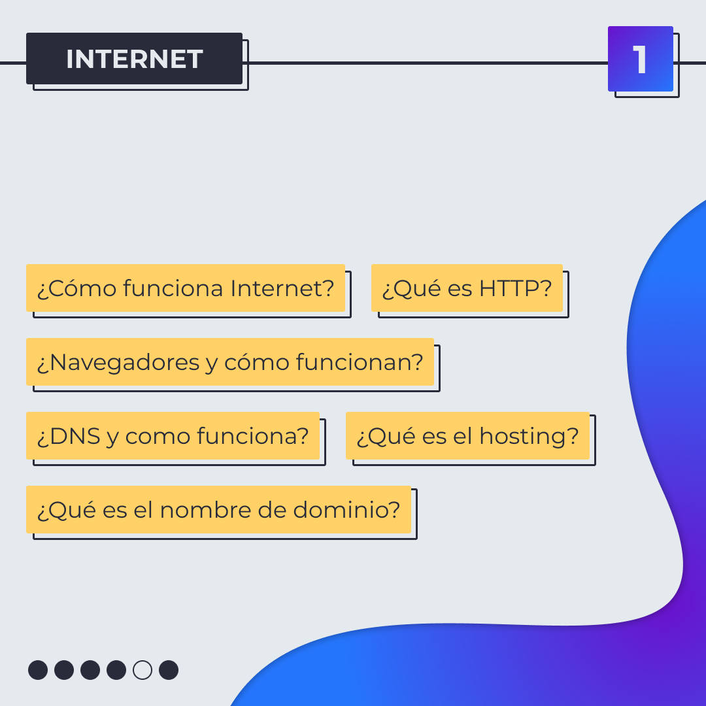
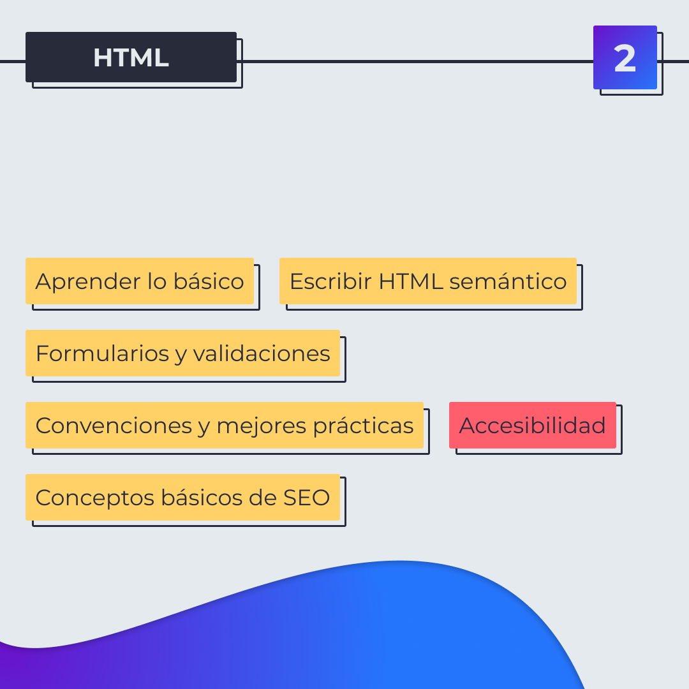
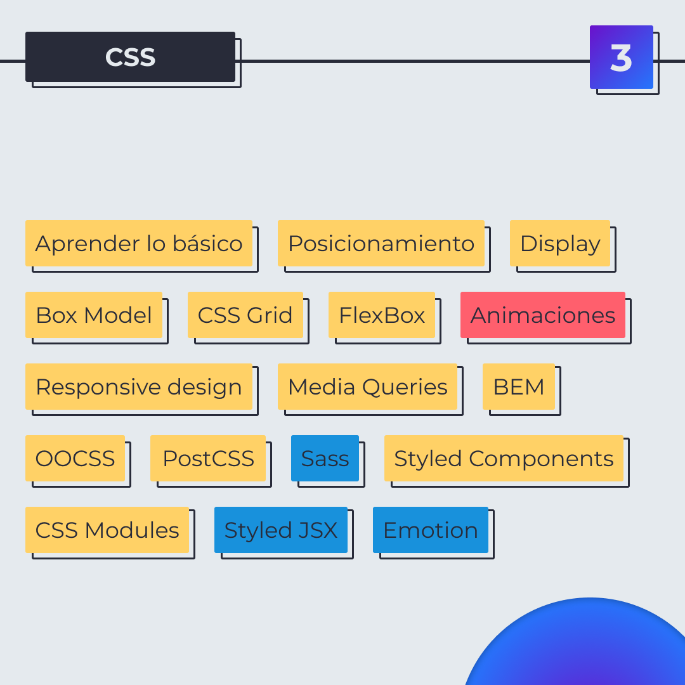
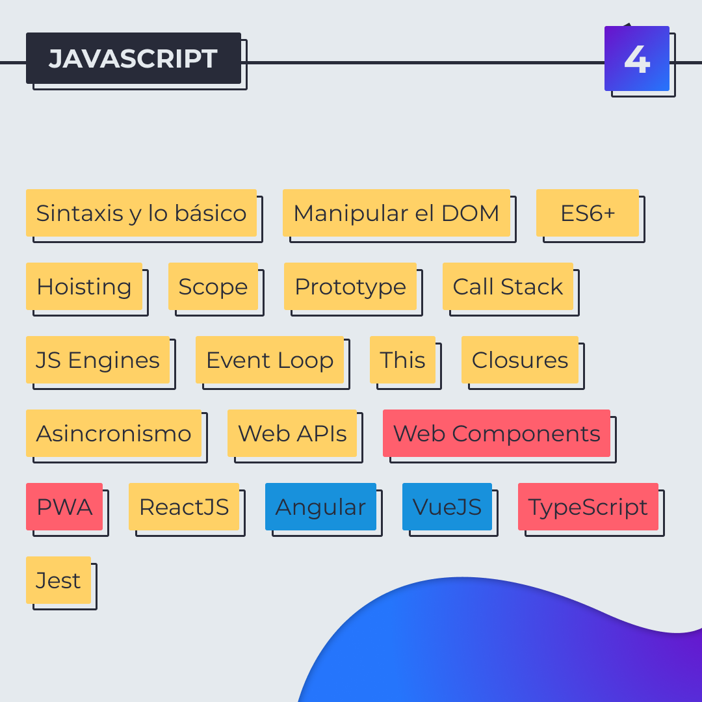
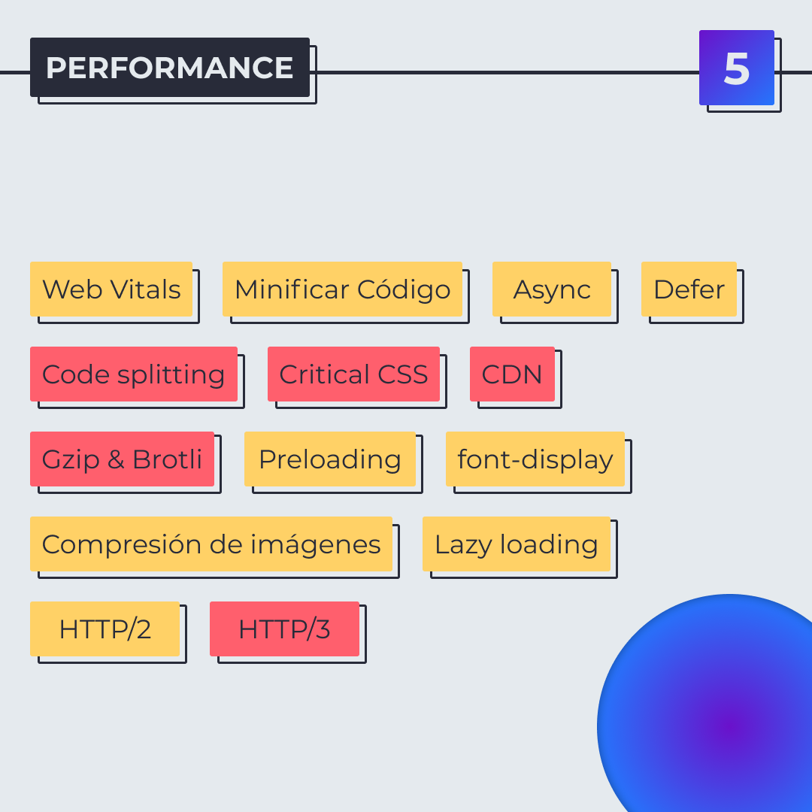
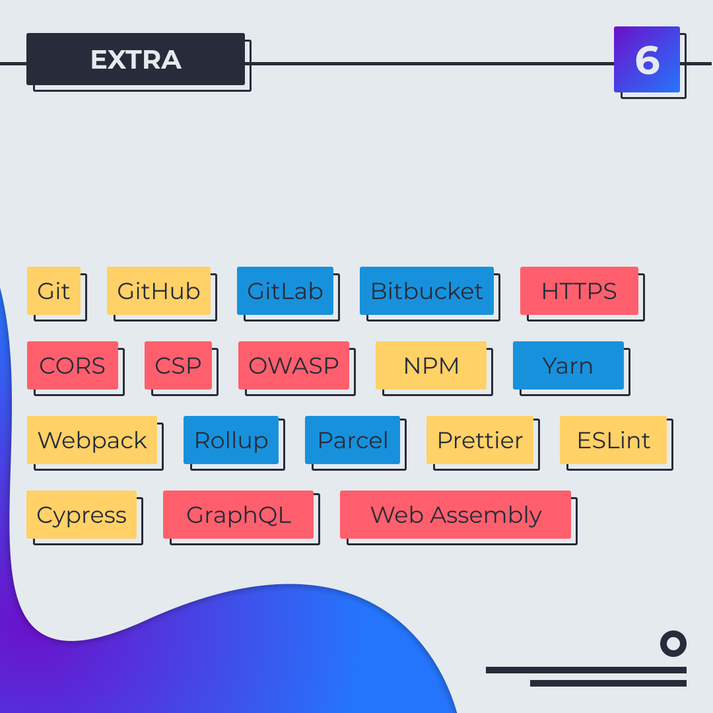
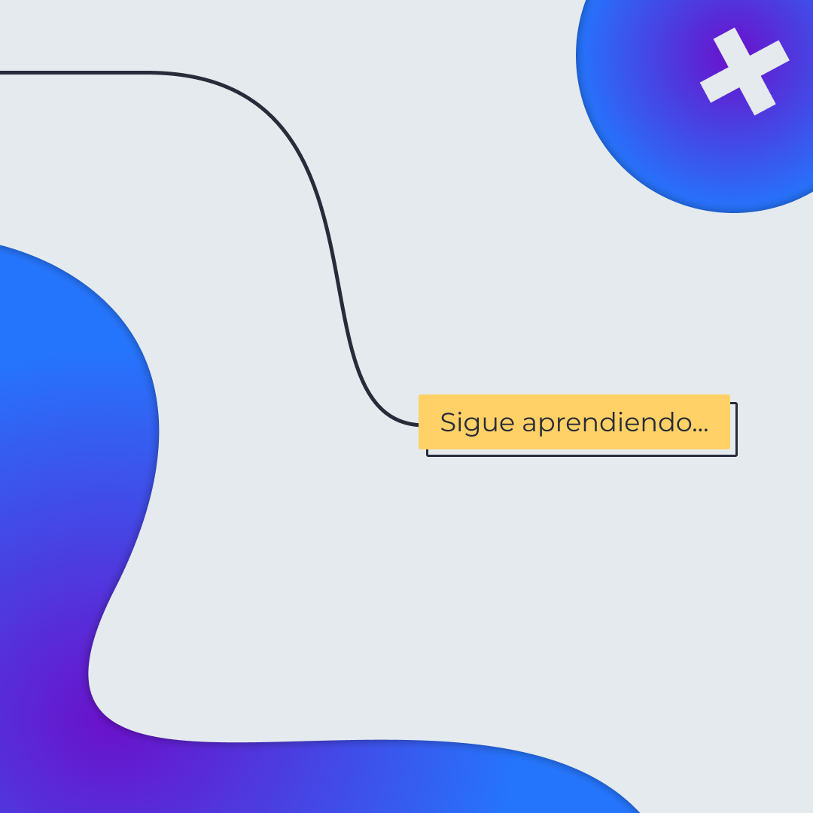

# Ruta para convertirse en Frontend Developer

Una ruta de aprendizaje para ser Frontend Developer, basada en <a href="https://roadmap.sh/" target="_blank">roadmap.sh</a>.

## 🤓 Aprende algo nuevo hoy

> Comparto los **bits** al menos una vez por semana.

Instagram: [@fili.santillan](https://www.instagram.com/fili.santillan/)  
Twitter: [@FiliSantillan](https://twitter.com/FiliSantillan)  
Facebook: [Fili Santillán](https://www.facebook.com/FiliSantillan96/)  
Sitio web: http://filisantillan.com

## Recursos

- [Developer Roadmaps](https://roadmap.sh/)
