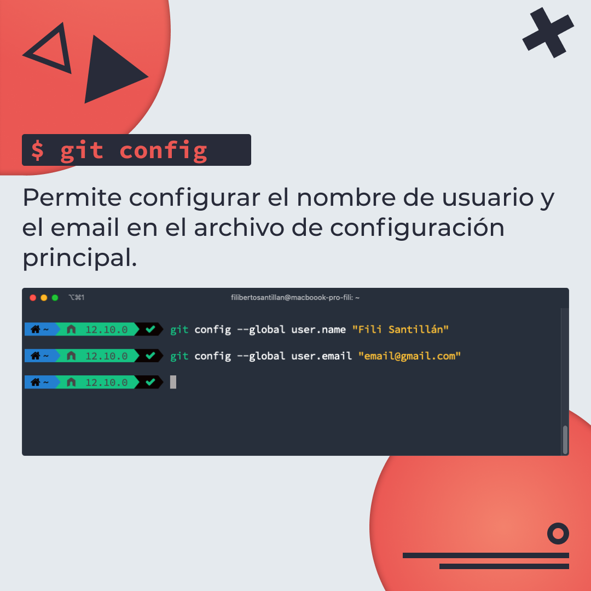
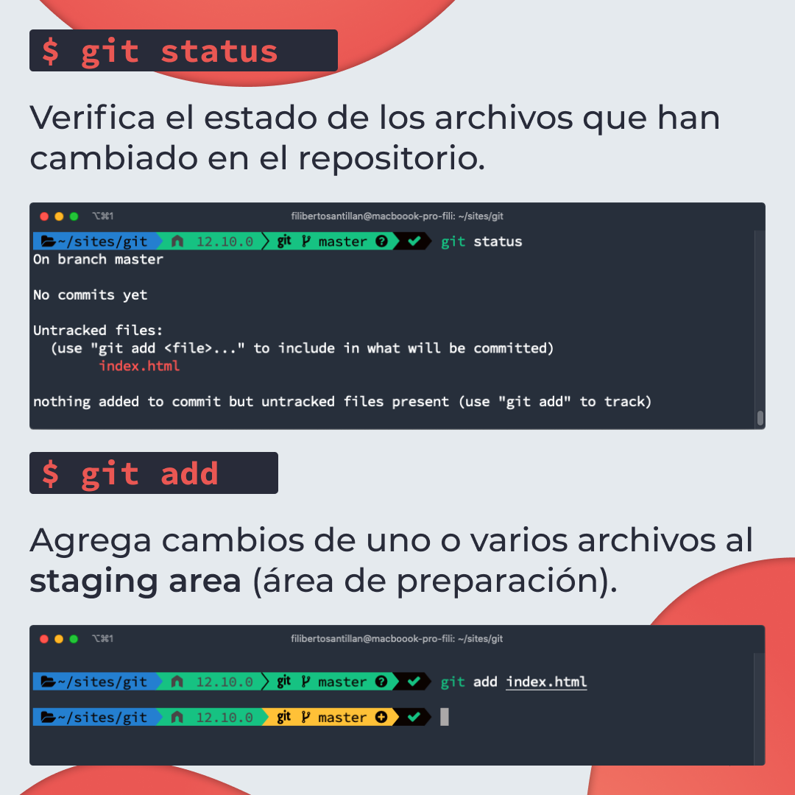
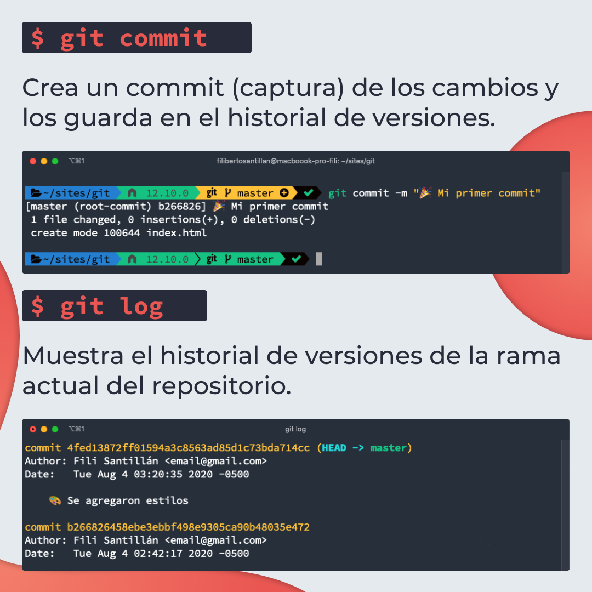
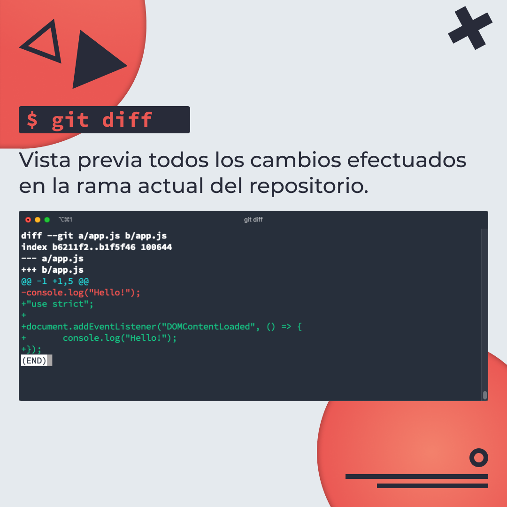
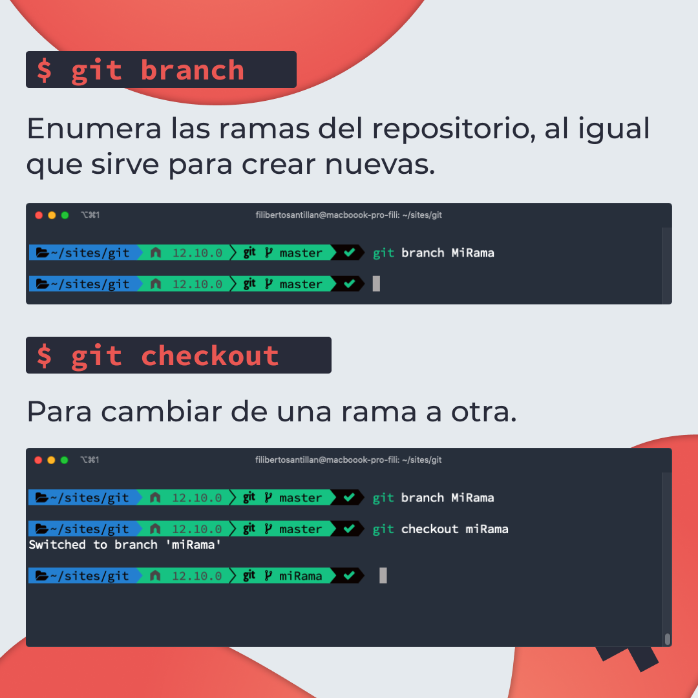
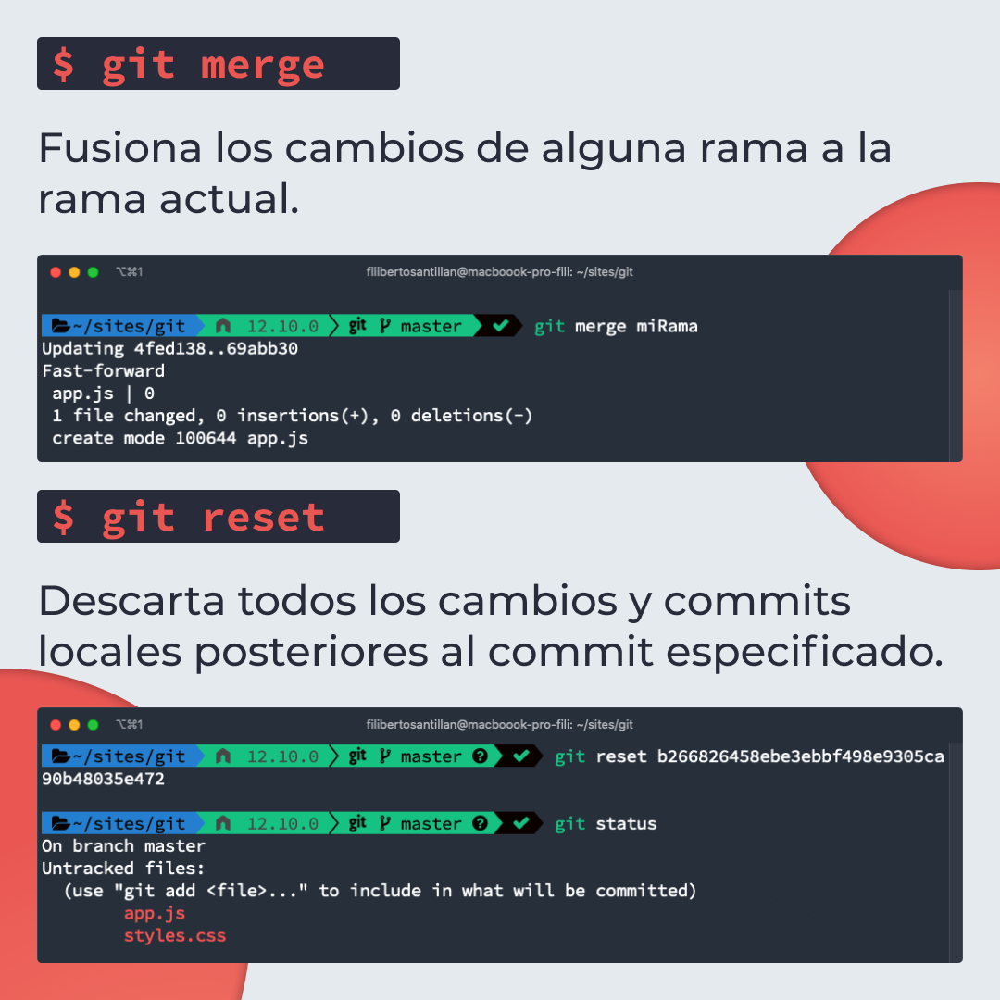
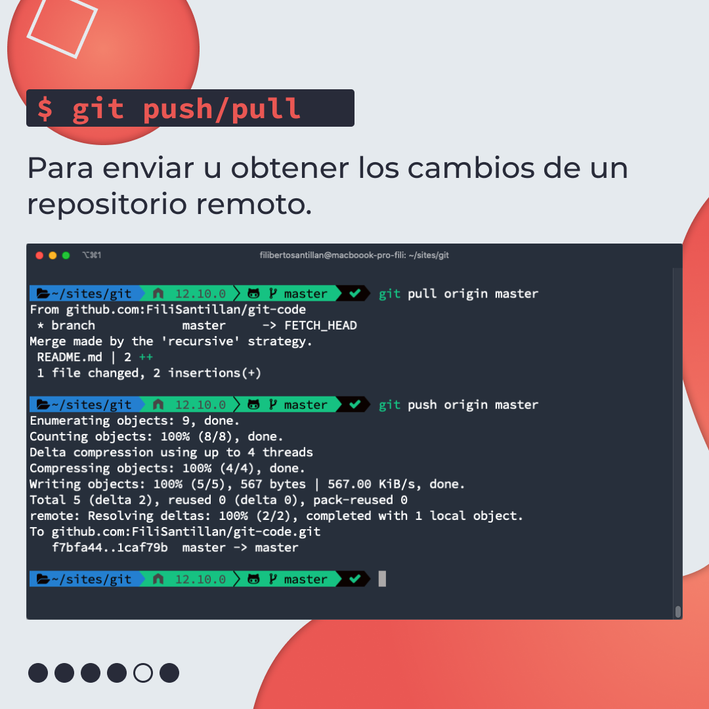

# Comandos básicos para Git

Una lista de los comandos más usados y básicos que necesitas para tus proyectos con git.

> Código utilizado en los ejemplos: [git-commands.sh](./git-commands.sh)

## 🤓 Aprende algo nuevo hoy

> Comparto los **bits** al menos una vez por semana.

Instagram: [@fili.santillan](https://www.instagram.com/fili.santillan/)  
Twitter: [@FiliSantillan](https://twitter.com/FiliSantillan)  
Facebook: [Fili Santillán](https://www.facebook.com/FiliSantillan96/)  
Sitio web: http://filisantillan.com

## 📚 Recursos

-   [Basic Git commands](https://confluence.atlassian.com/bitbucketserver/basic-git-commands-776639767.html)
-   [Essential git commands every developer should know](https://dev.to/dhruv/essential-git-commands-every-developer-should-know-2fl)
-   [Curso de Git - Fili Santillán](https://filisantillan.com/videos/curso-de-git/)
