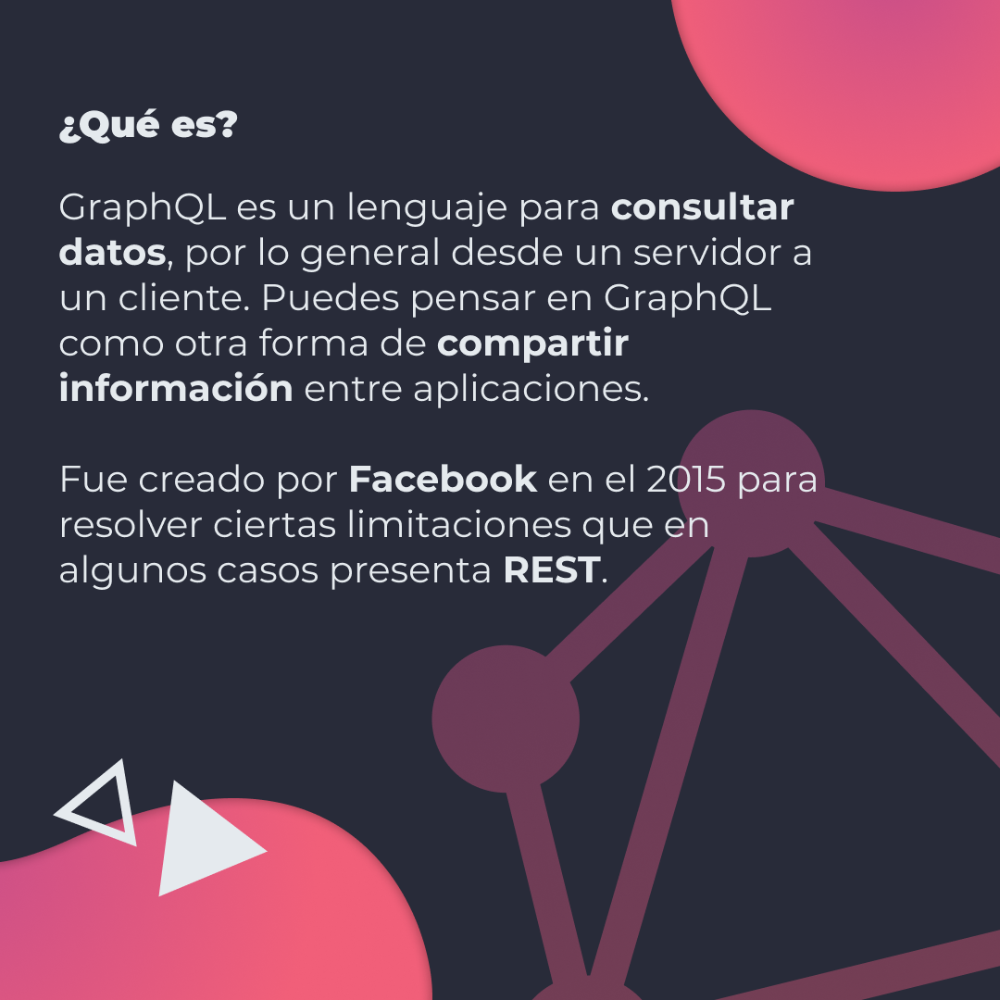
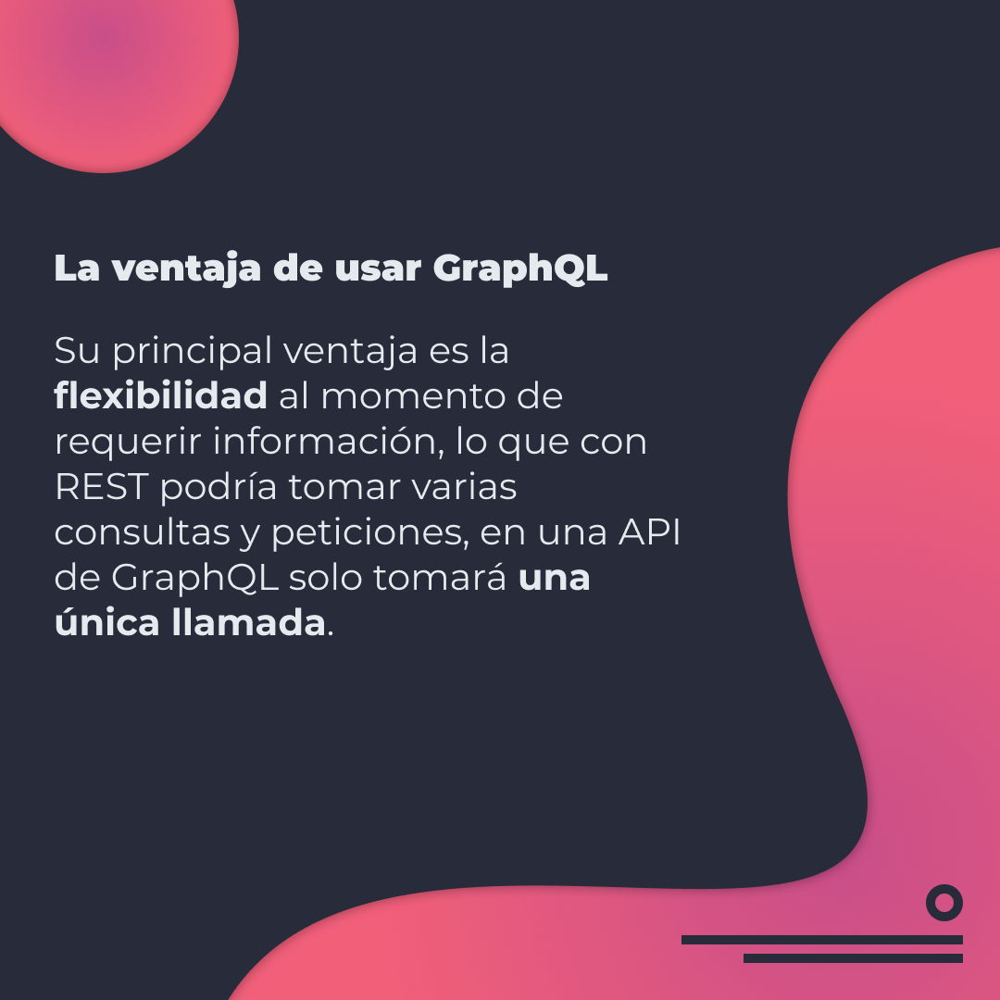
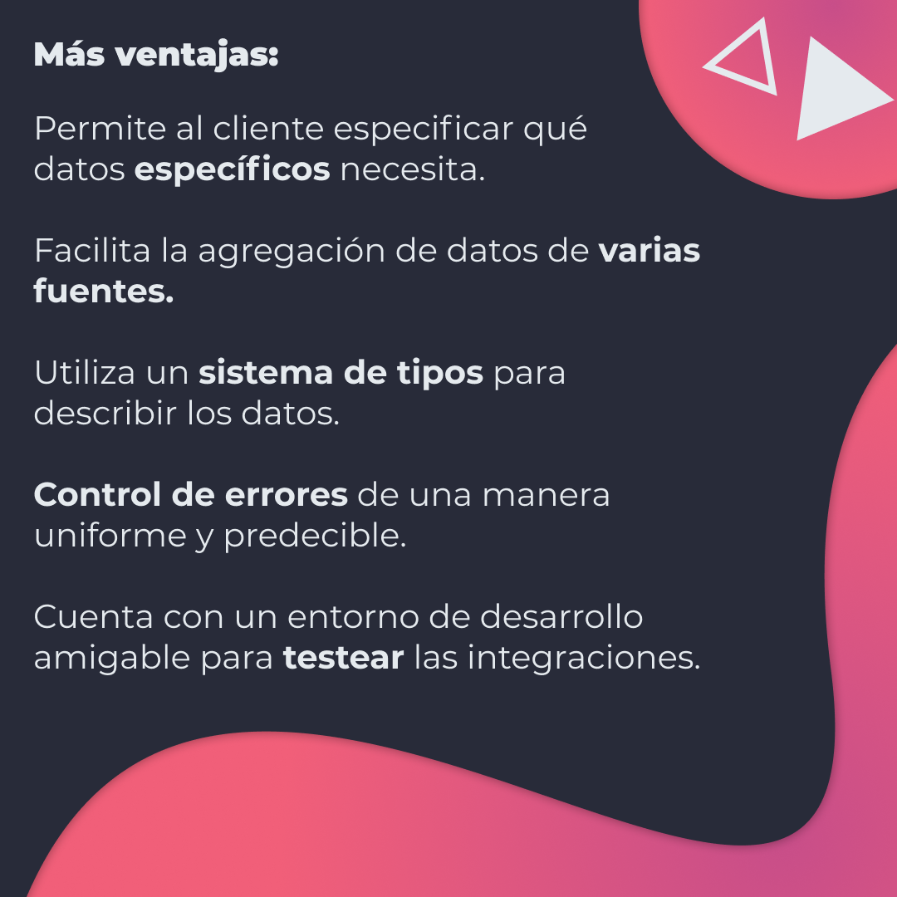
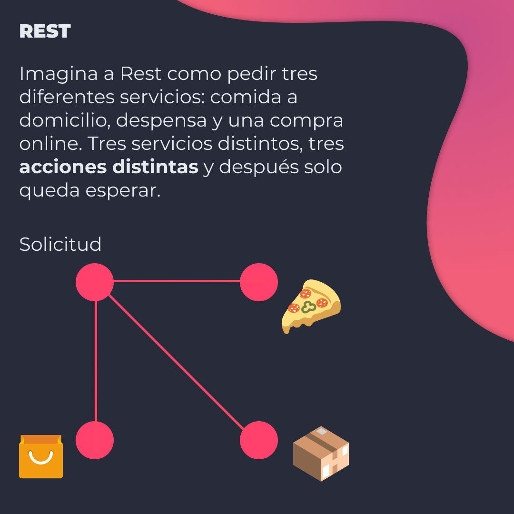
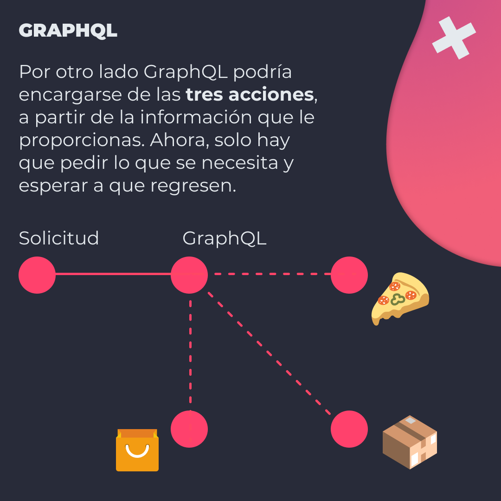
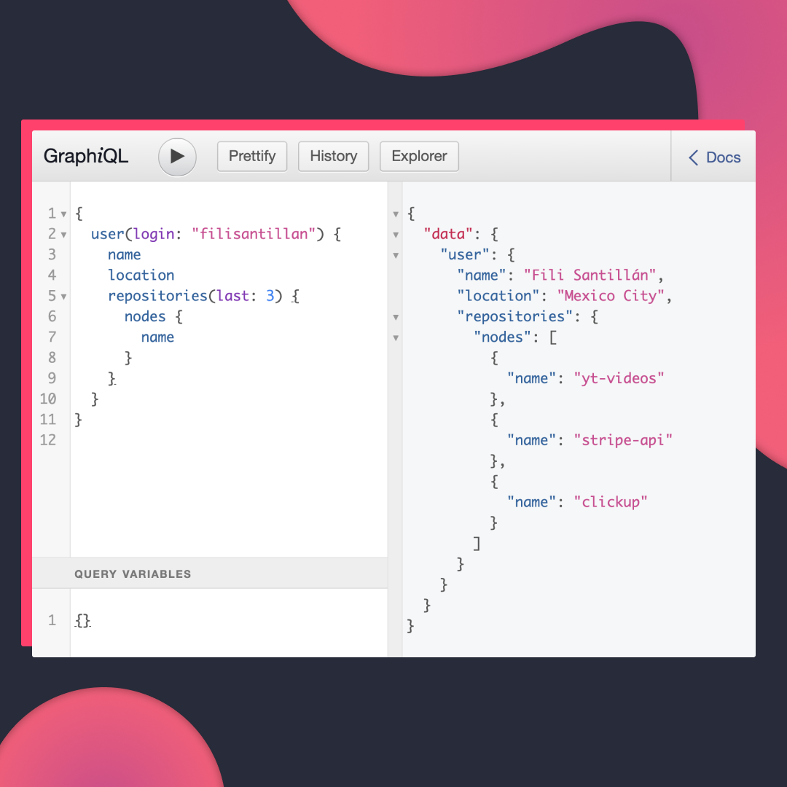
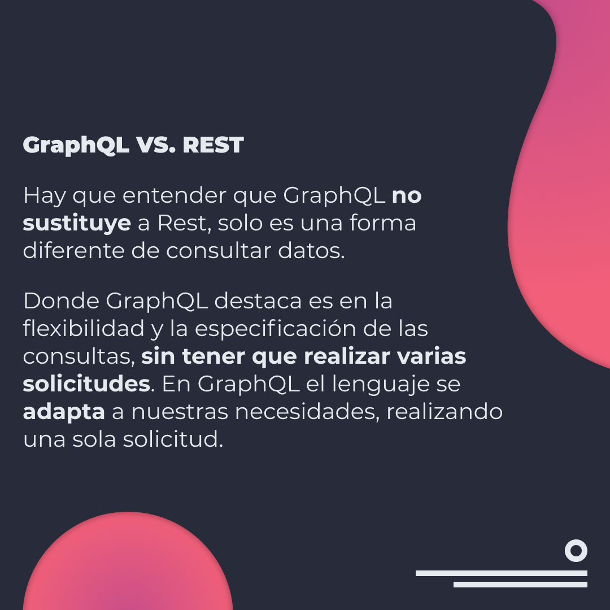
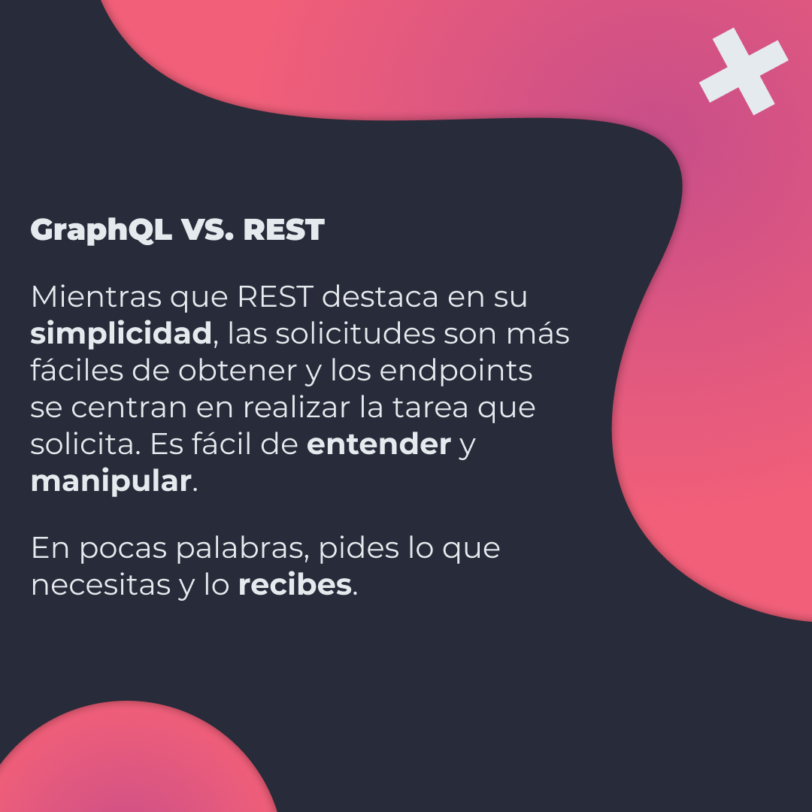

# Aprende sobre GraphQL

GraphQL es un lenguaje para consultar datos, por lo general desde un servidor a un cliente. Puedes pensar en GraphQL como otra forma de compartir información entre aplicaciones.

## 🤓 Aprende algo nuevo hoy

> Comparto los **bits** al menos una vez por semana.

Instagram: [@fili.santillan](https://www.instagram.com/fili.santillan/)  
Twitter: [@FiliSantillan](https://twitter.com/FiliSantillan)  
Facebook: [Fili Santillán](https://www.facebook.com/FiliSantillan96/)  
Sitio web: http://filisantillan.com

## Recursos

- [Introduction to GraphQL](https://graphql.org/learn/)
