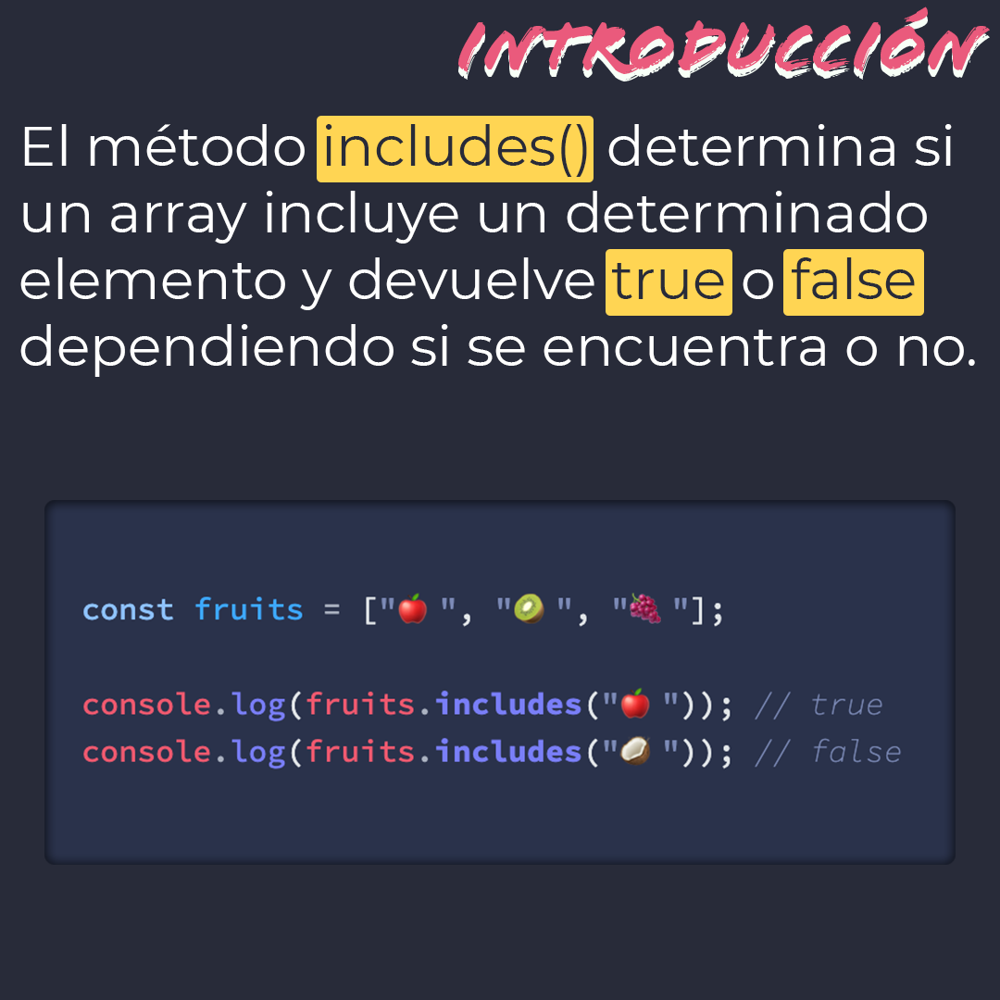
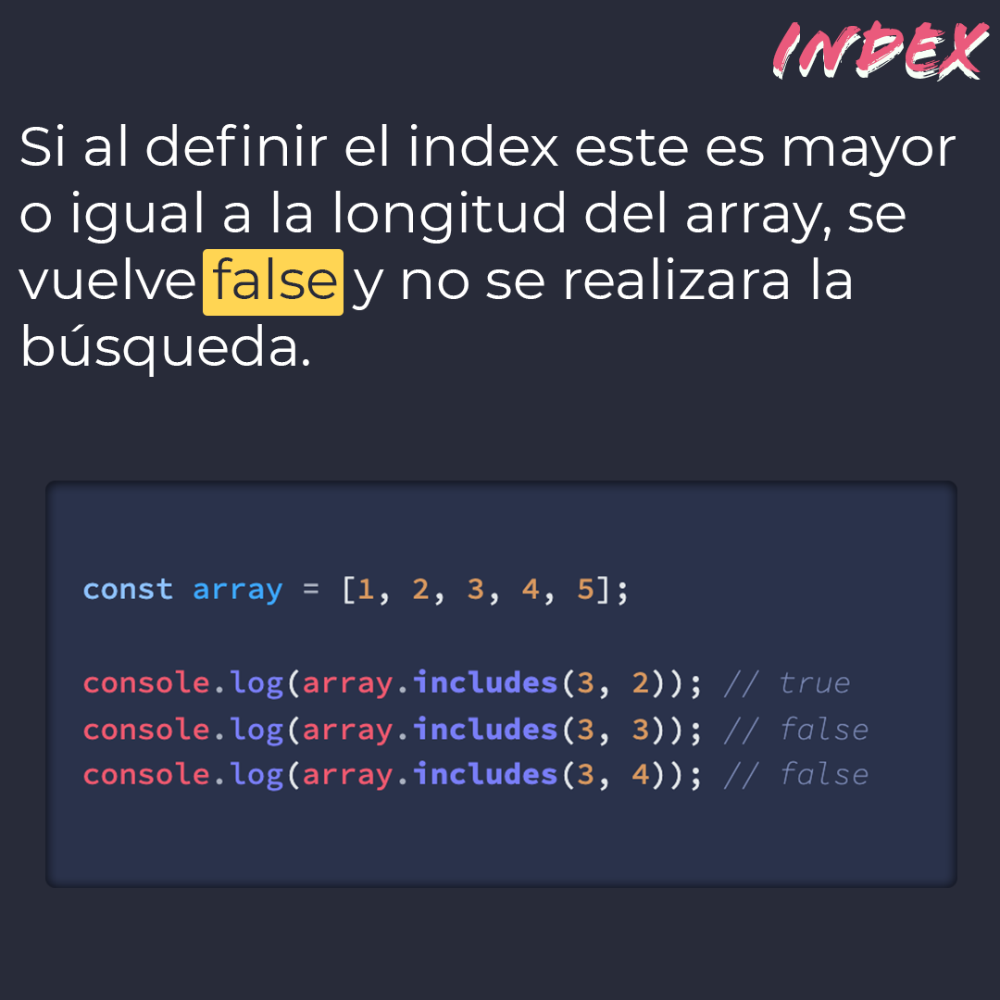
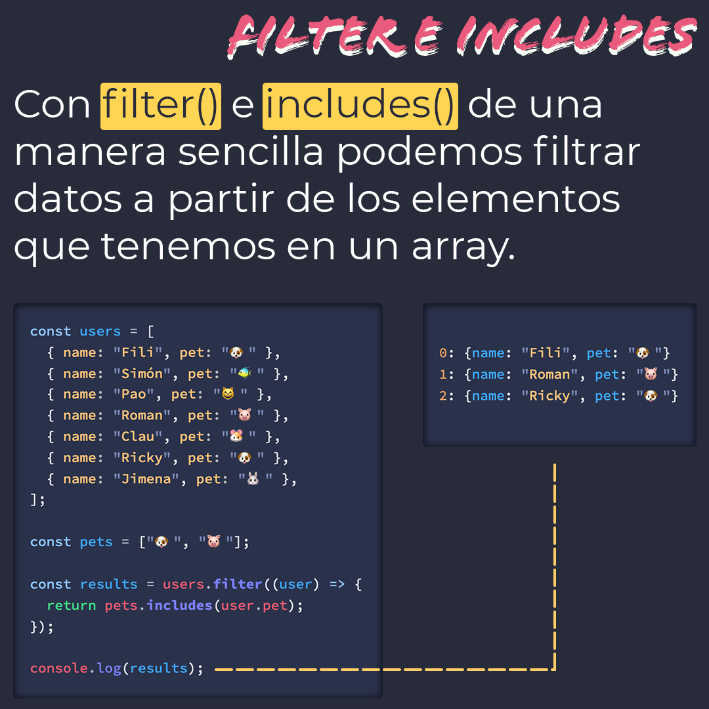

# `includes()`

El método `includes()` determina si un array incluye un determinado elemento y devuelve `true` o `false` dependiendo si se encuentra o no.

> Código utilizado en los ejemplos: [includes.js](/BitSnack/includes/includes.js)

## 🤓 Aprende algo nuevo hoy

> Comparto **bits** al menos una vez por semana.

Instagram: [@fili.santillan](https://www.instagram.com/fili.santillan/)  
Twitter: [@FiliSantillan](https://twitter.com/FiliSantillan)  
Facebook: [Fili Santillán](https://www.facebook.com/FiliSantillan96/)  
Sitio web: http://filisantillan.com  

## 📚 Recursos

- [MDN includes](https://developer.mozilla.org/es/docs/Web/JavaScript/Referencia/Objetos_globales/Array/includes)