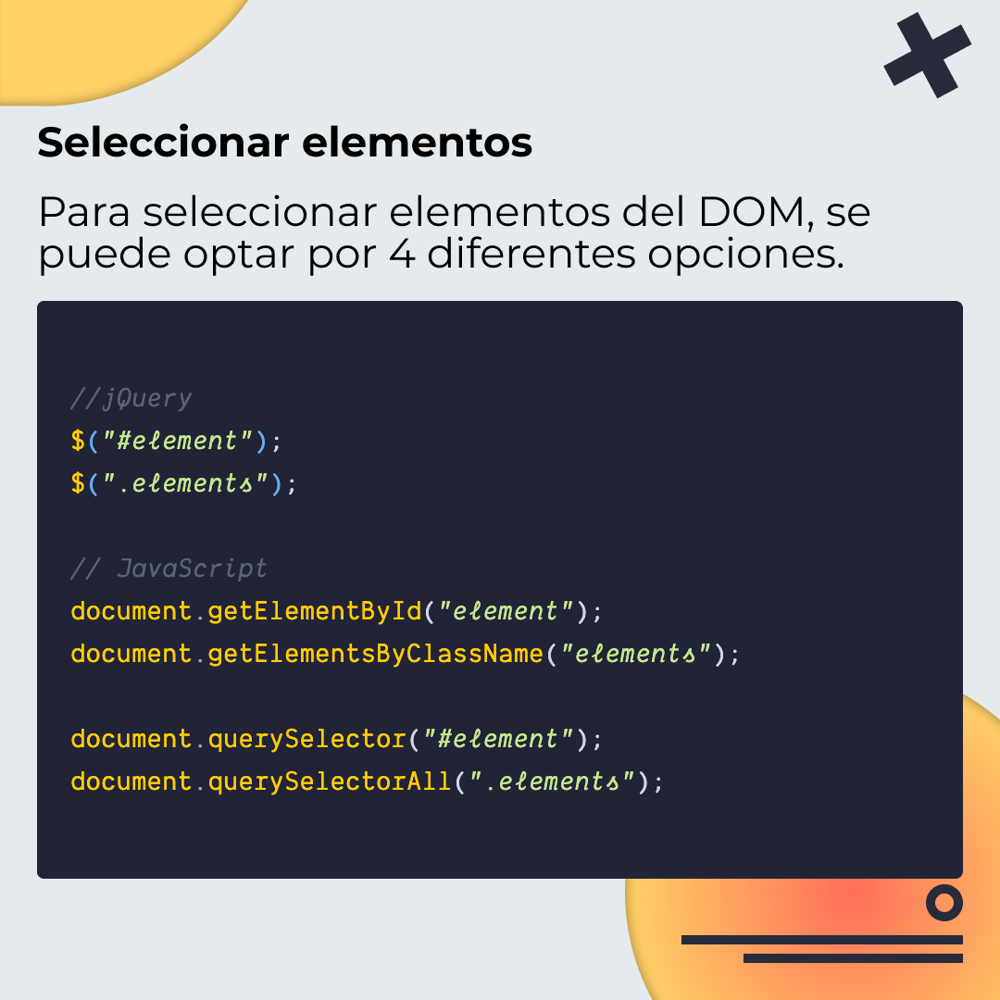
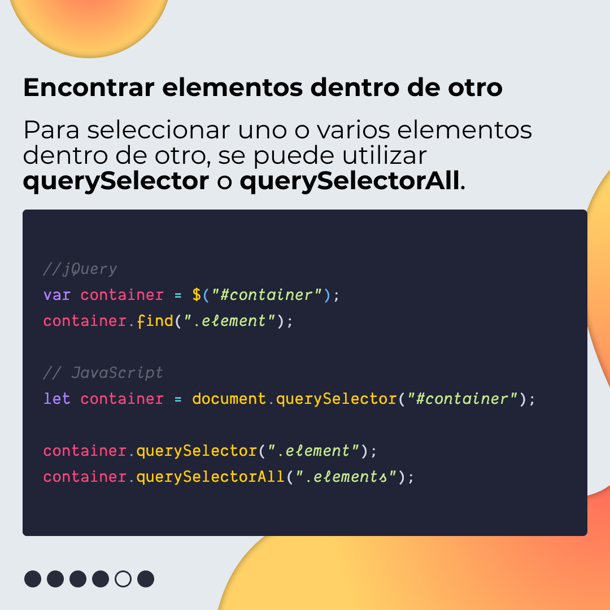
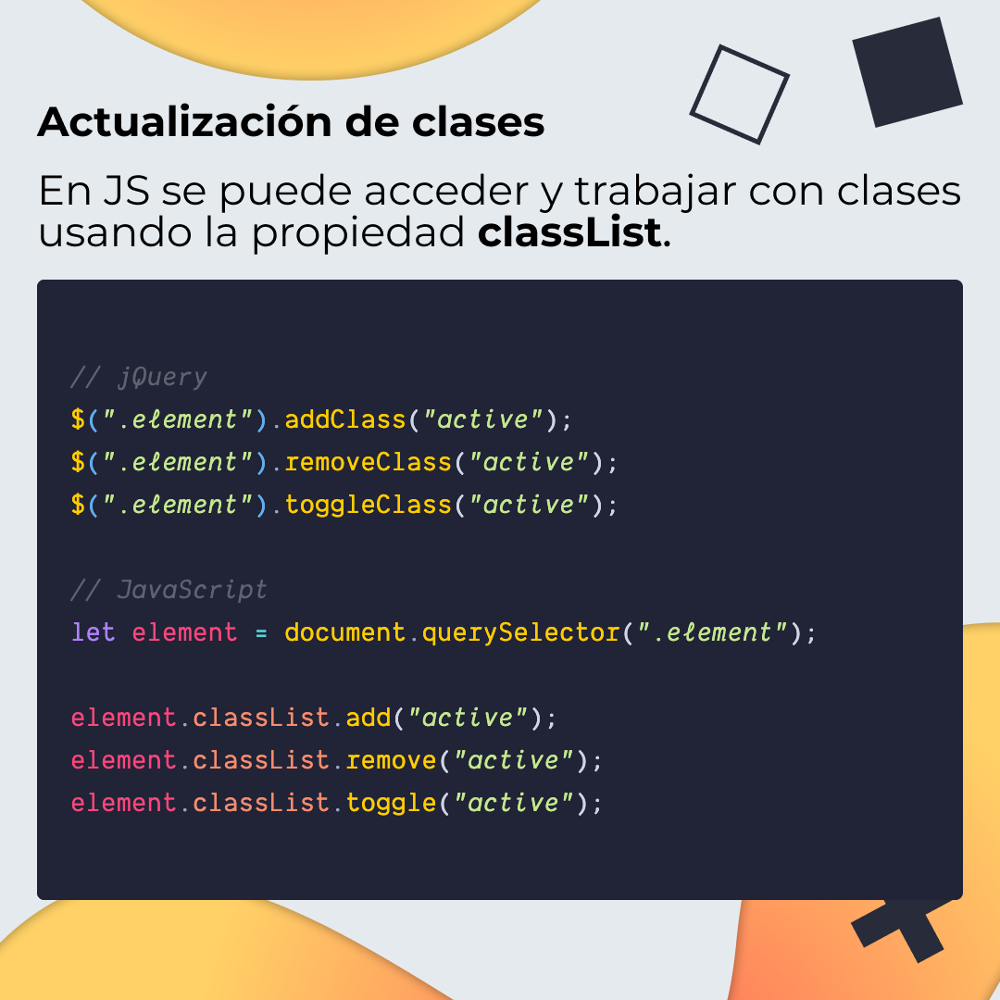
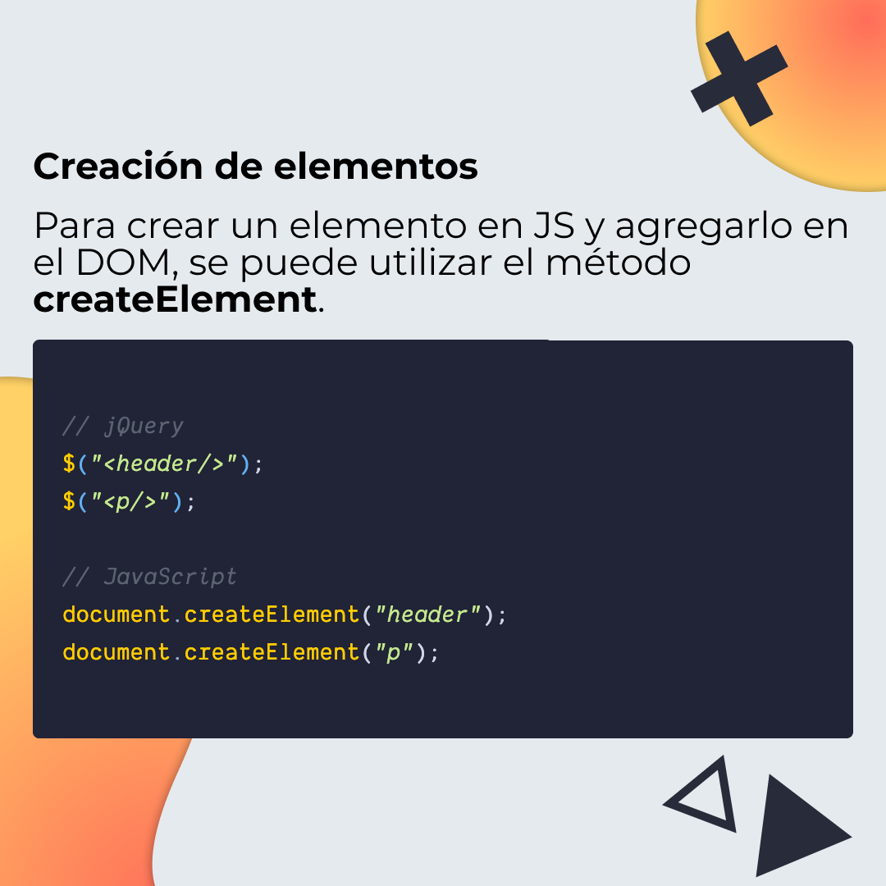
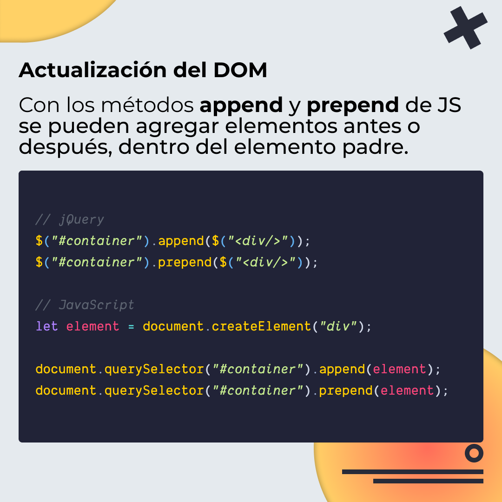
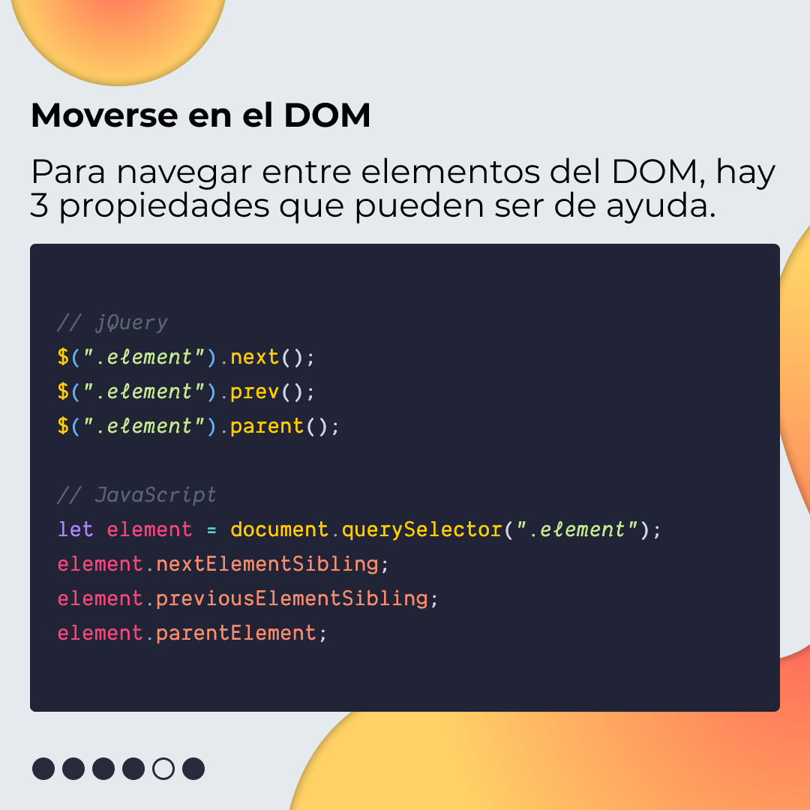
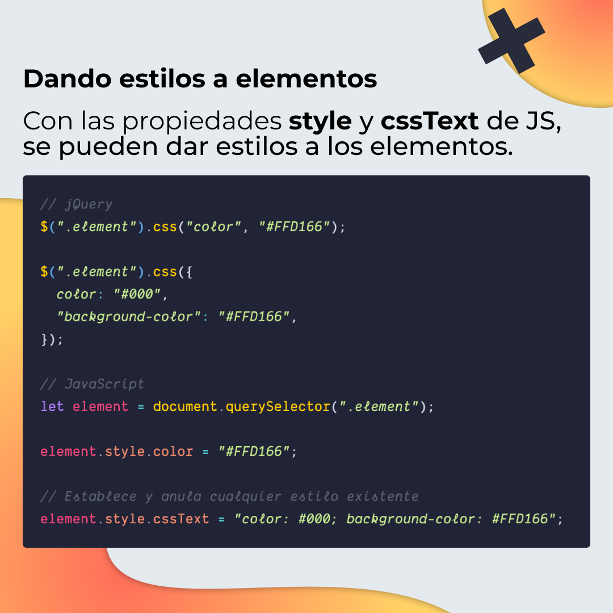
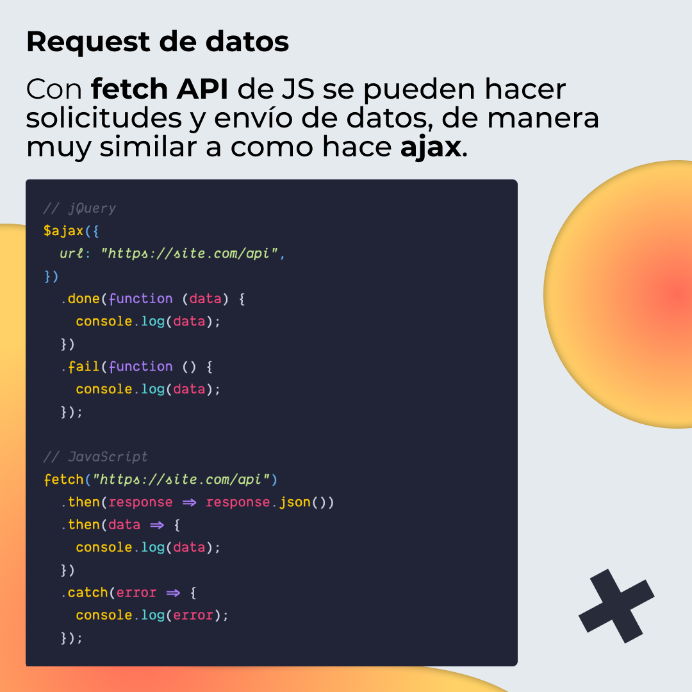

# De jQuery a JavaScript

Diferentes alternativas para pasar de jQuery a JavaScript.

## 🤓 Aprende algo nuevo hoy

> Comparto los **bits** al menos una vez por semana.

Instagram: [@fili.santillan](https://www.instagram.com/fili.santillan/)  
Twitter: [@FiliSantillan](https://twitter.com/FiliSantillan)  
Facebook: [Fili Santillán](https://www.facebook.com/FiliSantillan96/)  
Sitio web: http://filisantillan.com  

## 📚 Recursos

- [Cheat sheet for moving from jQuery to vanilla JavaScript](https://tobiasahlin.com/blog/move-from-jquery-to-vanilla-javascript/#working-with-classes)
- [From jQuery to DOM and ES6](https://www.lewagon.com/blog/from-jquery-to-dom-and-es6)
