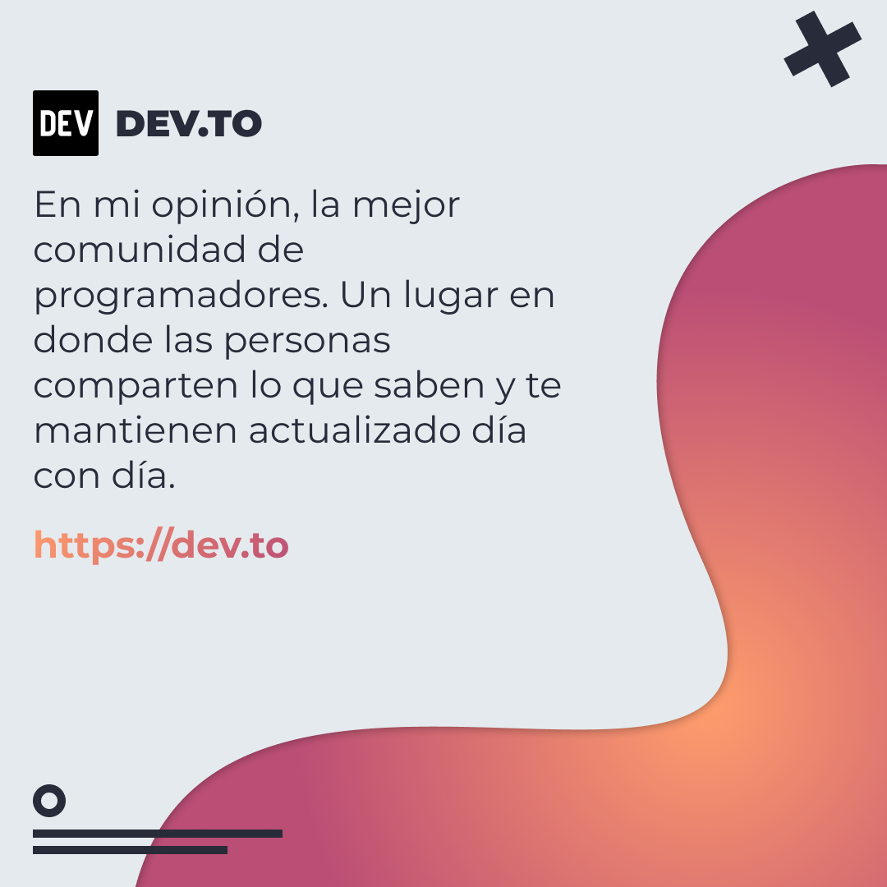
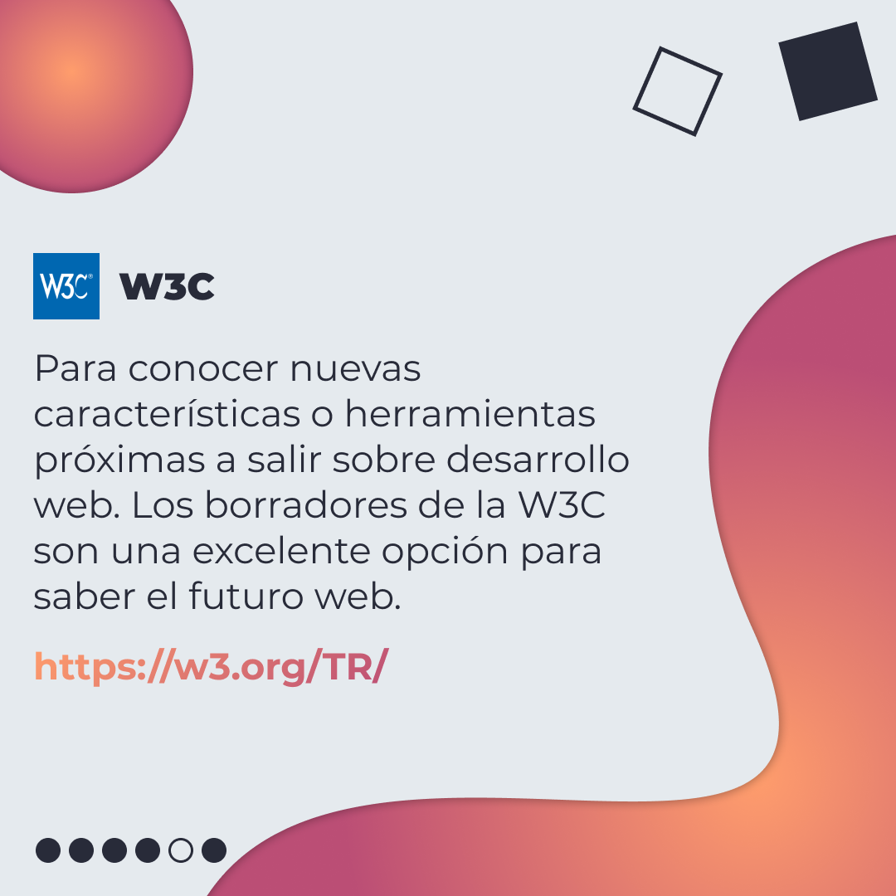
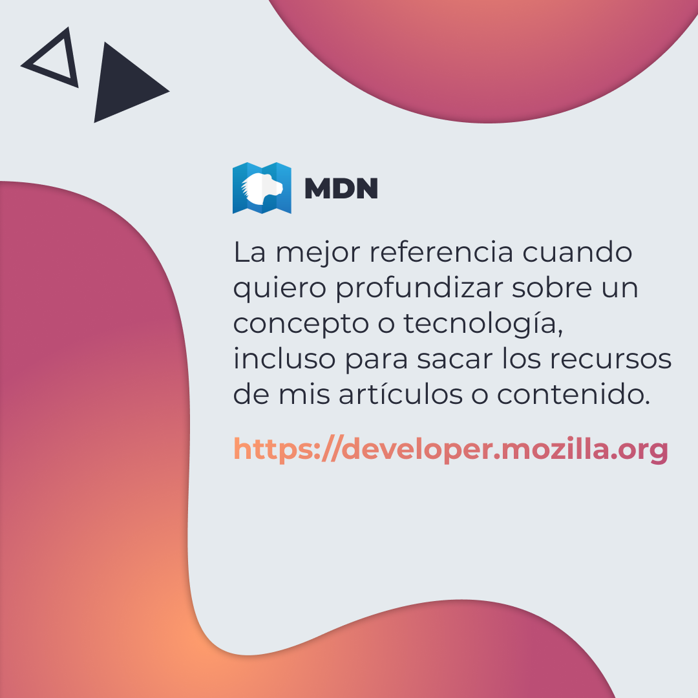
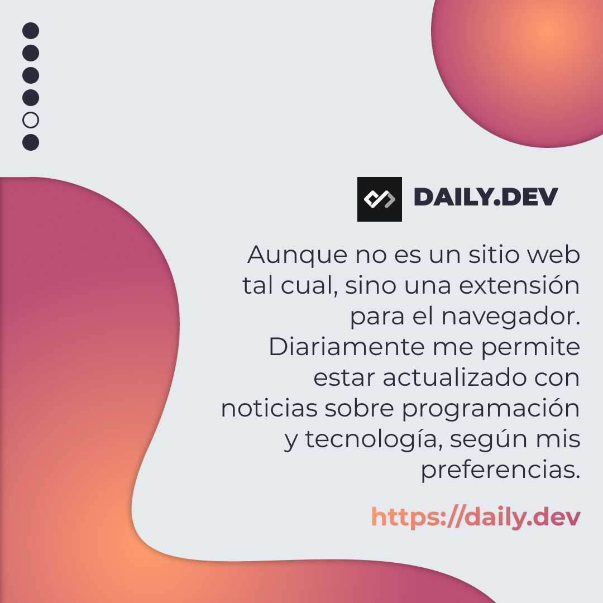

# 4 Sitios para mantenerse actualizado

Les comparto como normalmente suelo estar actualizado y al tanto de mi profesión como Frontend.

<!-- > Código utilizado en los ejemplos: [srcset.html](/BitSnack/srcset/srcset.html) -->

## 🤓 Aprende algo nuevo hoy

> Comparto los **bits** al menos una vez por semana.

Instagram: [@fili.santillan](https://www.instagram.com/fili.santillan/)  
Twitter: [@FiliSantillan](https://twitter.com/FiliSantillan)  
Facebook: [Fili Santillán](https://www.facebook.com/FiliSantillan96/)  
Sitio web: http://filisantillan.com

## 📚 Recursos

- [Dev.to](https://dev.to)
- [W3C](https://w3.org/TR/)
- [MDN](https://developer.mozilla.org/)
- [Daily.dev](https://daily.dev/)
