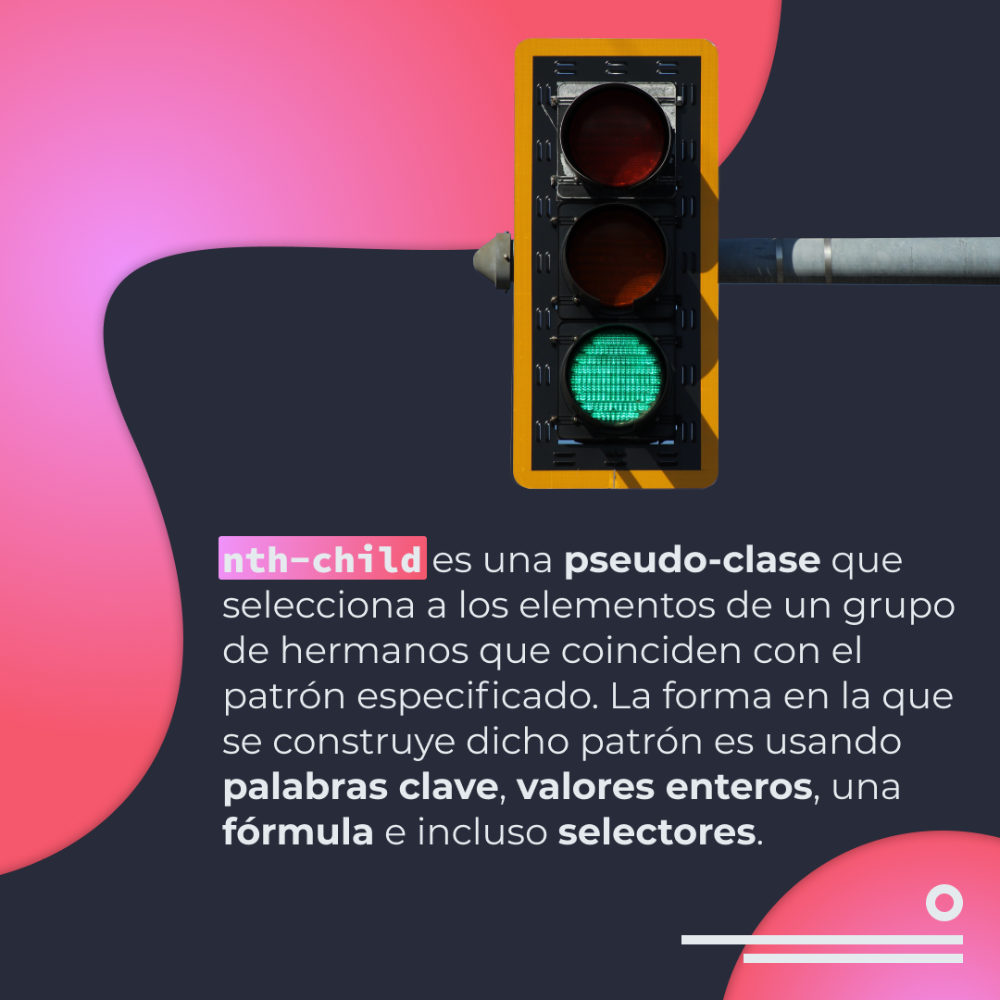
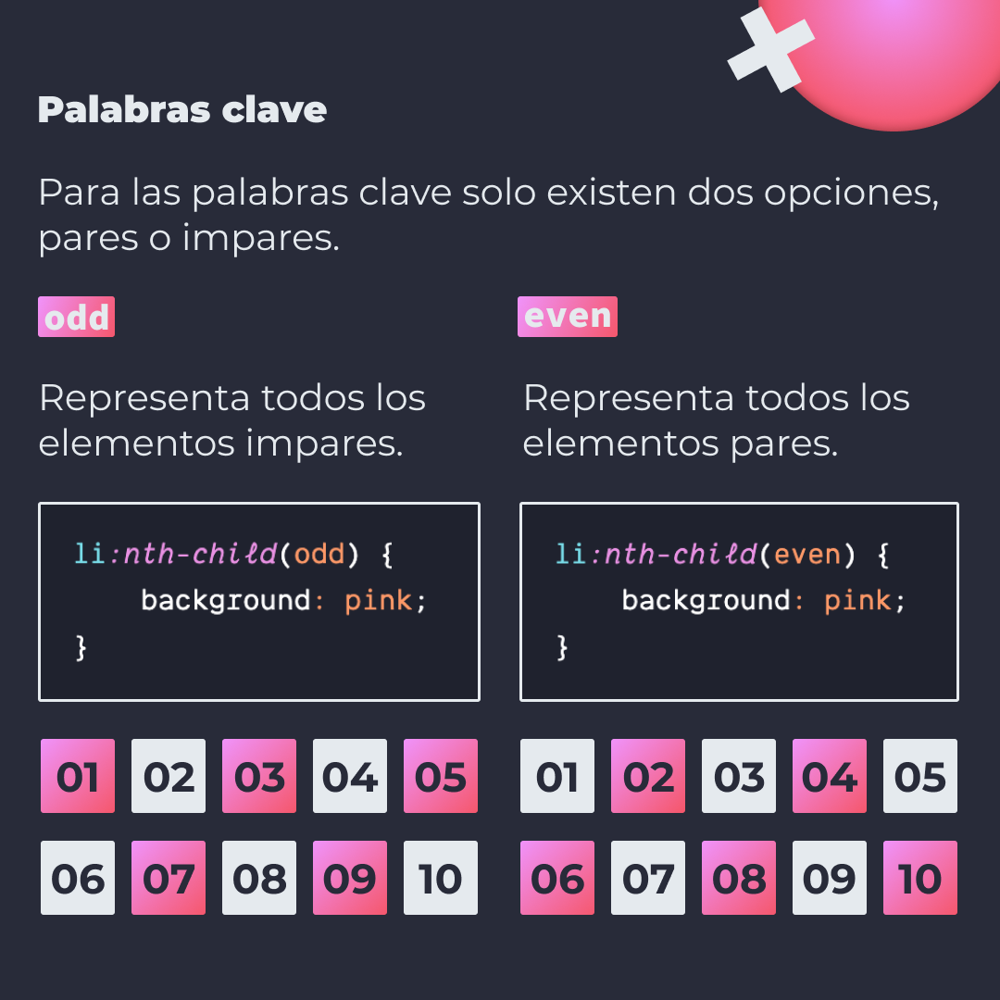
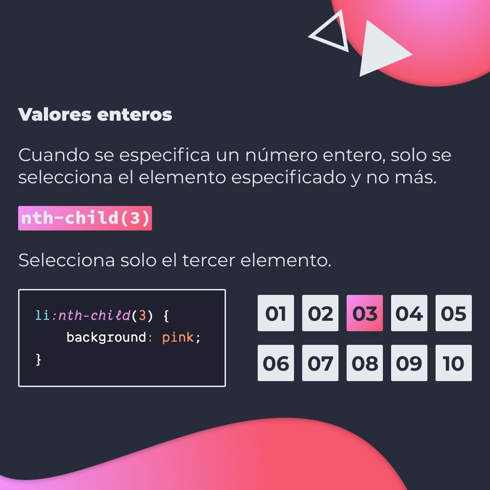
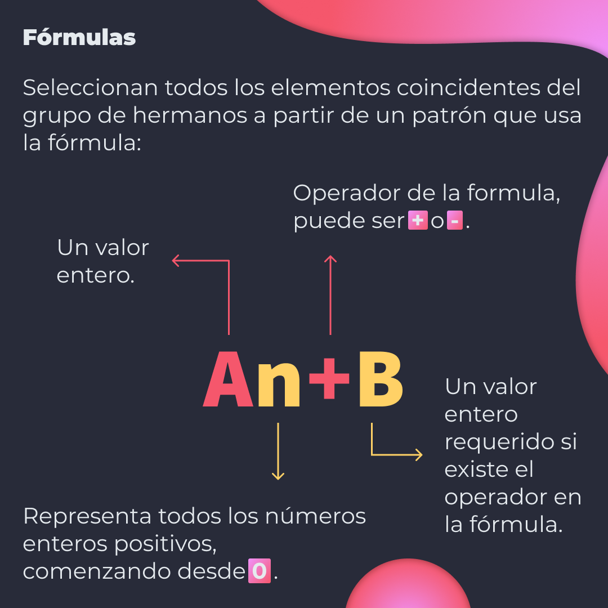
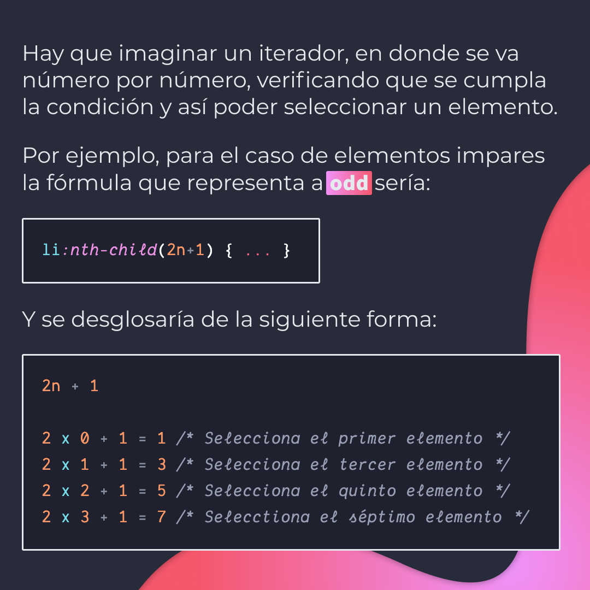
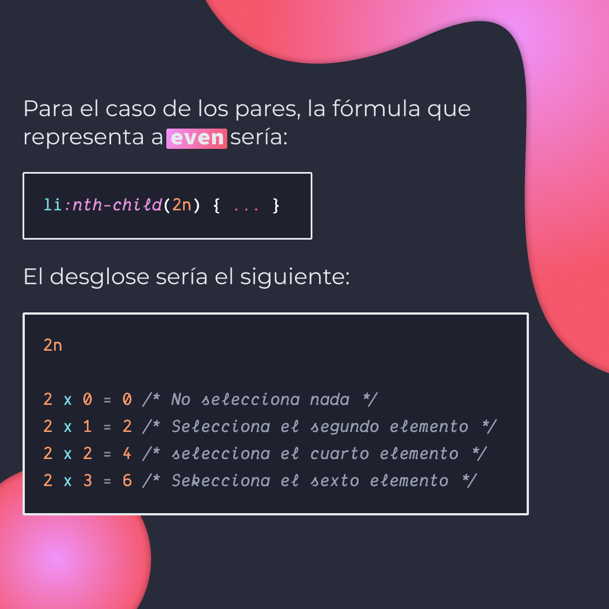
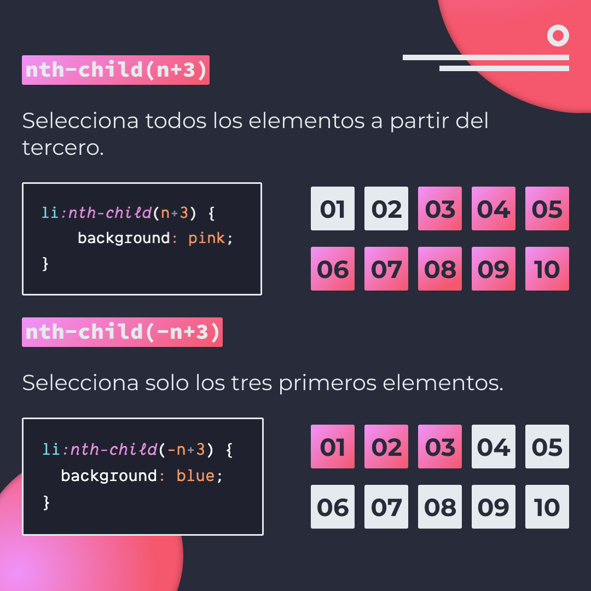
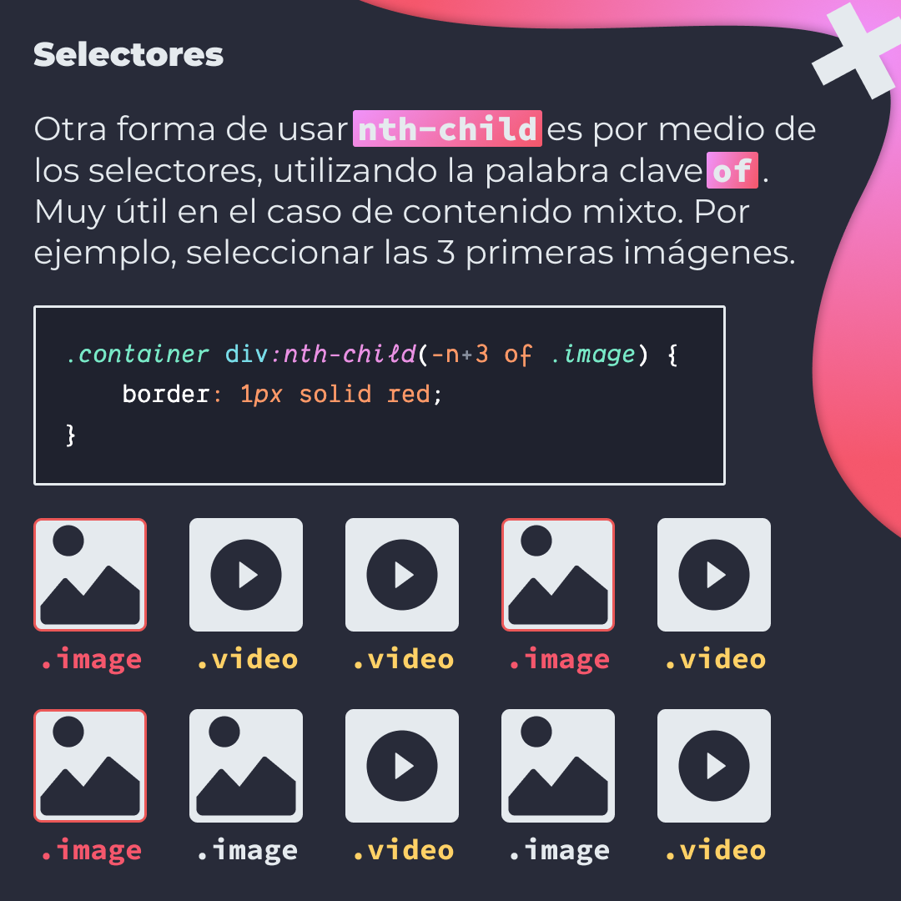

# `nth-child`

`nth-child` es un pseudo-clase que selecciona a los elementos de un grupo de hermanos que coinciden con el patrón especificado. La forma en la se construye dicho patrón es usando palabras clave, valores enteros, una fórmula en incluso selectores.

> Código utilizado en los ejemplos: [nth-child.css](./nth-child.css)

## 🤓 Aprende algo nuevo hoy

> Comparto los **bits** al menos una vez por semana.

Instagram: [@fili.santillan](https://www.instagram.com/fili.santillan/)  
Twitter: [@FiliSantillan](https://twitter.com/FiliSantillan)  
Facebook: [Fili Santillán](https://www.facebook.com/FiliSantillan96/)  
Sitio web: http://filisantillan.com

## Recursos

- [Fili Santillán nth-child](https://filisantillan.com/bits/nth-child/)
