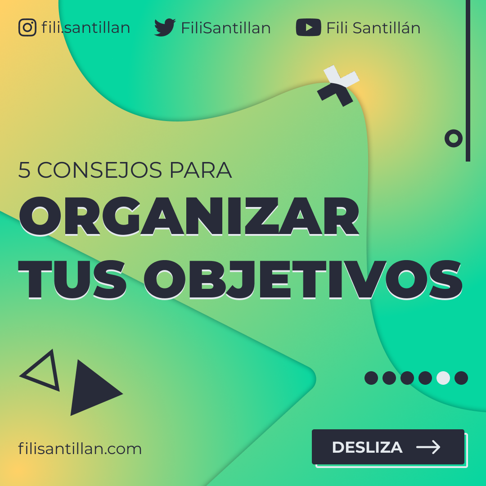
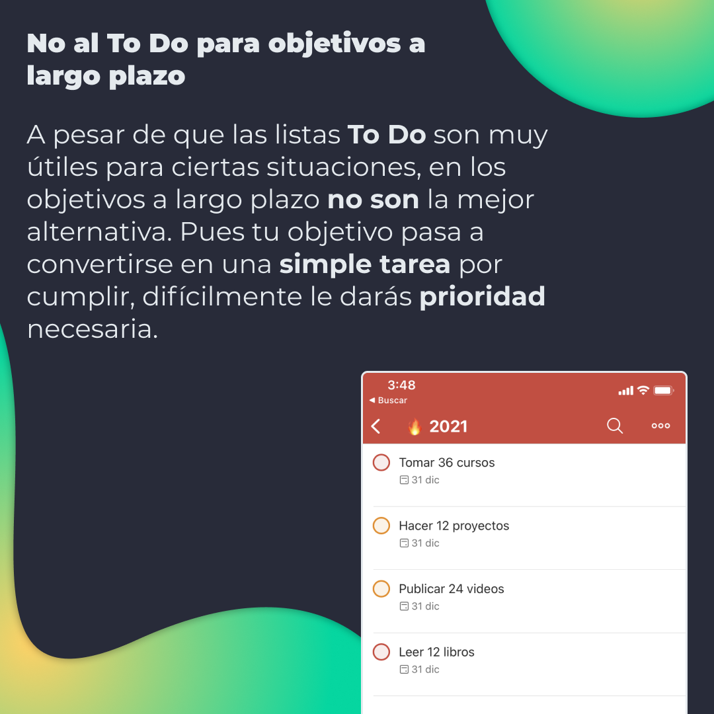
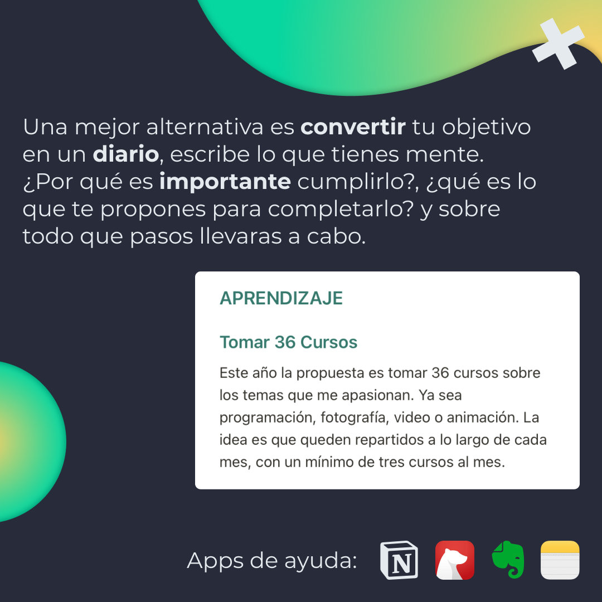
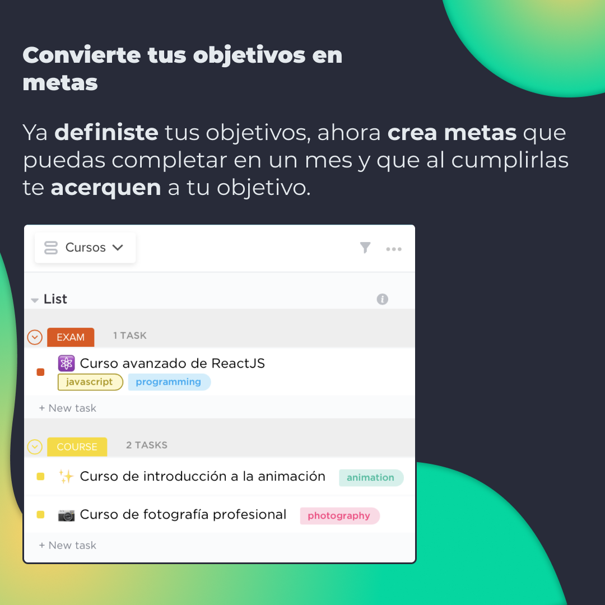
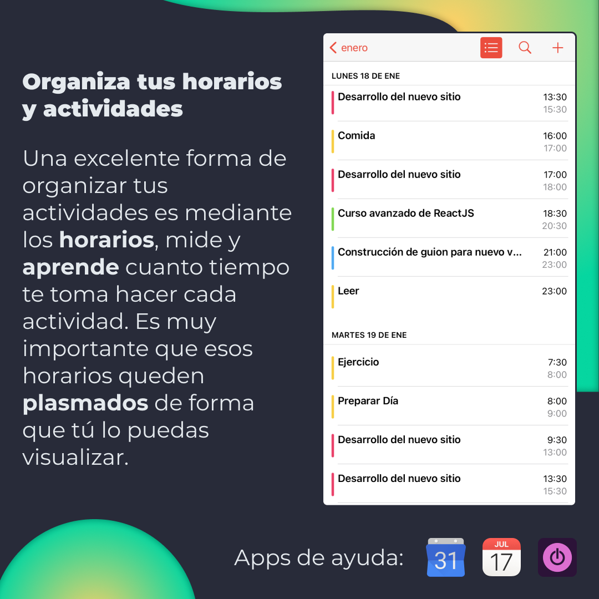

# 5 Consejos para organizar tus objetivos

Les platico un poco sobre como me organizo cada año y voy llevando mis objetivos al rededor de los meses, semanas e incluso días.

## 🤓 Aprende algo nuevo hoy

> Comparto los **bits** al menos una vez por semana.

Instagram: [@fili.santillan](https://www.instagram.com/fili.santillan/)  
Twitter: [@FiliSantillan](https://twitter.com/FiliSantillan)  
Facebook: [Fili Santillán](https://www.facebook.com/FiliSantillan96/)  
Sitio web: http://filisantillan.com
