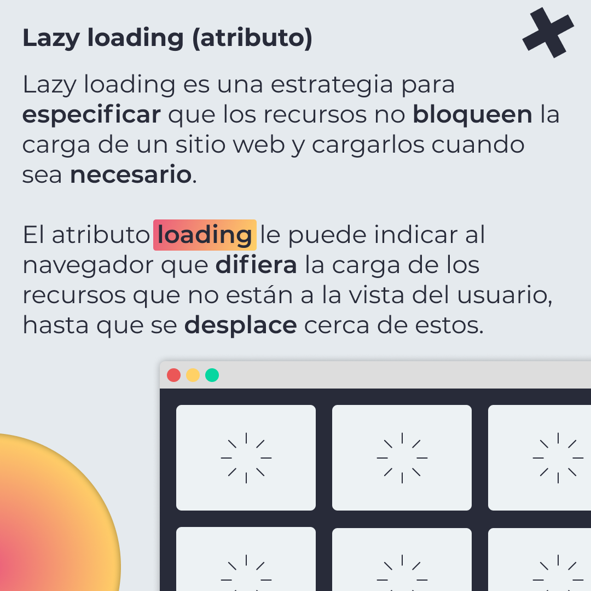
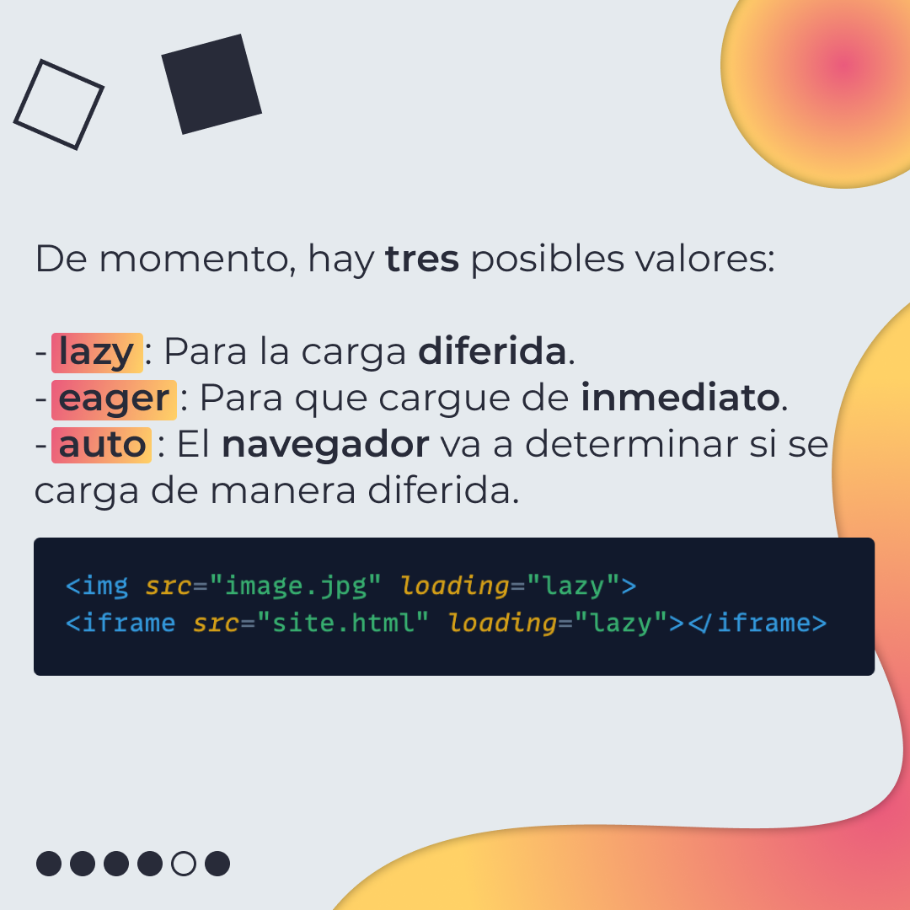
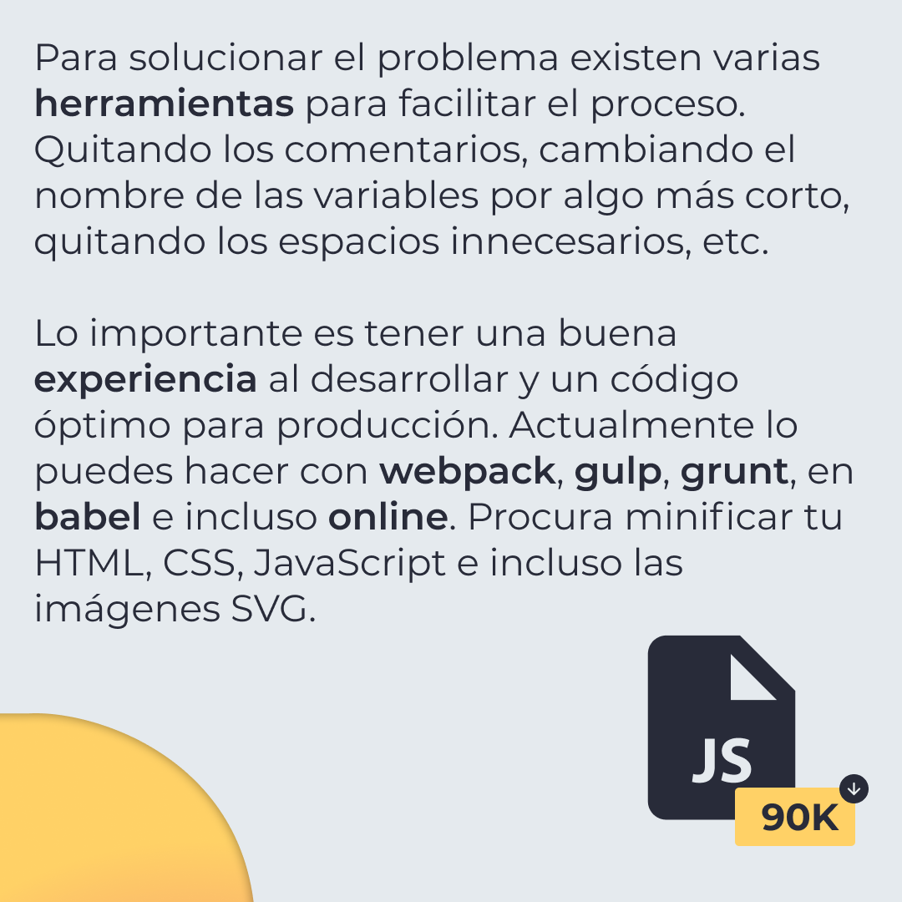
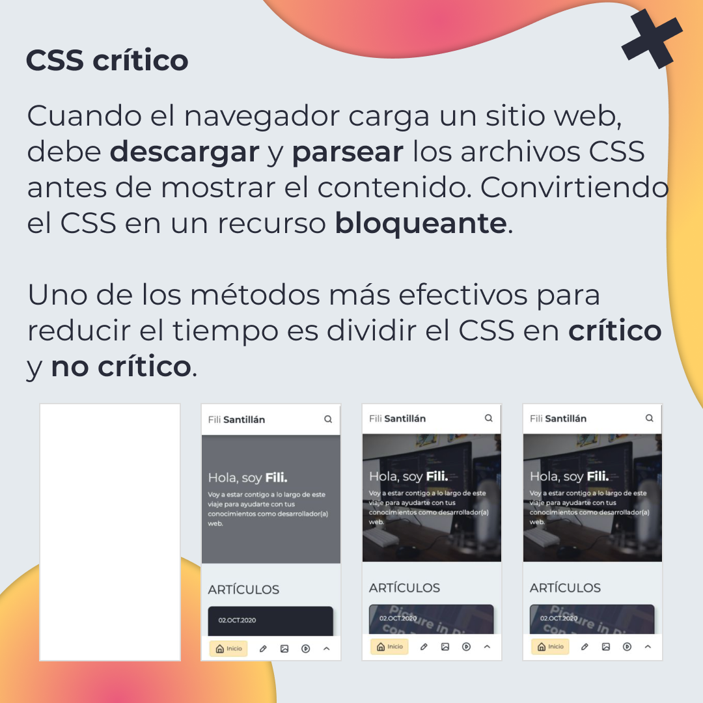
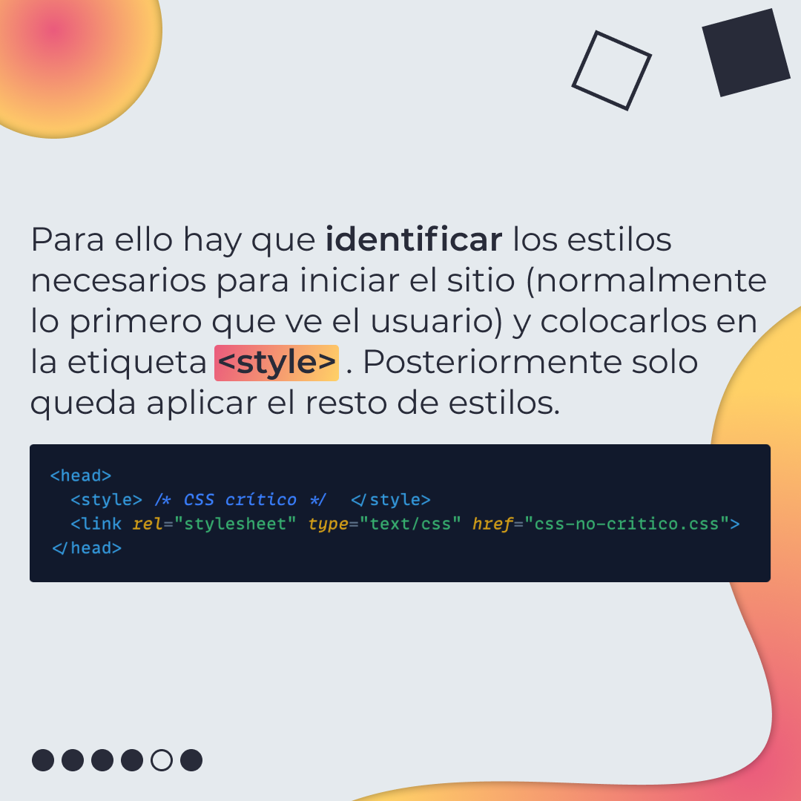
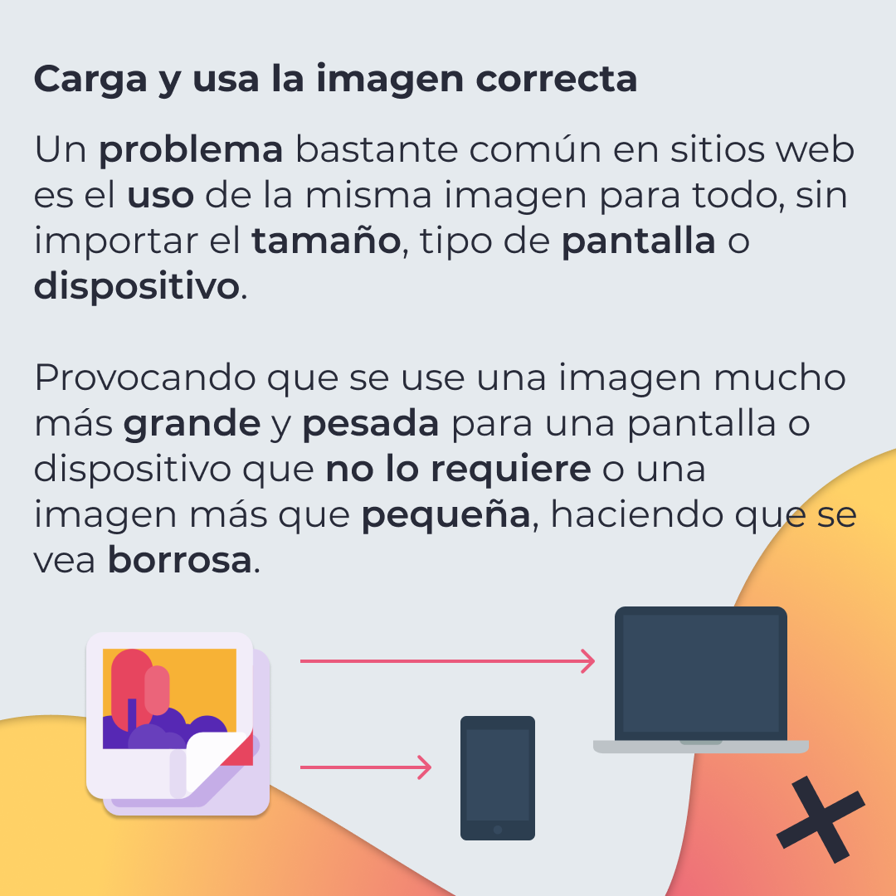
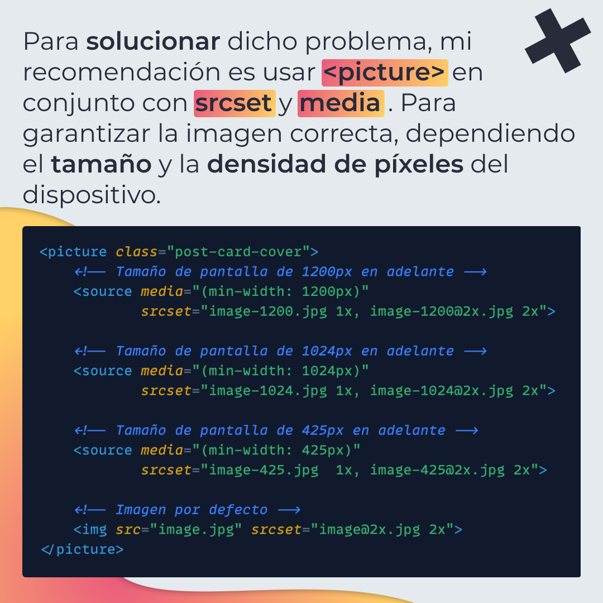

# Técnicas para mejorar el performance

🔥 Esta vez, sobre Lazy loading (nativo), el mitificar tu código, CSS crítico para no bloquear tu sitio y finalmente imágenes dependiendo el dispositivo.

[Ver primera parte](/BitSnack/performance/performance.md)

## 🤓 Aprende algo nuevo hoy

> Comparto los **bits** al menos una vez por semana.

Instagram: [@fili.santillan](https://www.instagram.com/fili.santillan/)  
Twitter: [@FiliSantillan](https://twitter.com/FiliSantillan)  
Facebook: [Fili Santillán](https://www.facebook.com/FiliSantillan96/)  
Sitio web: http://filisantillan.com

## 📚 Recursos

-   [Mejorando la carga de un sitio web: Imágenes vs. velocidad](https://filisantillan.com/blog/mejorando-la-carga-de-un-sitio-web-imagenes-vs-velocidad/)
-   [Web Performance 101](https://3perf.com/talks/web-perf-101/)
-   [Native image lazy-loading for the web!](https://addyosmani.com/blog/lazy-loading)
