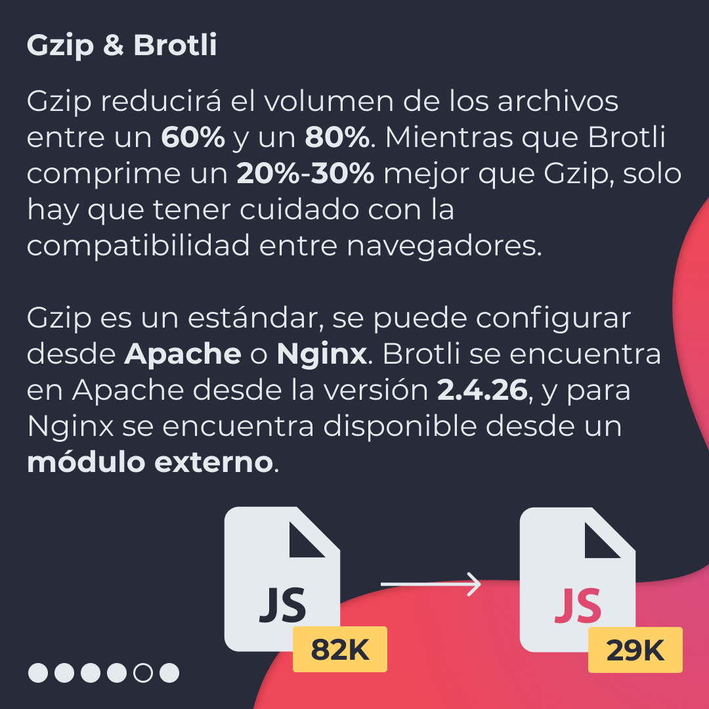
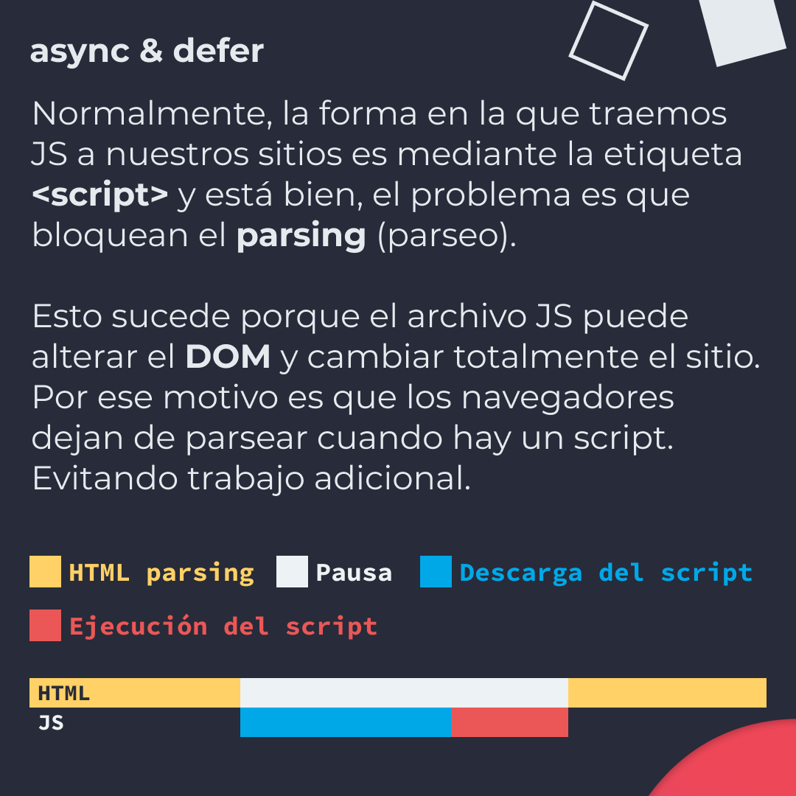
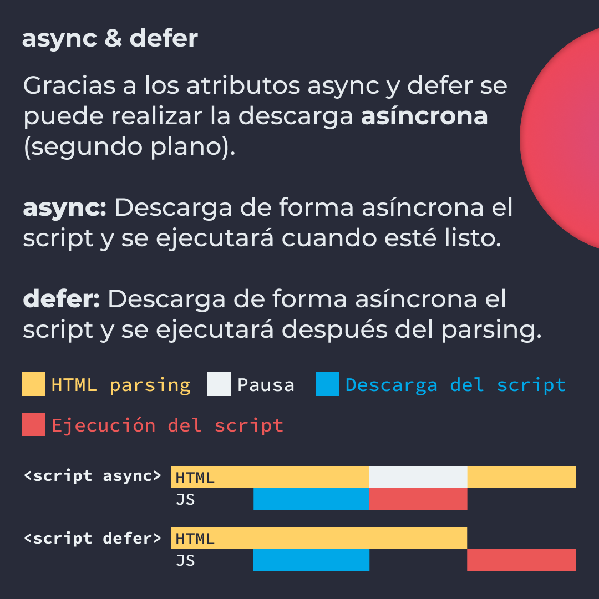
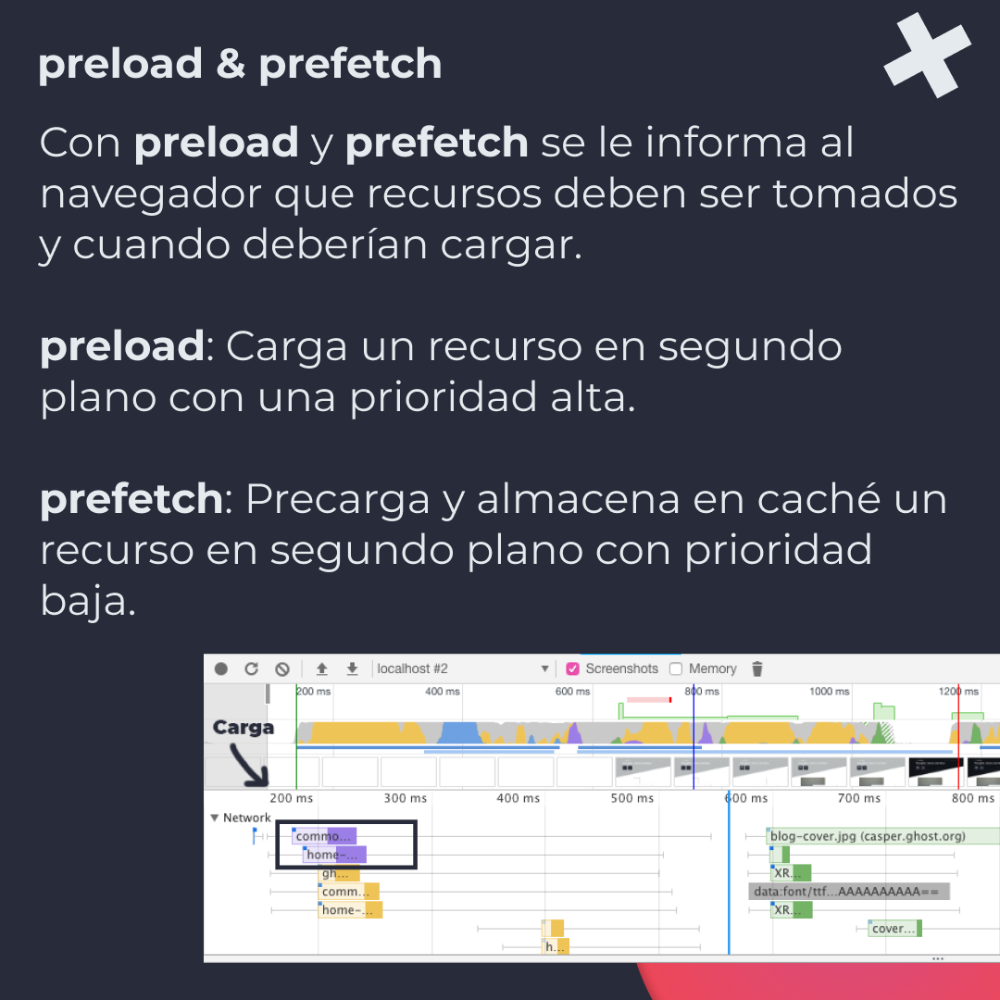
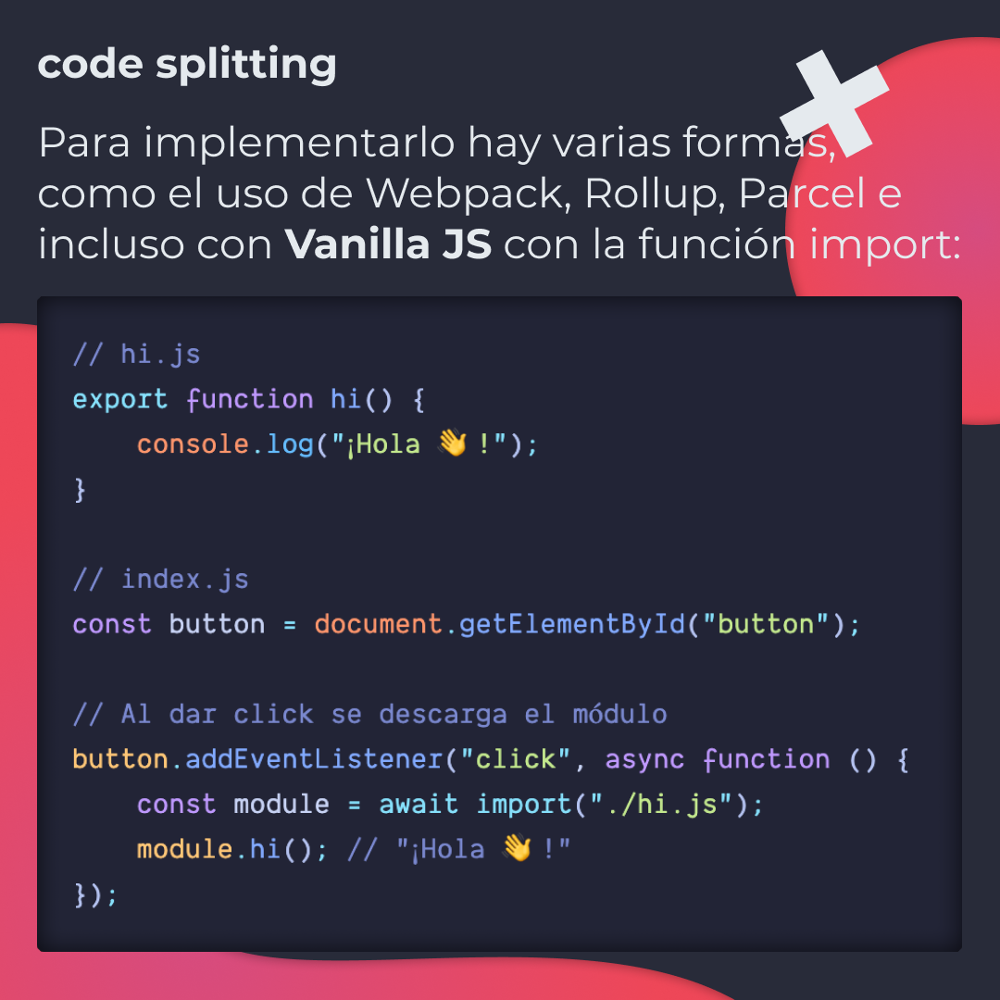

# 4 Técnicas para mejorar el performance

De acuerdo con un estudio de Google, el 40% de las personas abandona un sitio
web que tarda más de 3 segundos en cargar. No solo eso, en 2006 intentó hacer la
búsqueda más lenta y descubrieron que los usuarios realizaban un 25% menos de
solicitudes. ¿No es suficiente?

En 2016, AliExpress aceleró un tercio su sitio y recibió un 10.5% más de
pedidos. Mejorar el performance de un sitio web trae consigo mejorar la
experiencia del usuario al igual que muchas mejoras más, como ventas, un mejor
posicionamiento, retención, etc.

Por ello, hoy te enseño 4 técnicas para mejorar el performance de un sitio web.

> Código utilizado en los ejemplos:
> [preload-prefetch.html](/BitSnack/performance/preload-prefetch.html) y
> [code-splitting.js](/BitSnack/performance/code-splitting.js)

## 🤓 Aprende algo nuevo hoy

> Comparto los **bits** al menos una vez por semana.

Instagram: [@fili.santillan](https://www.instagram.com/fili.santillan/)  
Twitter: [@FiliSantillan](https://twitter.com/FiliSantillan)  
Facebook: [Fili Santillán](https://www.facebook.com/FiliSantillan96/)  
Sitio web: http://filisantillan.com

## 📚 Recursos

-   [Mejorando la carga de un sitio web: Imágenes vs. velocidad](https://filisantillan.com/blog/mejorando-la-carga-de-un-sitio-web-imagenes-vs-velocidad/)
-   [Dynamic import](https://filisantillan.com/bits/dynamic-import/)
-   [Web Performance 101](https://3perf.com/talks/web-perf-101/#perf-importance-part-1)
-   [Preload, Prefetch And Priorities in Chrome](https://medium.com/reloading/preload-prefetch-and-priorities-in-chrome-776165961bbf)
-   [All you need to know about JavaScript code splitting](https://www.creativebloq.com/how-to/all-you-need-to-know-about-javascript-code-splitting)
-   [Brotli vs Gzip Compression. How we improved our latency by 37%](https://medium.com/oyotech/how-brotli-compression-gave-us-37-latency-improvement-14d41e50fee4#:~:text=Gzip%20vs%20Brotli%3A,keys%20instead%20of%20full%20keywords.&text=Javascript%20files%20compressed%20with%20Brotli,are%2017%25%20smaller%20than%20gzip.)
