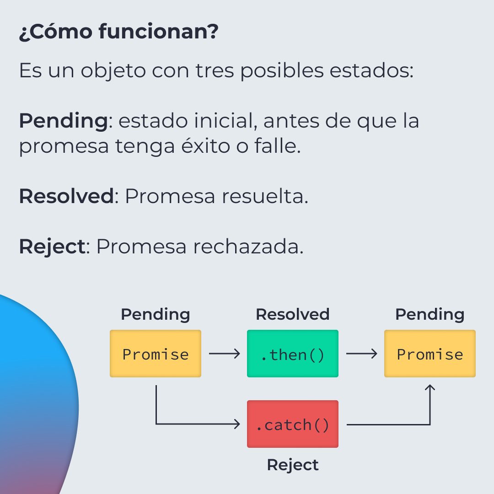
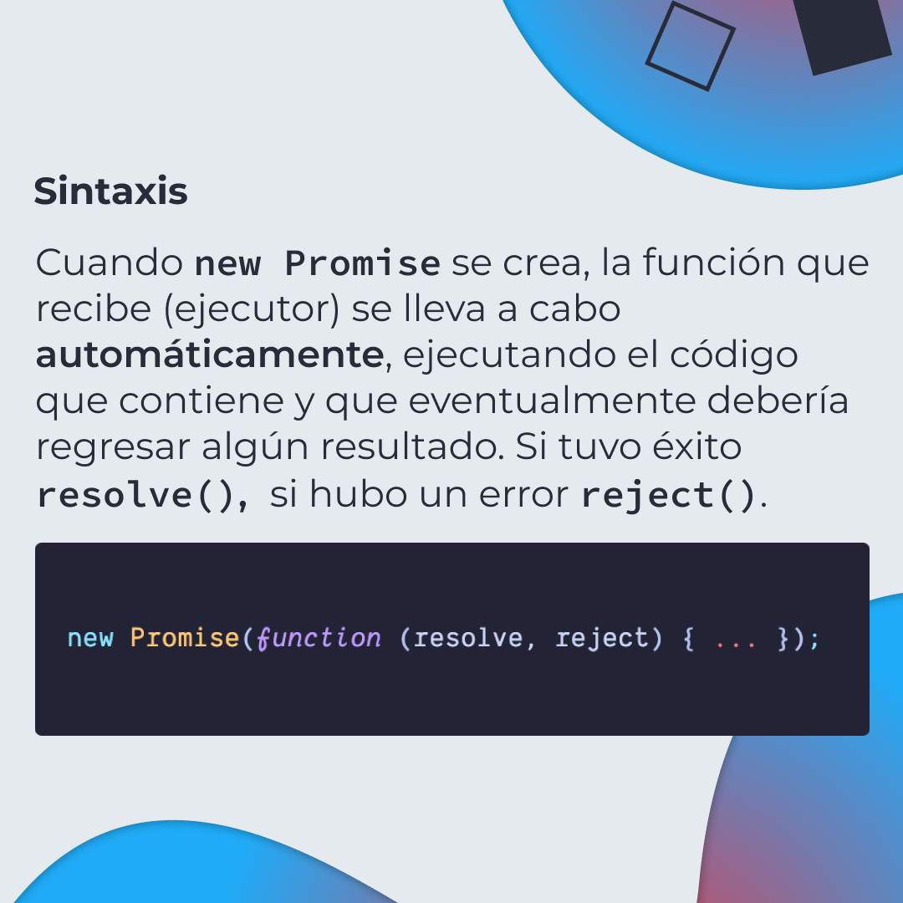
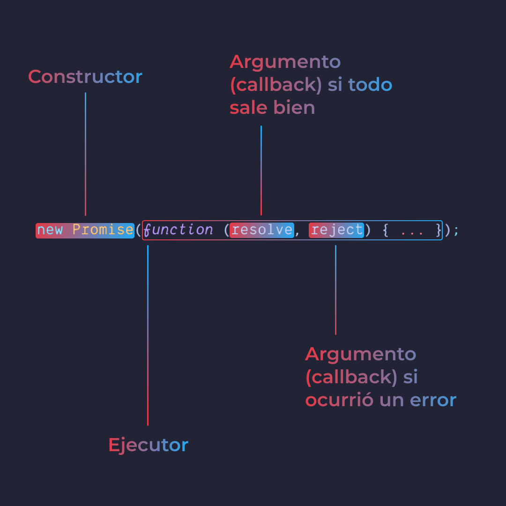
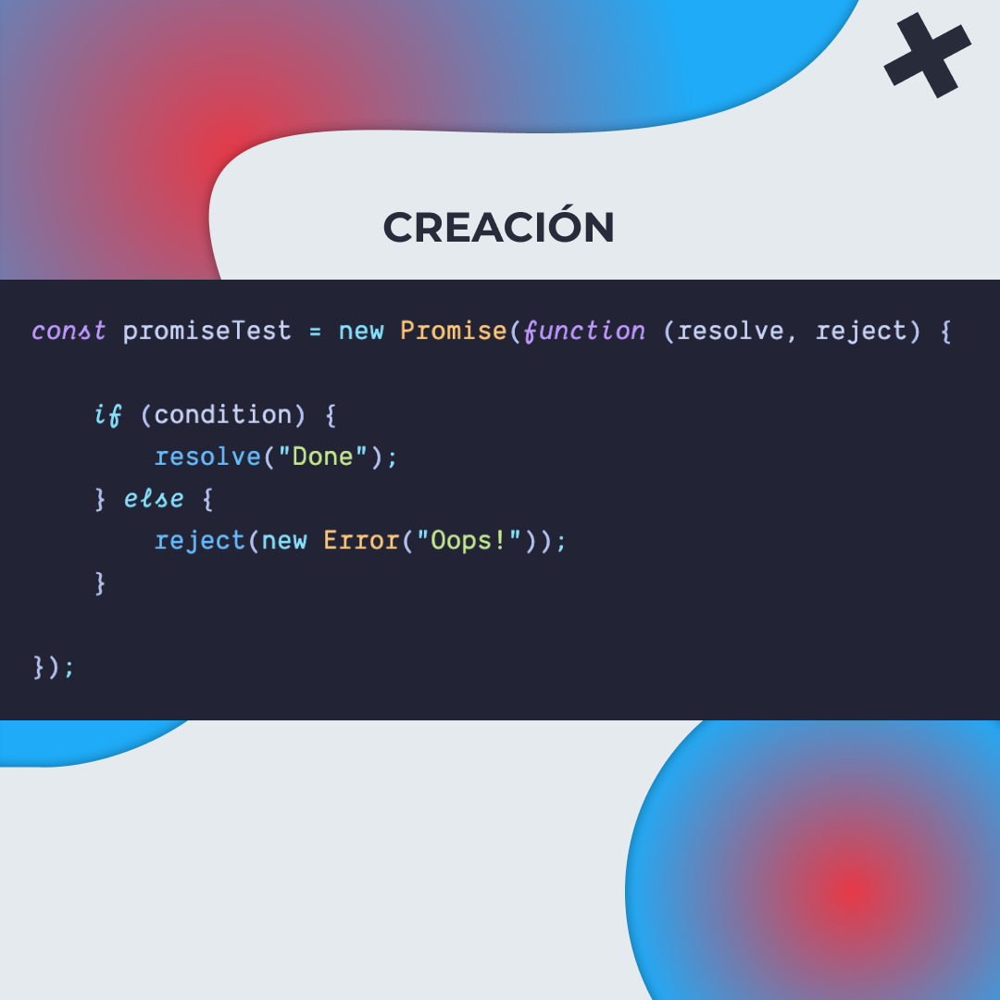
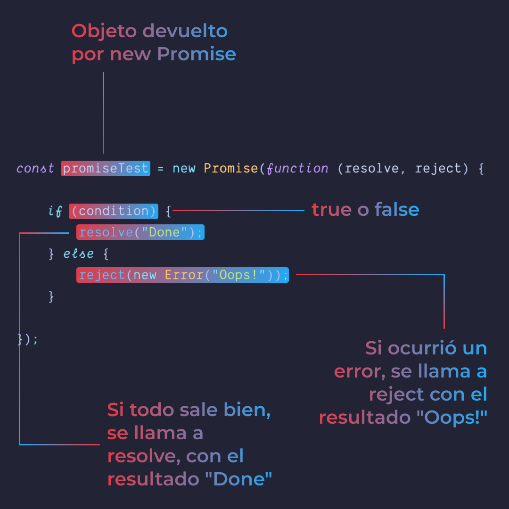
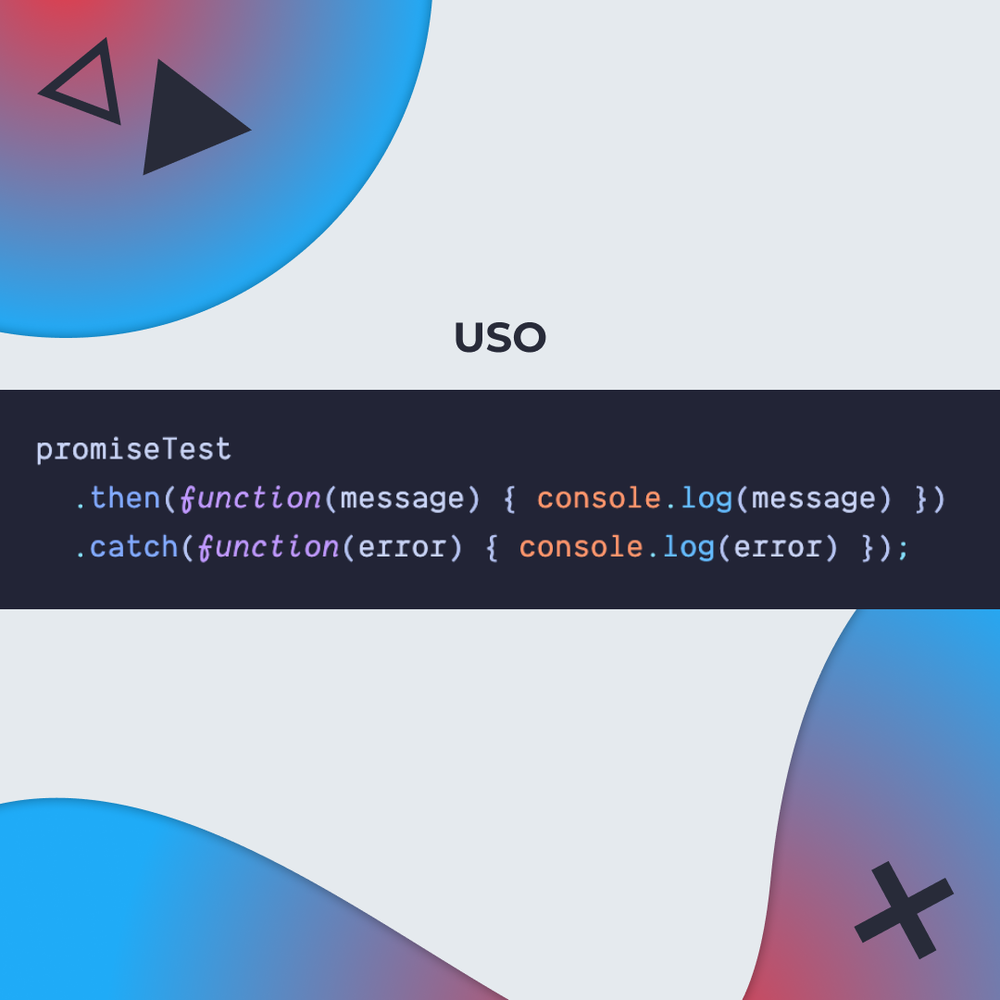
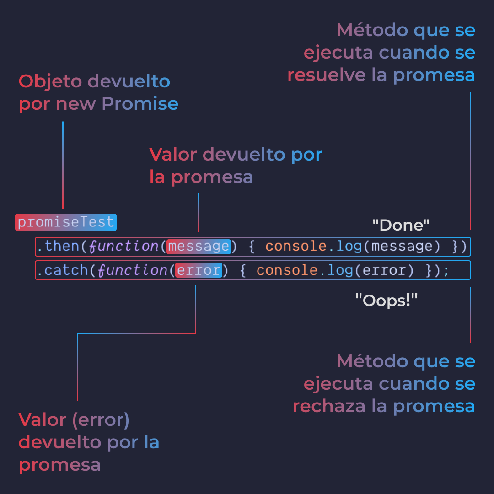

# Promesas en JavaScript

Una promesa en JavaScript es similar a una promesa en la vida real. Hay dos posibles
resultados: se cumple o no.

En JavaScript, representa un valor que puede estar disponible en el futuro o nunca.
Es decir, se va a resolver o rechazar.

> Código utilizado en los ejemplos: [promises.js](/BitSnack/promises/promises.js)

## 🤓 Aprende algo nuevo hoy

> Comparto los **bits** al menos una vez por semana.

Instagram: [@fili.santillan](https://www.instagram.com/fili.santillan/)  
Twitter: [@FiliSantillan](https://twitter.com/FiliSantillan)  
Facebook: [Fili Santillán](https://www.facebook.com/FiliSantillan96/)  
Sitio web: http://filisantillan.com

## 📚 Recursos

-   [JavaScript Promise Tutorial: Resolve, Reject, and Chaining in JS and ES6](https://www.freecodecamp.org/news/javascript-es6-promises-for-beginners-resolve-reject-and-chaining-explained/)
-   [Promise - JS Info](https://javascript.info/promise-basics)
-   [Promise - MDN](https://developer.mozilla.org/en-US/docs/Web/JavaScript/Reference/Global_Objects/Promise)
