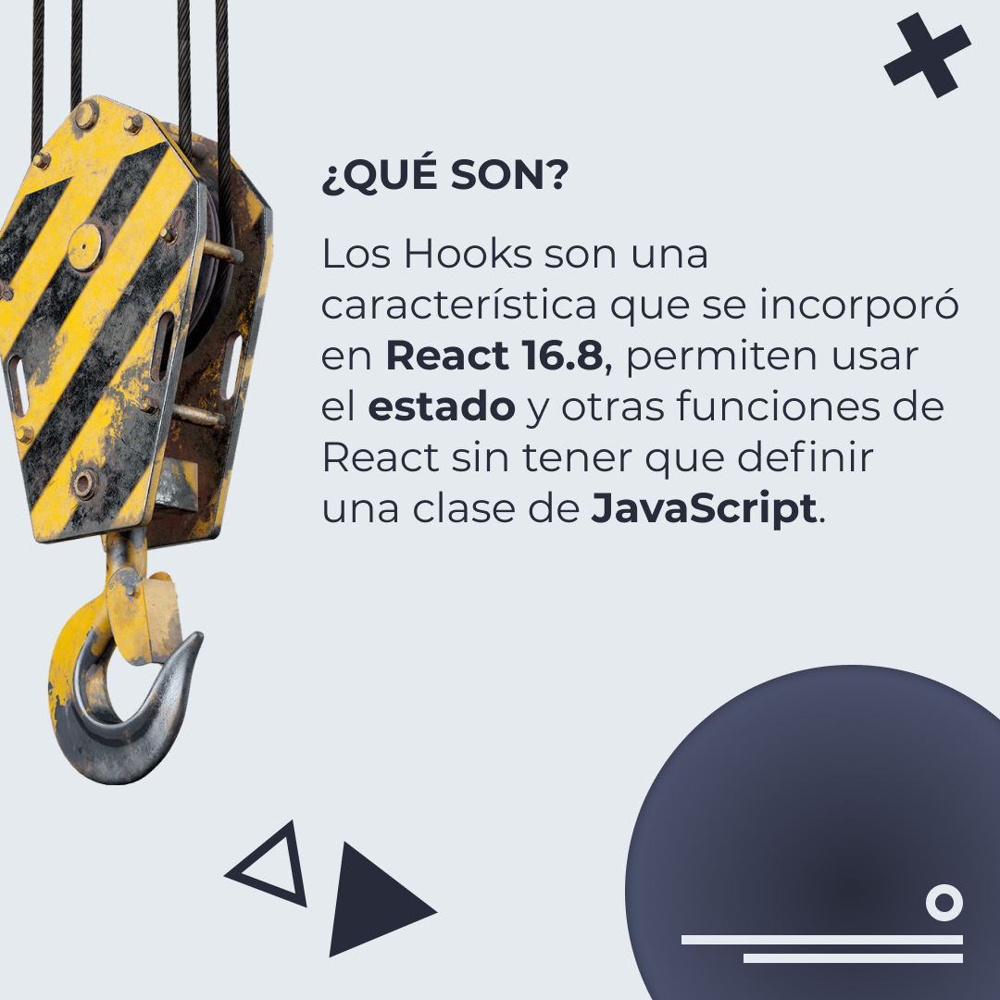
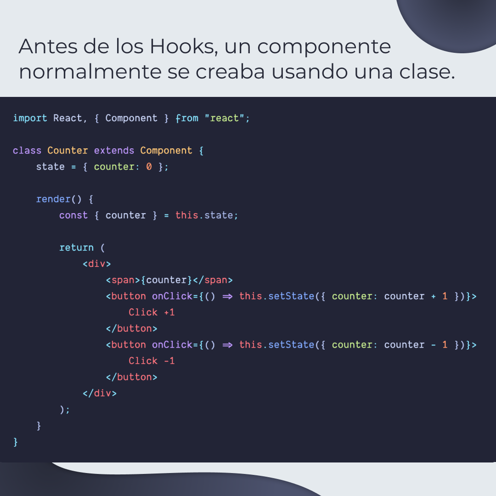
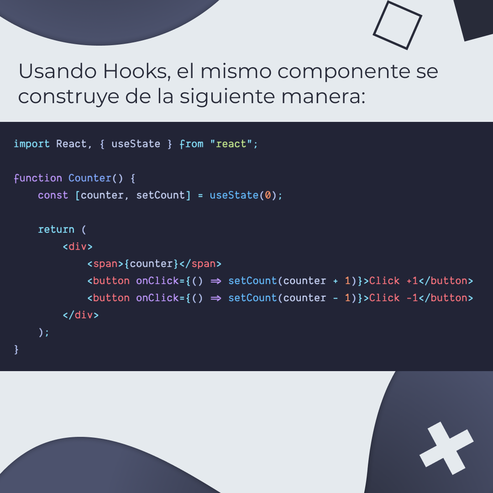
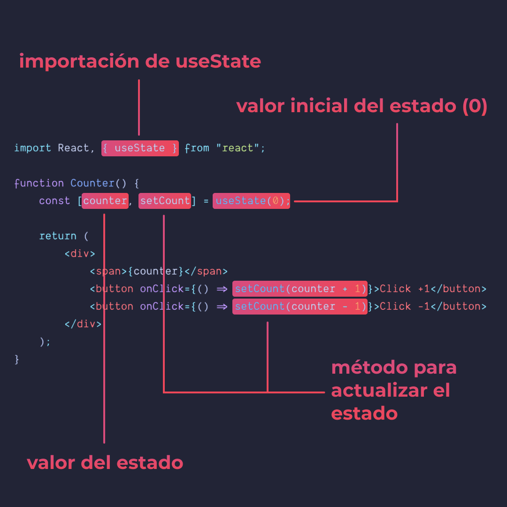
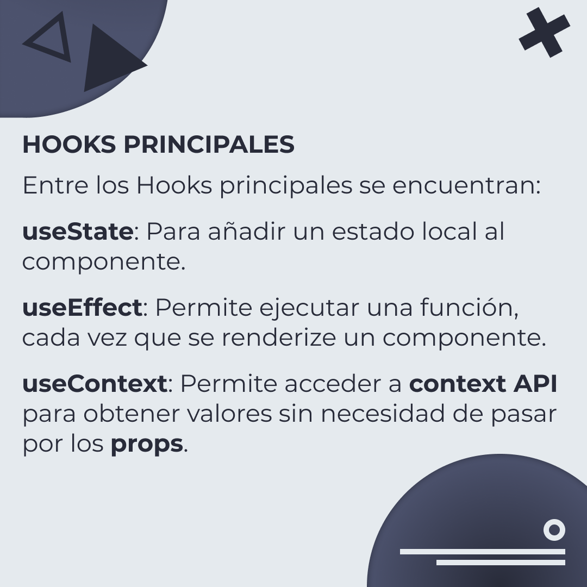

# React Hooks

Los Hooks son una característica que se incorporó en React 16.8, permiten usar
el estado y otras funciones de React sin tener que definir una clase de
JavaScript.

> Código utilizado en los ejemplos:
> [react-hooks.js](/BitSnack/react-hooks/react-hooks.js)

## 🤓 Aprende algo nuevo hoy

> Comparto los **bits** al menos una vez por semana.

Instagram: [@fili.santillan](https://www.instagram.com/fili.santillan/)  
Twitter: [@FiliSantillan](https://twitter.com/FiliSantillan)  
Facebook: [Fili Santillán](https://www.facebook.com/FiliSantillan96/)  
Sitio web: http://filisantillan.com

## 📚 Recursos

-   [Introducing Hooks](https://reactjs.org/docs/hooks-intro.html)
-   [Curso de React Avanzado](https://platzi.com/cursos/react-avanzado/)
-   [Imagen del gancho](https://www.cgtrader.com/3d-models/industrial/other/crane-hook-804d5884-f23b-40f1-a9e3-d1812a28fd8a)
