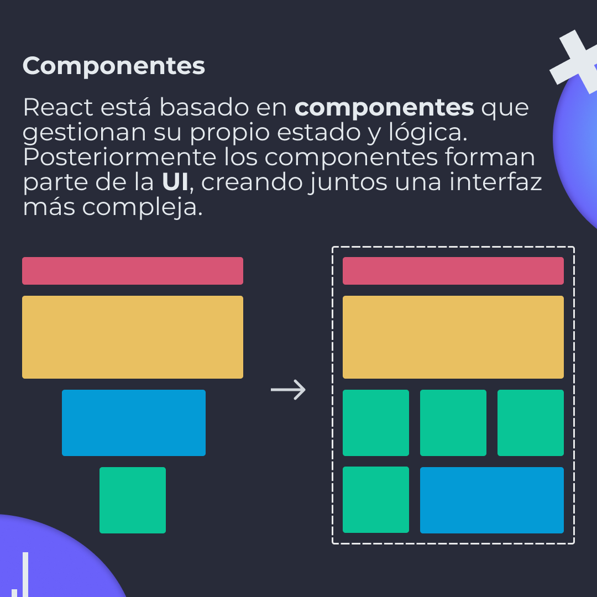
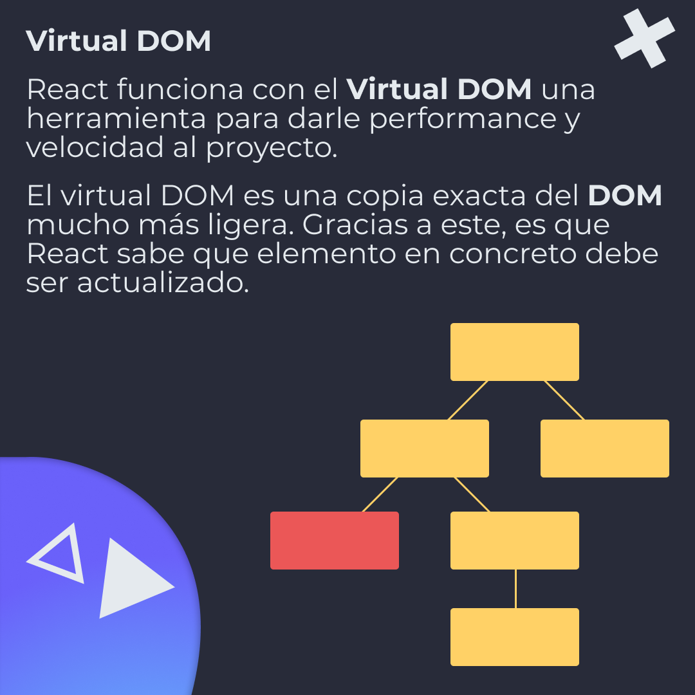
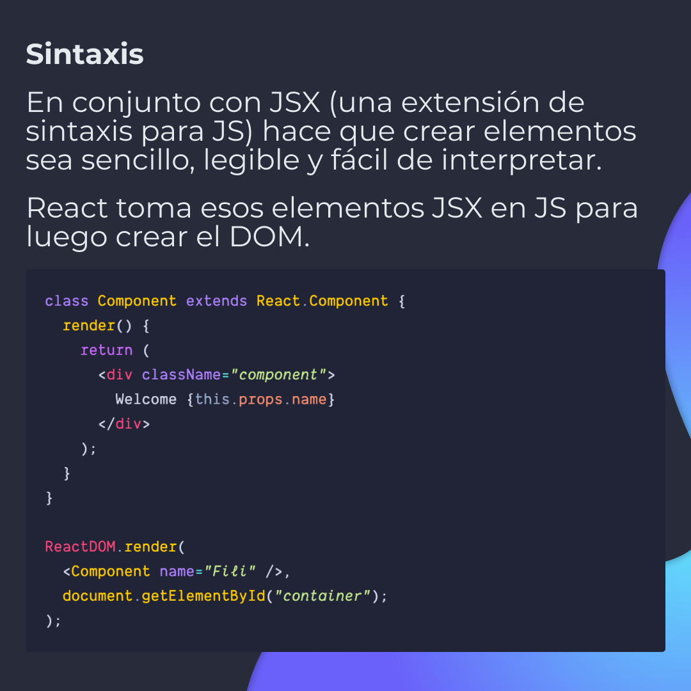

# Qué es y cómo funciona React

React es una librería de JavaScript open source creada por Facebook para construir interfaces basada en componentes.

## 🤓 Aprende algo nuevo hoy

> Comparto los **bits** al menos una vez por semana.

Instagram: [@fili.santillan](https://www.instagram.com/fili.santillan/)  
Twitter: [@FiliSantillan](https://twitter.com/FiliSantillan)  
Facebook: [Fili Santillán](https://www.facebook.com/FiliSantillan96/)  
Sitio web: http://filisantillan.com  

## 📚 Recursos

- [React Docs](https://reactjs.org/docs/getting-started.html)
