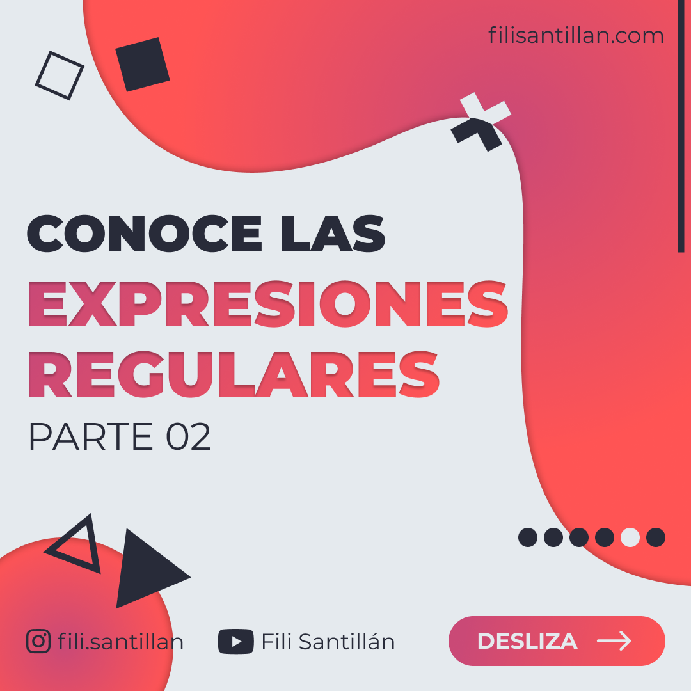

# Conoce las expresiones regulares 02

Se utilizan para hacer coincidir combinaciones de caracteres. Los patrones pueden determinar que caracteres salen o entran.

El resto del **BitSnack**, se encuentra en mis redes sociales debido a que son videos.   
Los puedes ver [aquí](https://www.instagram.com/p/CJJ5n9ogAxY/).

Puedes ver la primera parte [aquí](https://www.instagram.com/p/CI6cp15gVDt/).

Código utilizado en los ejemplos: [regExp2.txt](/BitSnack/regExp2/regExp2.md)

## 🤓 Aprende algo nuevo hoy

> Comparto los **bits** al menos una vez por semana.

Instagram: [@fili.santillan](https://www.instagram.com/fili.santillan/)  
Twitter: [@FiliSantillan](https://twitter.com/FiliSantillan)  
Facebook: [Fili Santillán](https://www.facebook.com/FiliSantillan96/)  
Sitio web: https://filisantillan.com
