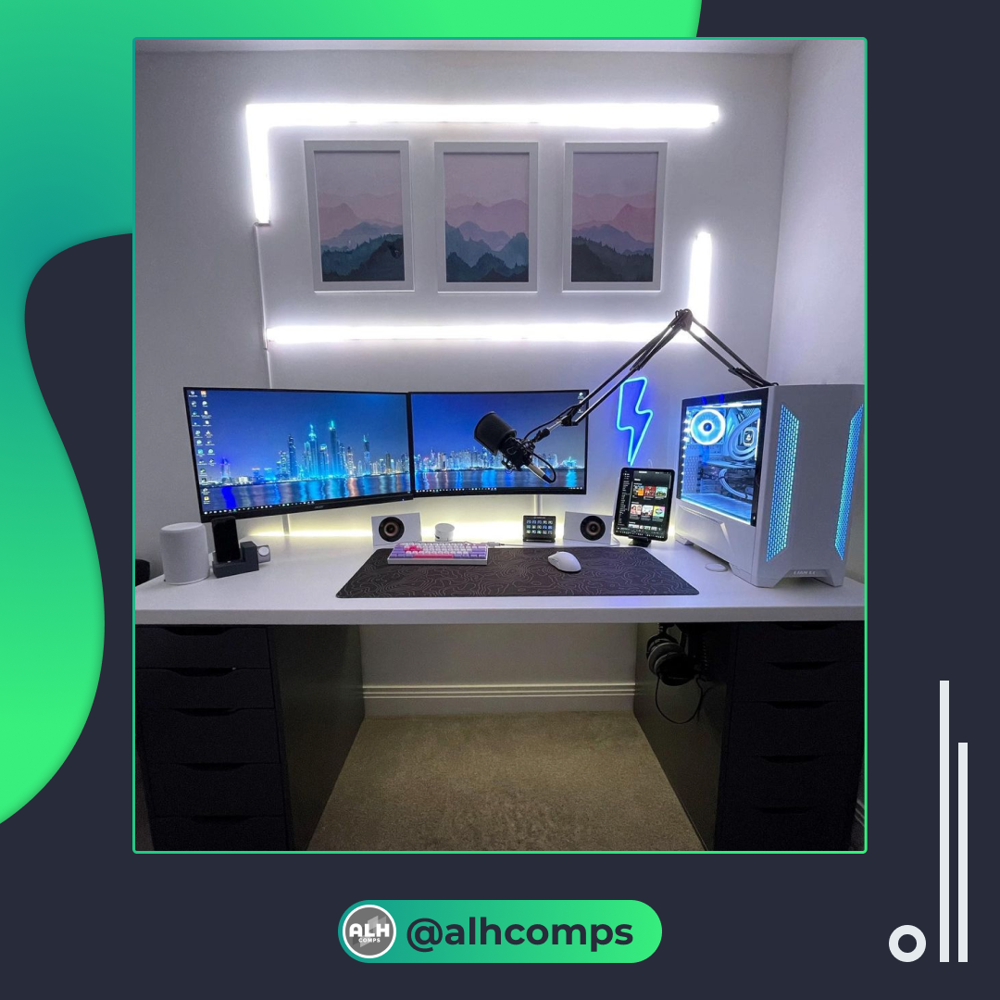
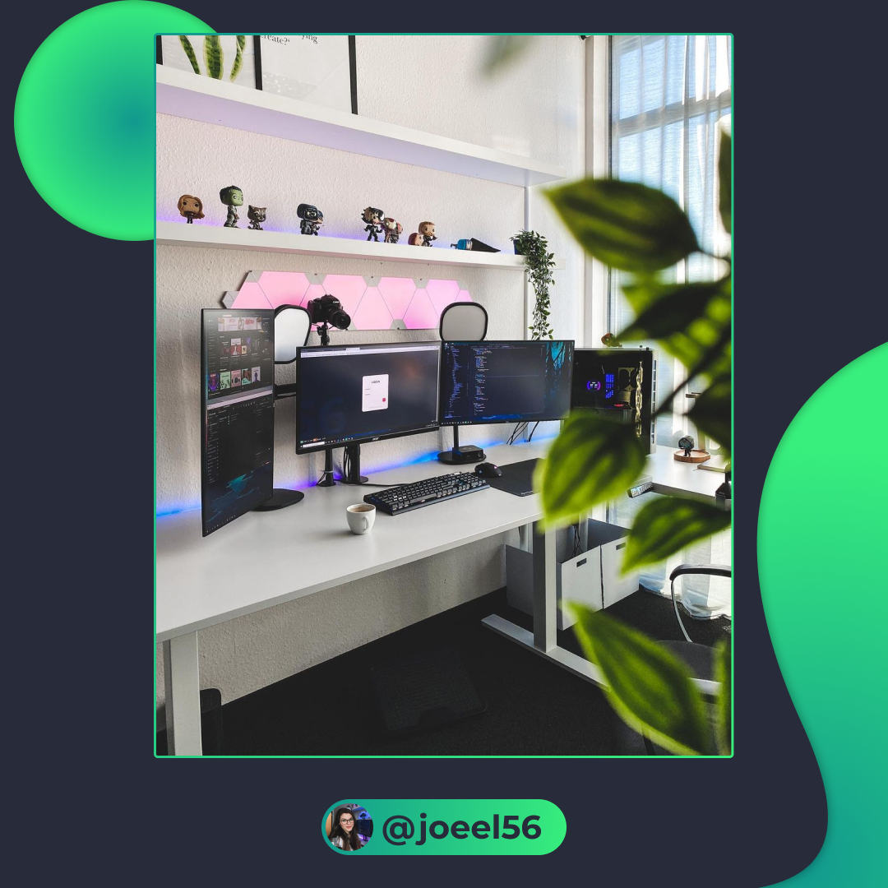
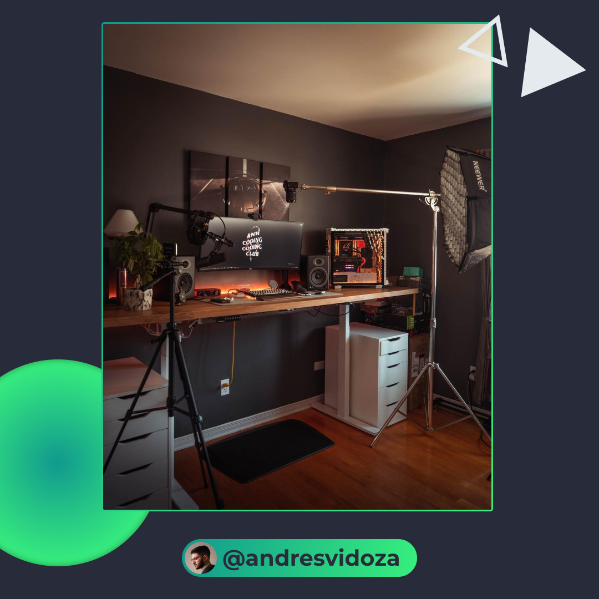
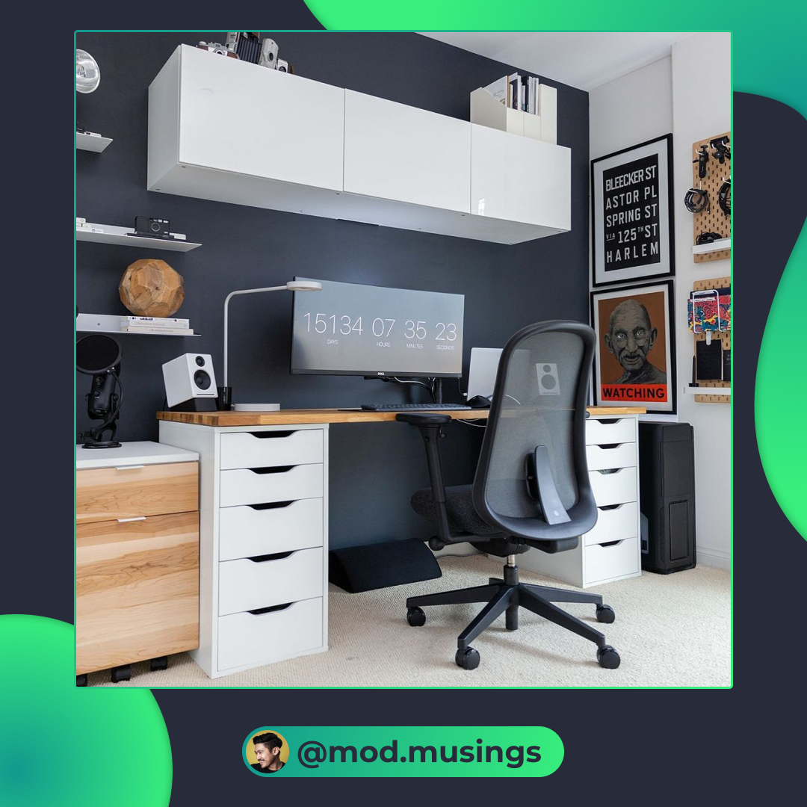
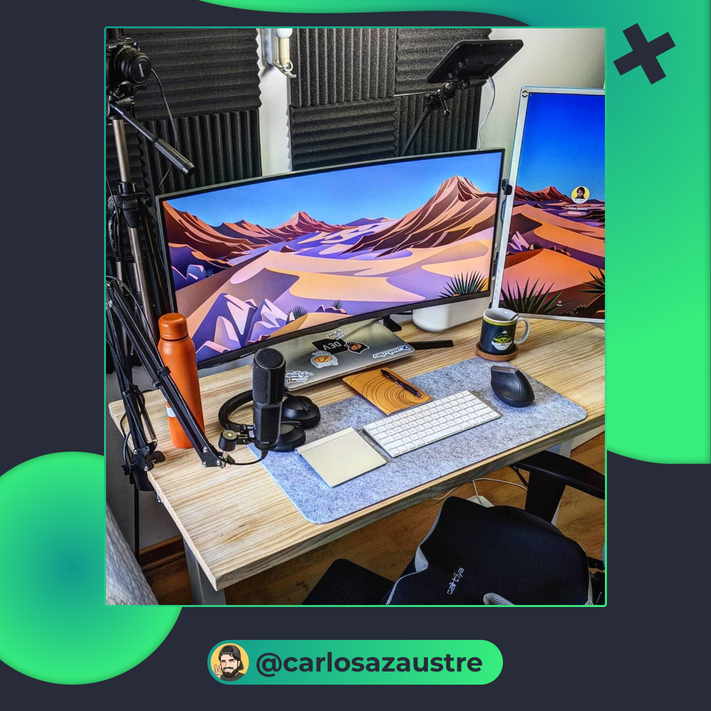
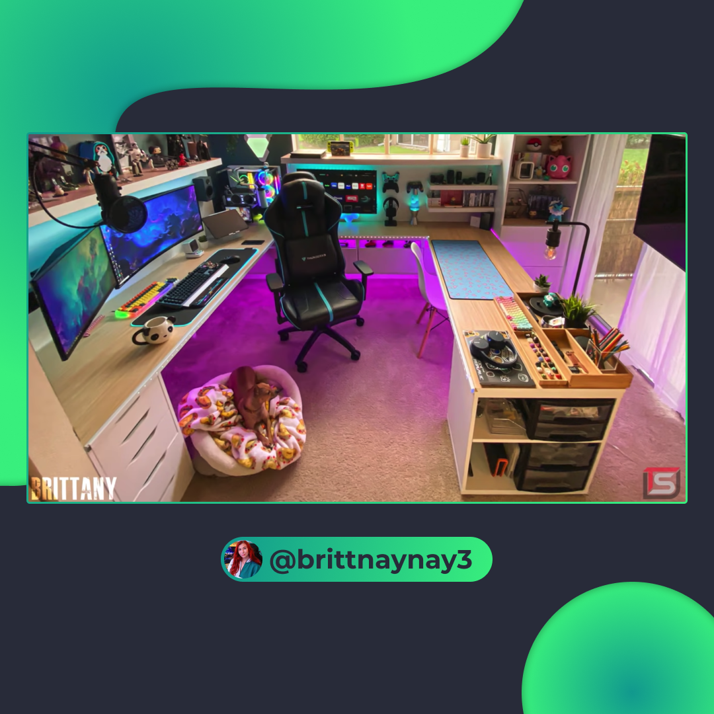

# 6 Setups increíbles e inspiradores

Una de las cosas más importantes en las que creo que se debe invertir es en el espacio de trabajo. El sentirte totalmente en paz con tu entorno es fundamental.⁠⁠

Mi recomendación es empieza por lo más económico y ve escalando poco a poco hasta llegar a tu objetivo. También podrías empezar por lo más esencial.⁠⁠

## 🤓 Aprende algo nuevo hoy

> Comparto los **bits** al menos una vez por semana.

Instagram: [@fili.santillan](https://www.instagram.com/fili.santillan/)  
Twitter: [@FiliSantillan](https://twitter.com/FiliSantillan)  
Facebook: [Fili Santillán](https://www.facebook.com/FiliSantillan96/)  
Sitio web: http://filisantillan.com
