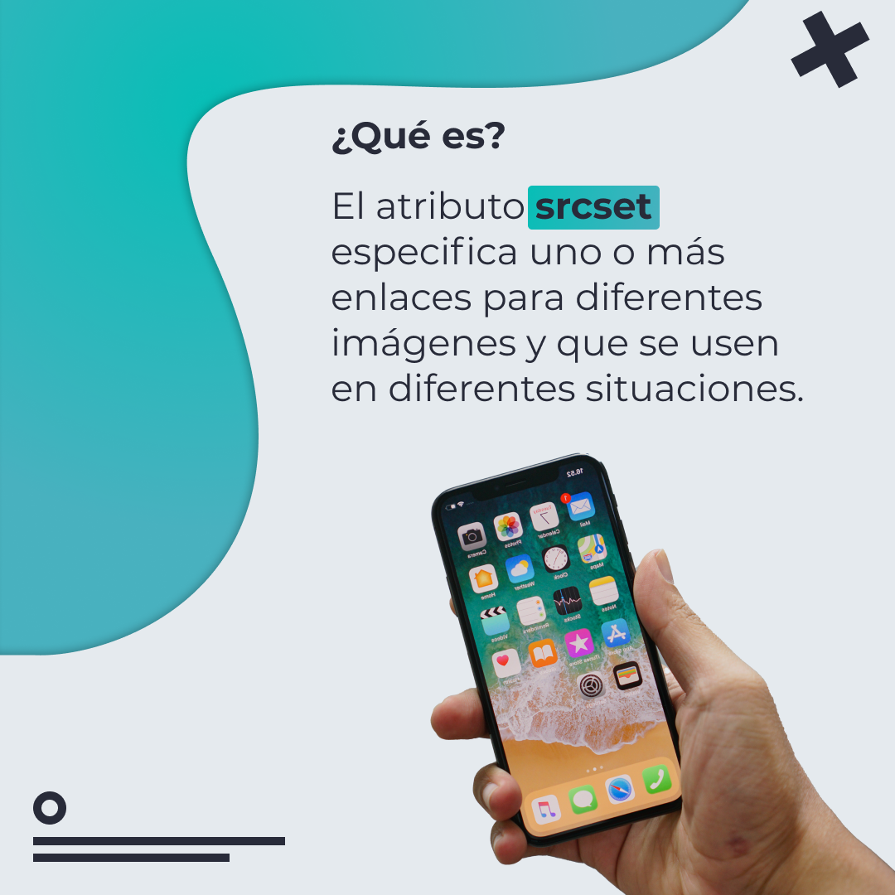
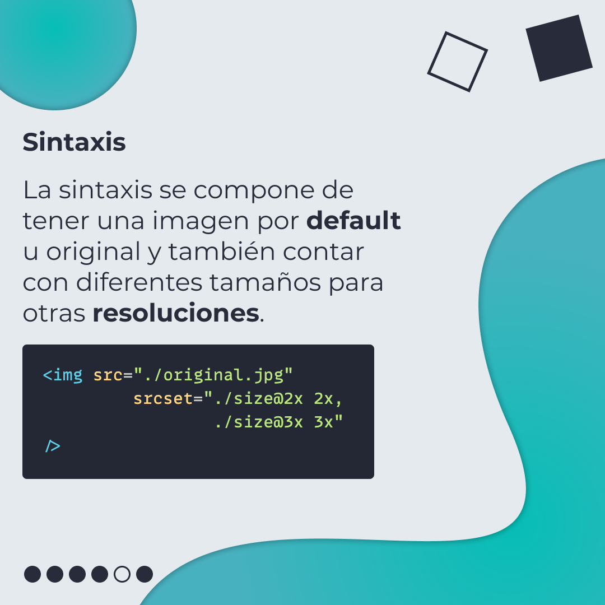
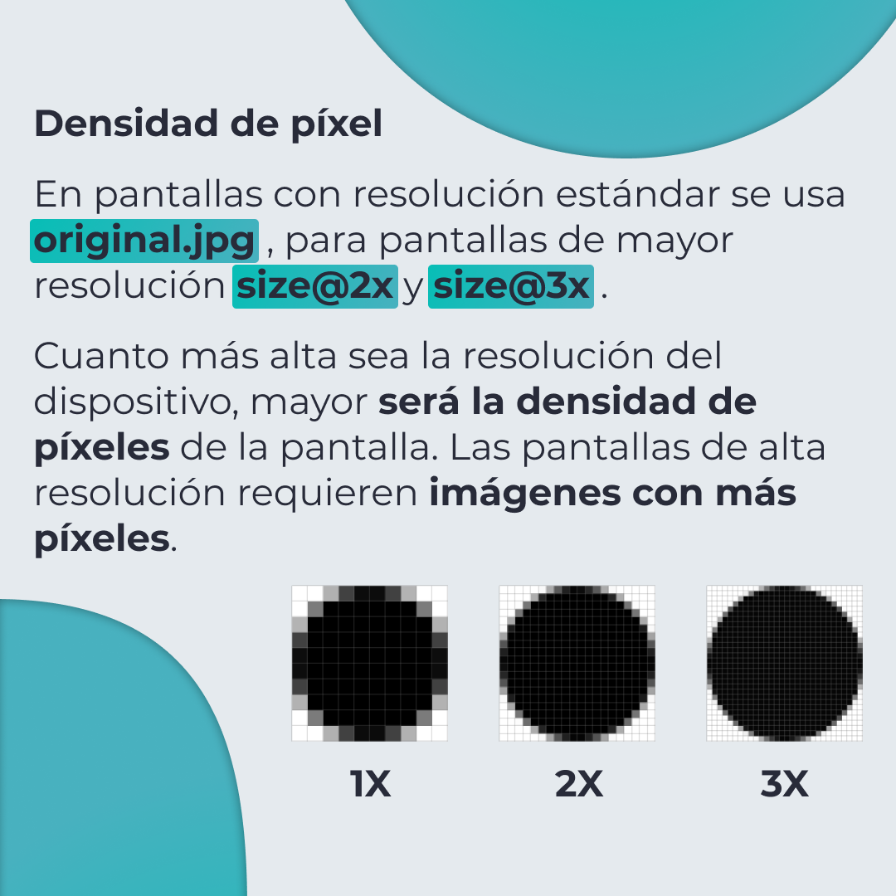
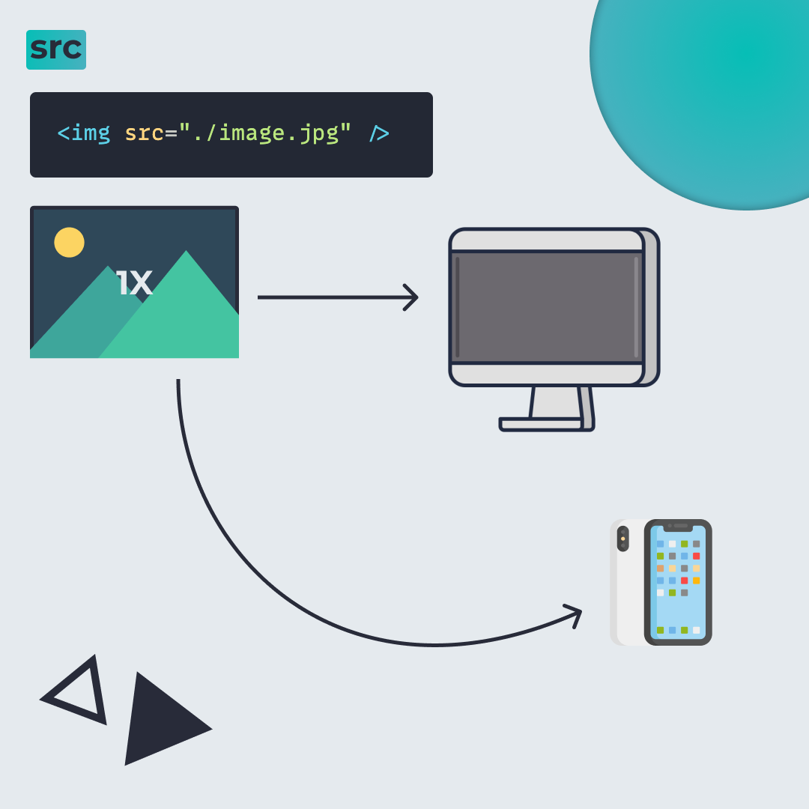
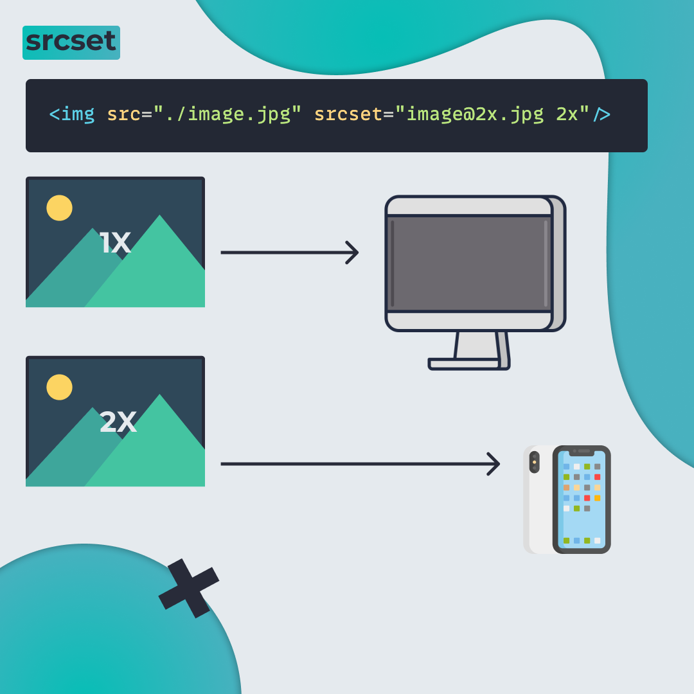
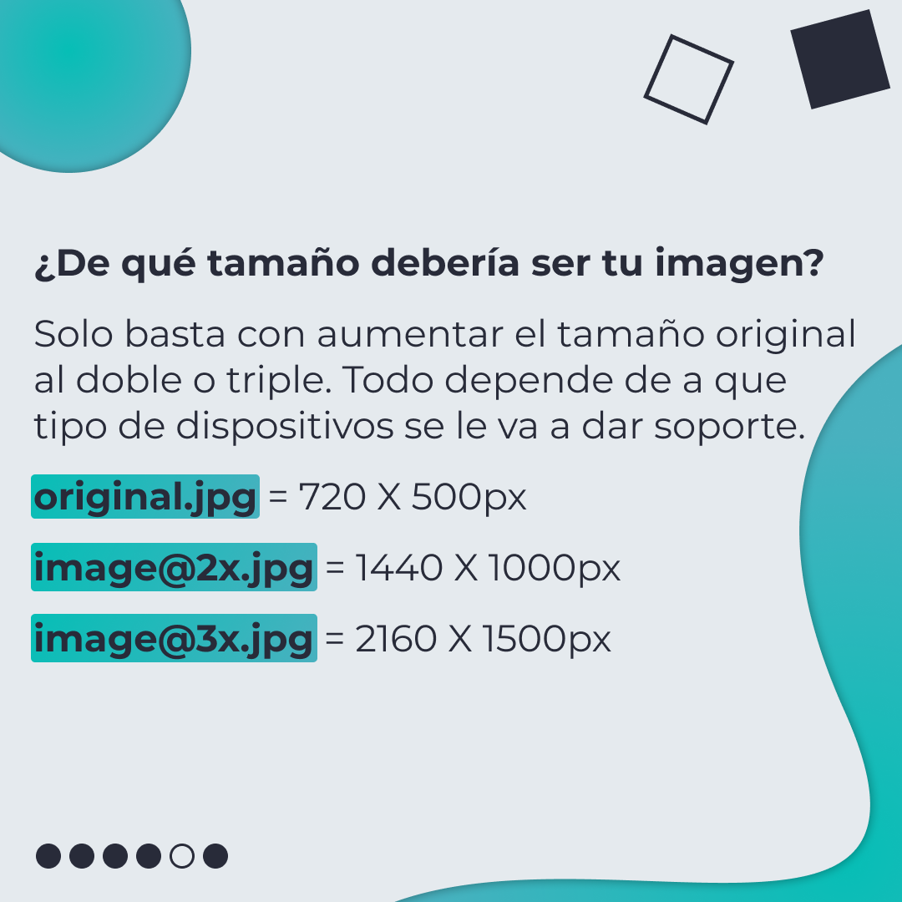
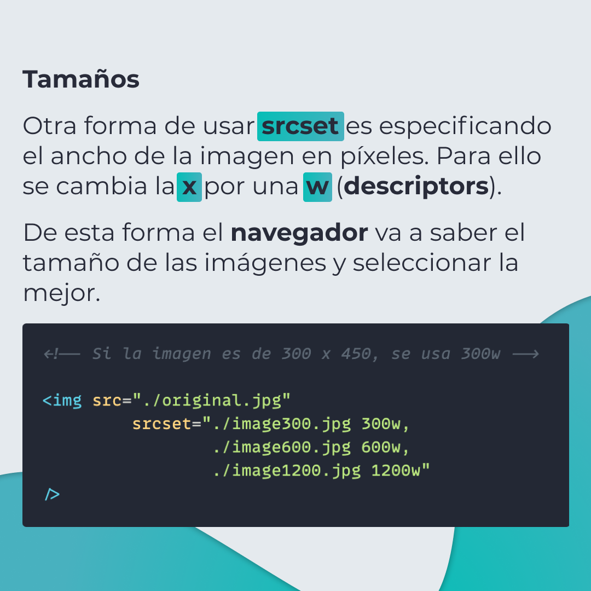

# srcset

El atributo srcset especifica uno o más enlaces para diferentes imágenes y que se usen en diferentes situaciones.

> Código utilizado en los ejemplos: [srcset.html](/BitSnack/srcset/srcset.html)

## 🤓 Aprende algo nuevo hoy

> Comparto los **bits** al menos una vez por semana.

Instagram: [@fili.santillan](https://www.instagram.com/fili.santillan/)  
Twitter: [@FiliSantillan](https://twitter.com/FiliSantillan)  
Facebook: [Fili Santillán](https://www.facebook.com/FiliSantillan96/)  
Sitio web: http://filisantillan.com

## 📚 Recursos

- [Mejorando la carga de un sitio web: Imágenes vs. velocidad](https://filisantillan.com/blog/mejorando-la-carga-de-un-sitio-web-imagenes-vs-velocidad/#im-genes-con-html)
- [img: The Image Embed element](https://developer.mozilla.org/en-US/docs/Web/HTML/Element/img)
-   [What Img Srcset Does In HTML5: A Quick & Simple Guide](https://html.com/attributes/img-srcset/)
-   [A Guide to the Responsive Images Syntax in HTML](https://css-tricks.com/a-guide-to-the-responsive-images-syntax-in-html/)
-   [background-blend-mode CSS-Tricks](https://css-tricks.com/almanac/properties/b/background-blend-mode/)
-   [Icono de imagen: DinosoftLabs](https://www.flaticon.com/free-icon/picture_714990?term=image&page=2&position=19&related_item_id=714990)
-   [Icono de macbook: Flat Icons](https://www.flaticon.com/authors/flat-icons)
-   [Icono de iphone: Freepik](https://www.flaticon.com/authors/freepik)
-   [Imagen del iphone por Bagus Hernawan](https://unsplash.com/photos/A6JxK37IlPo)
