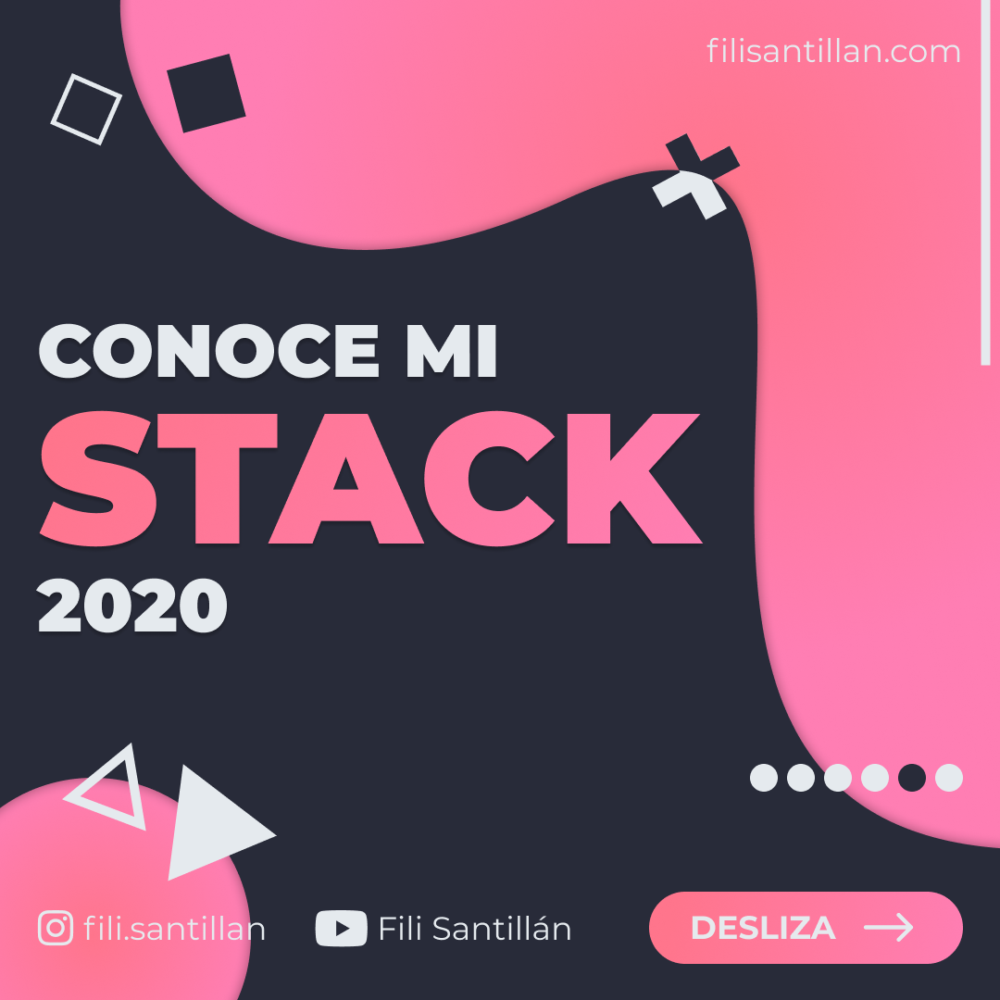
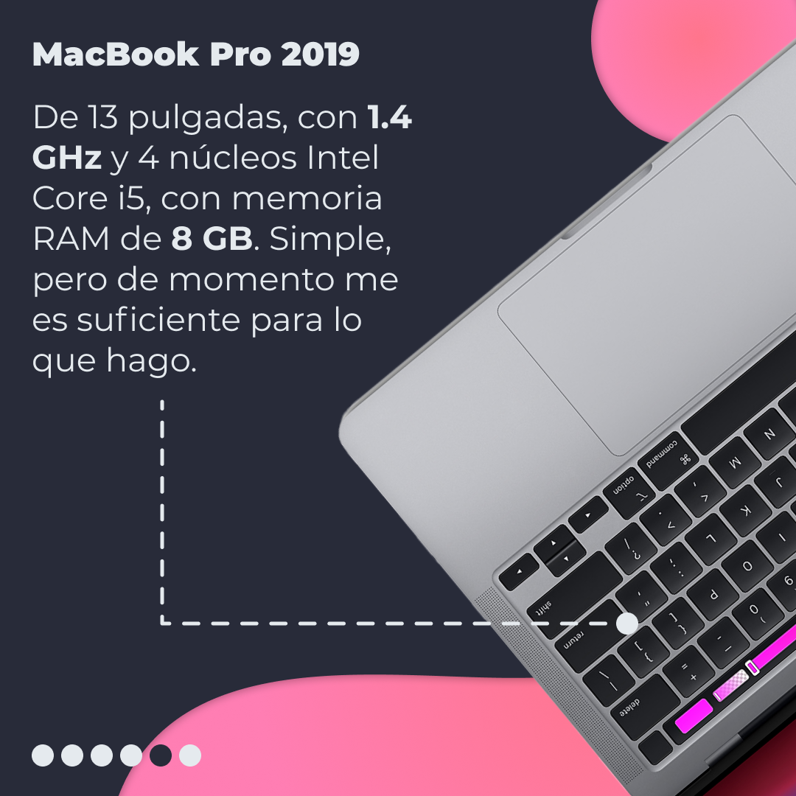
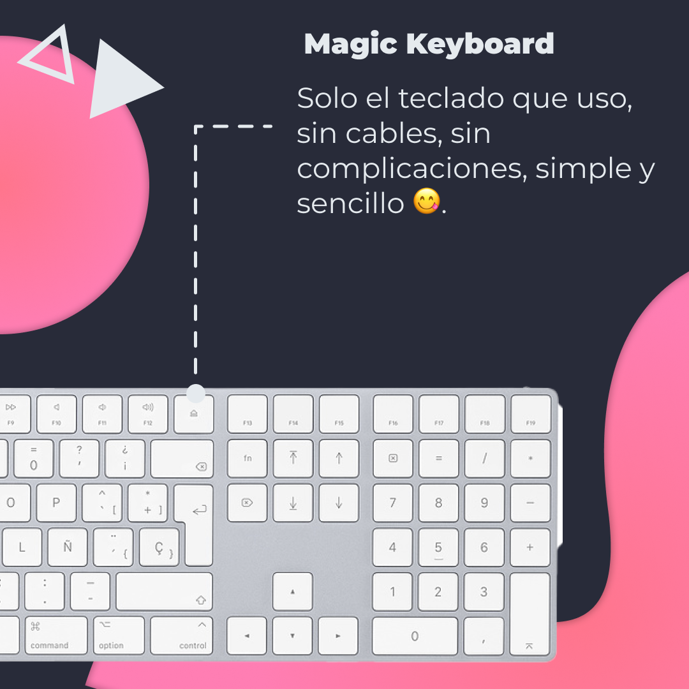
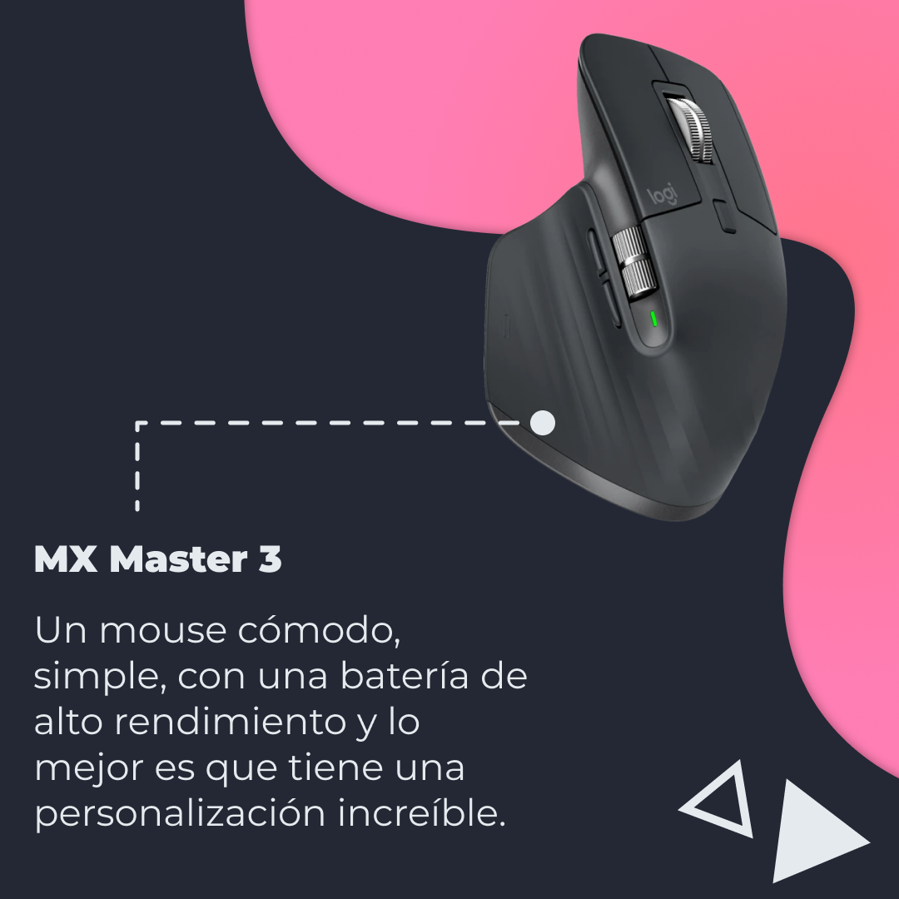
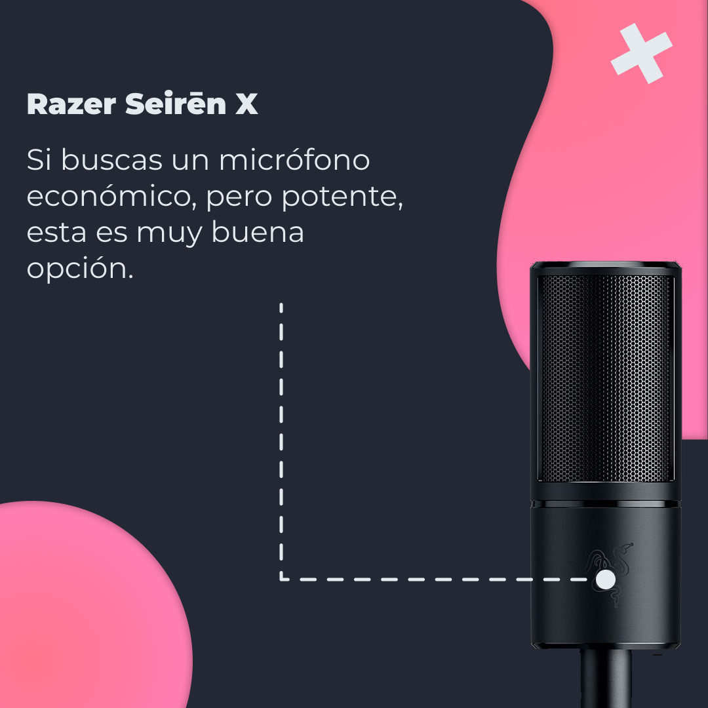
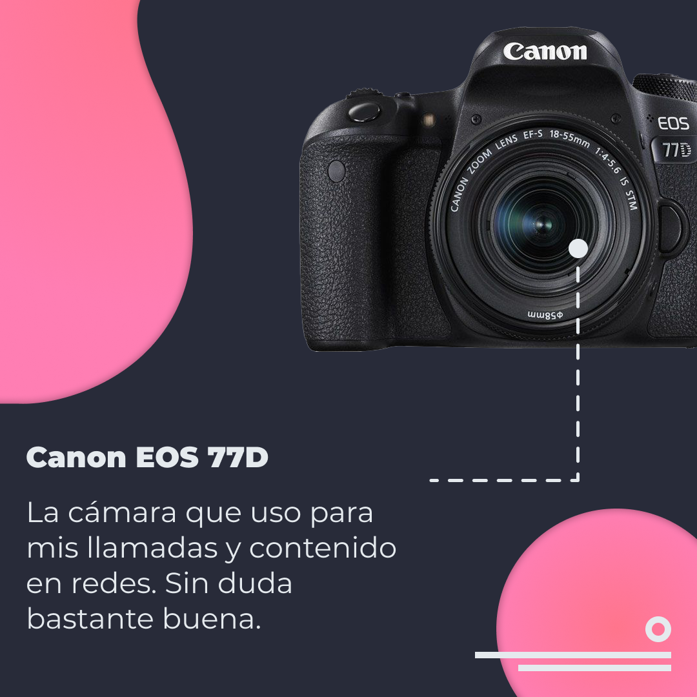
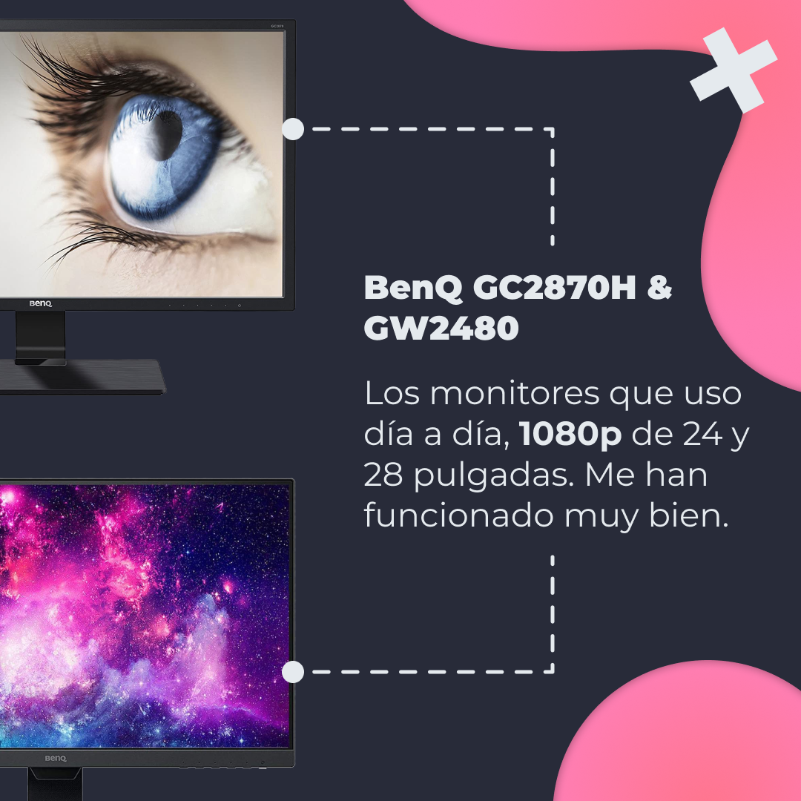

# Conoce mi Stack 2020

Hola, soy Fili. Desarrollador Frontend y hoy quiero enseñarte mi Hardware Stack con el que trabajo todos los días.

<!-- > Código utilizado en los ejemplos: [srcset.html](/BitSnack/srcset/srcset.html) -->

## 🤓 Aprende algo nuevo hoy

> Comparto los **bits** al menos una vez por semana.

Instagram: [@fili.santillan](https://www.instagram.com/fili.santillan/)  
Twitter: [@FiliSantillan](https://twitter.com/FiliSantillan)  
Facebook: [Fili Santillán](https://www.facebook.com/FiliSantillan96/)  
Sitio web: http://filisantillan.com

## 📚 Recursos

- [Fili Santillán Stack](https://filisantillan.com/stack)
