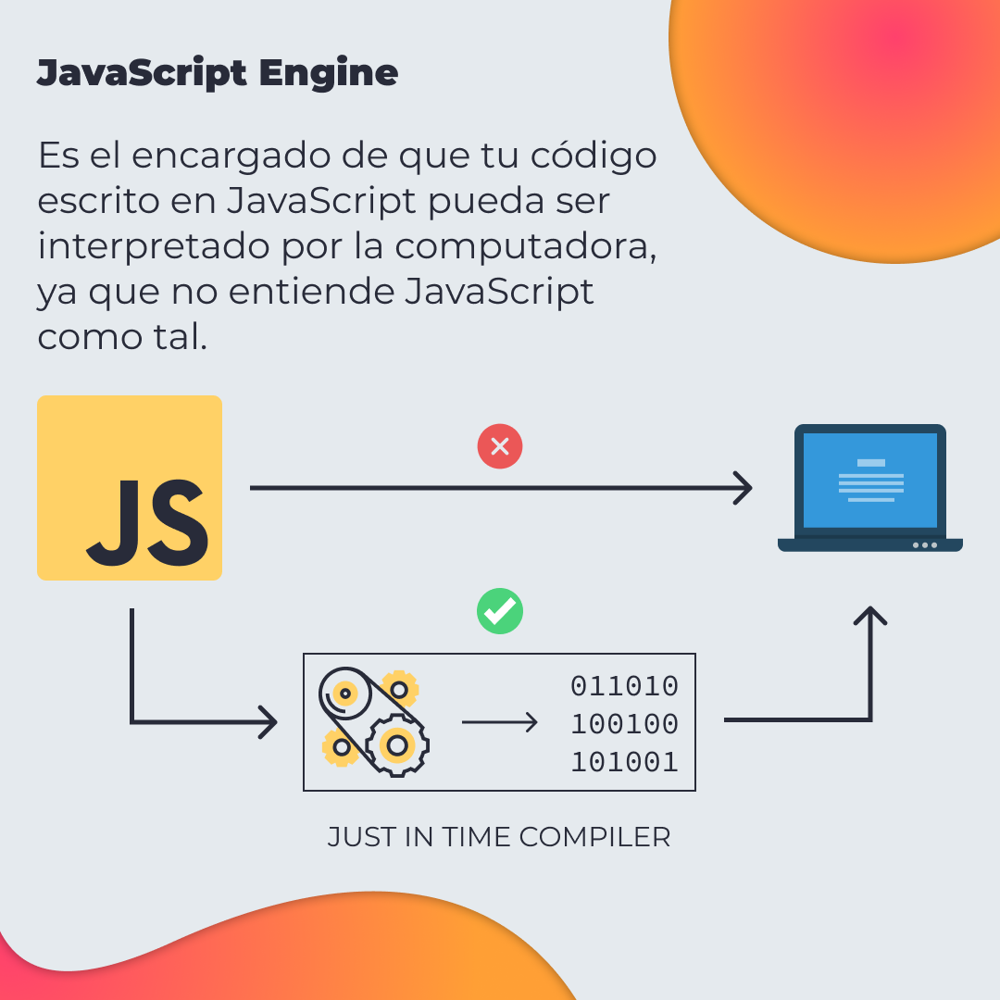
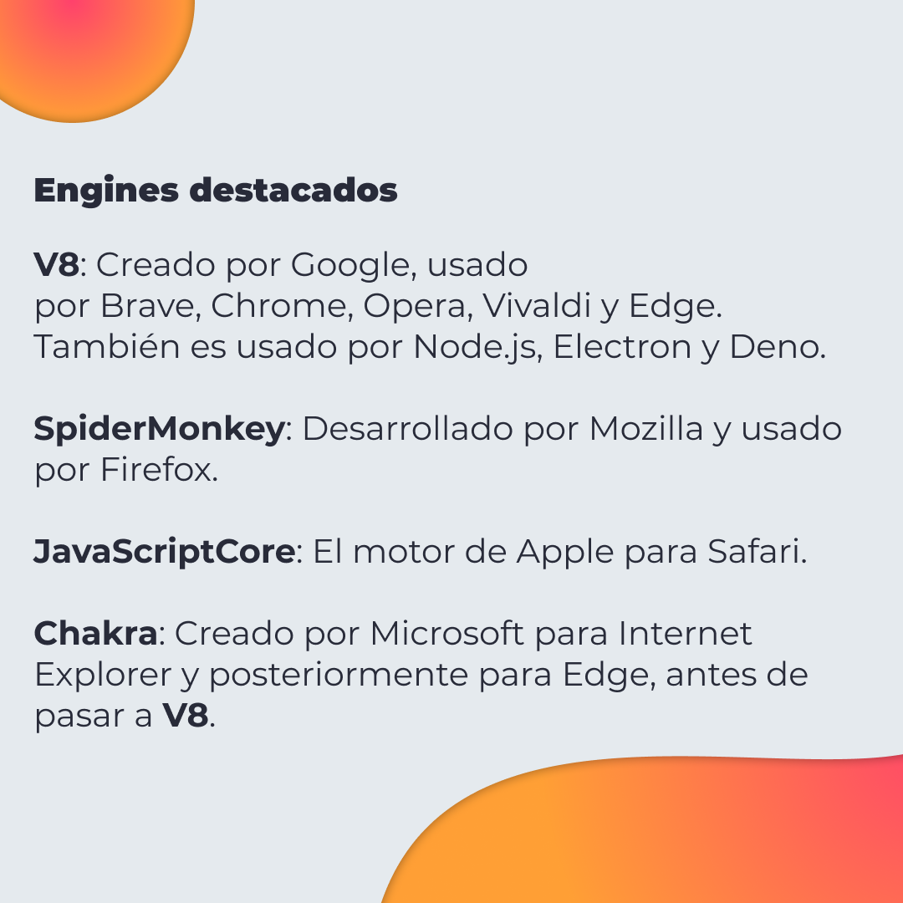
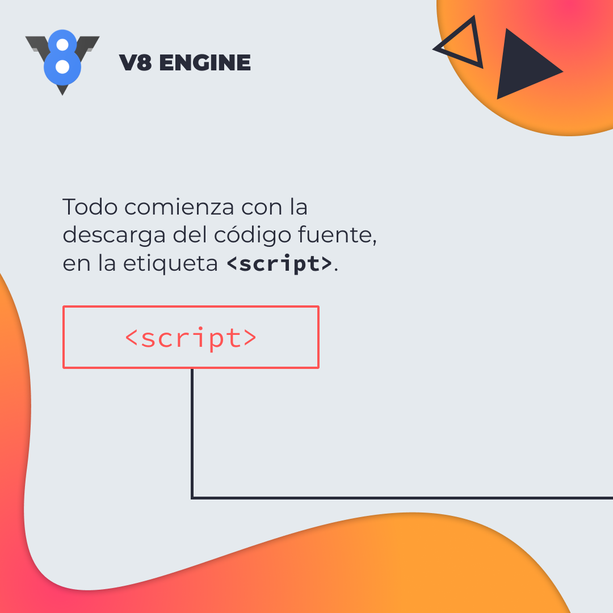
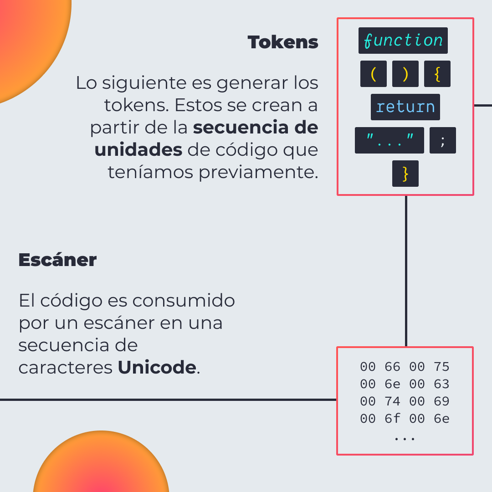
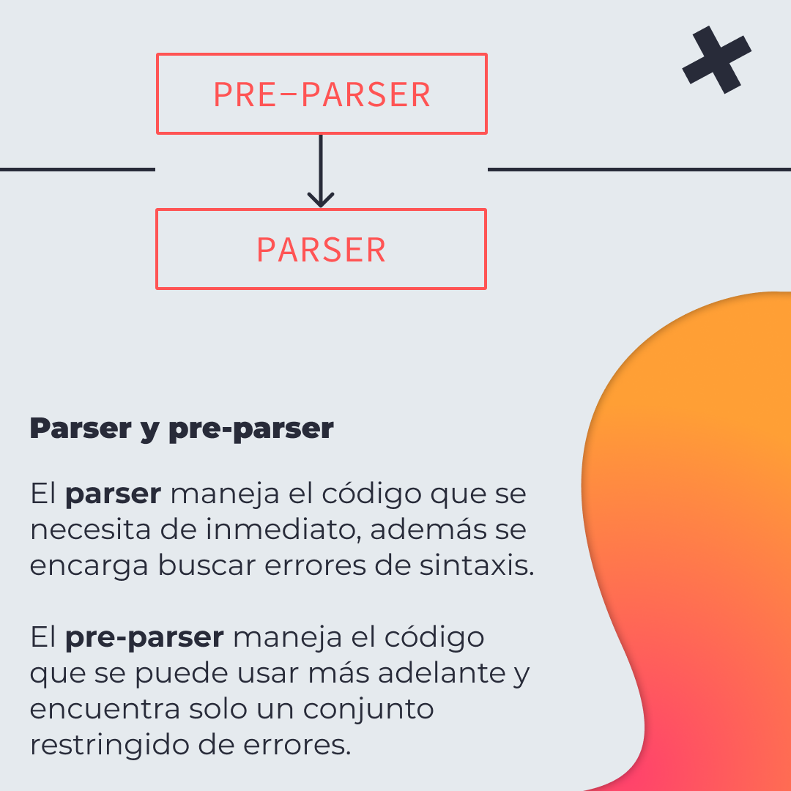
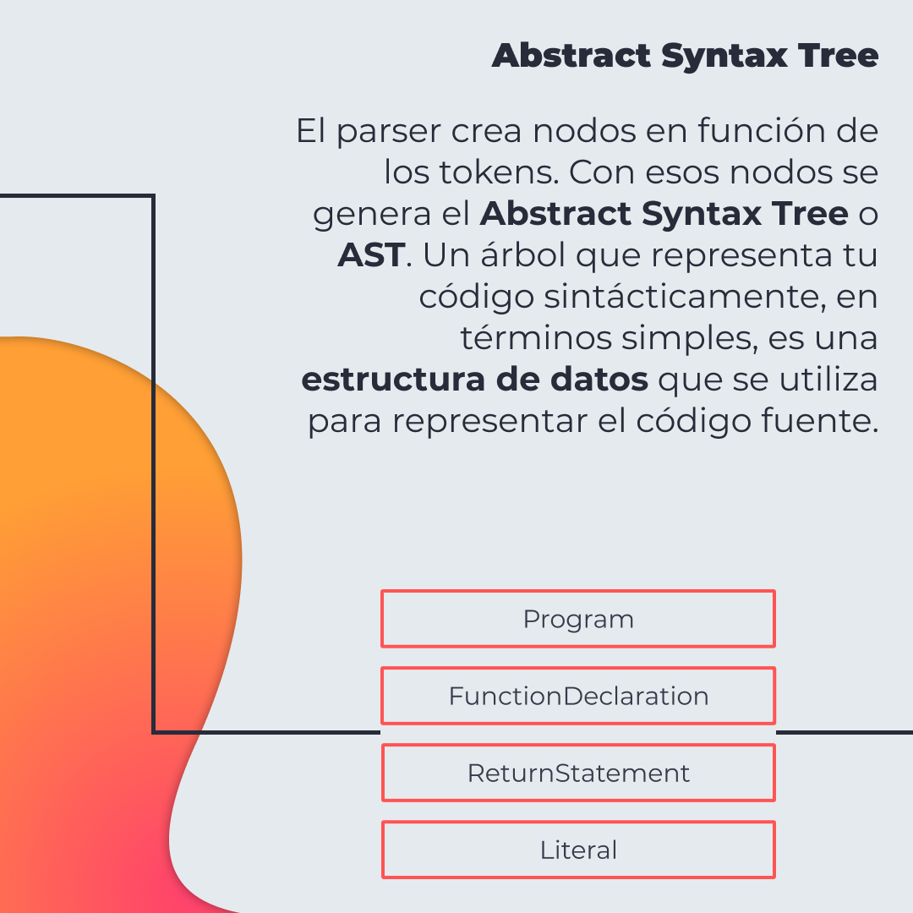
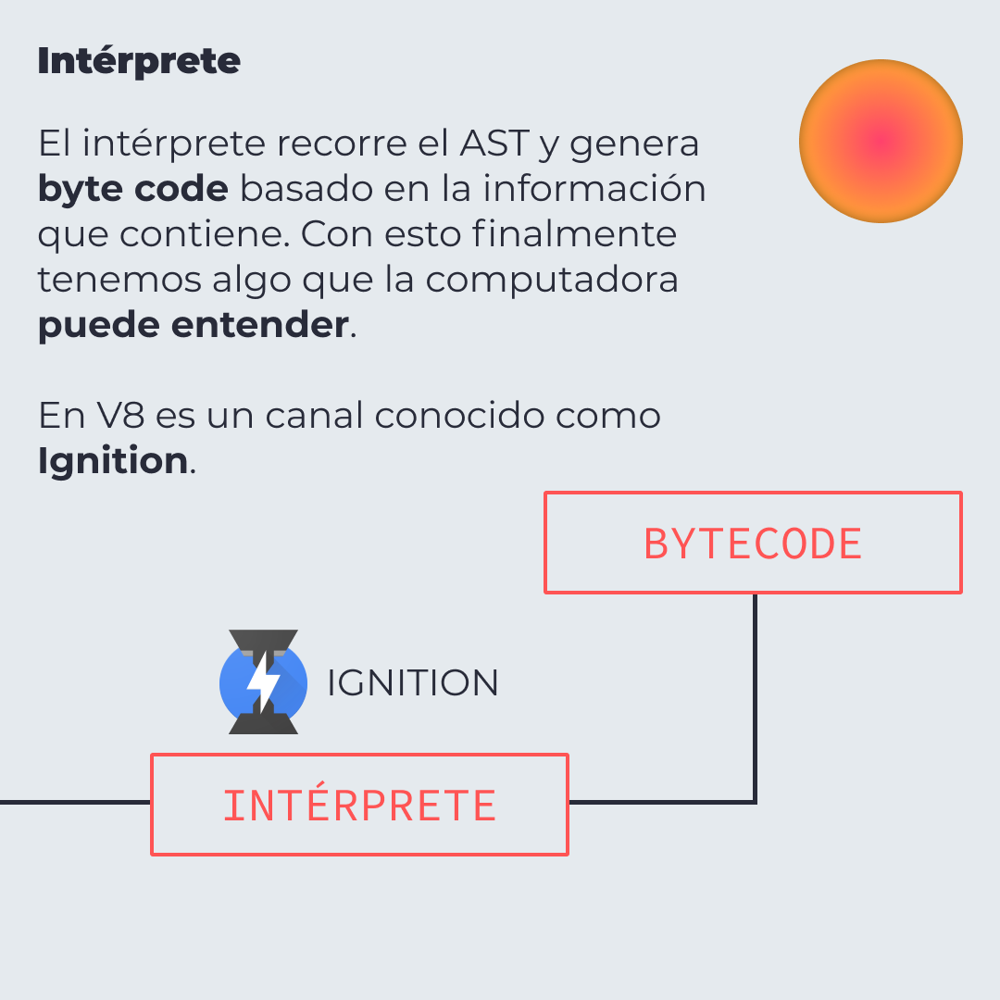
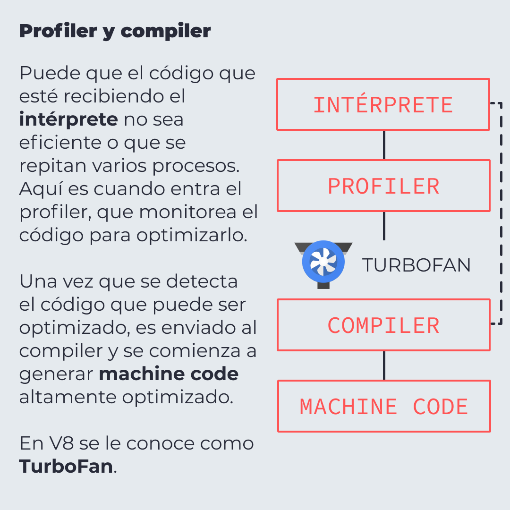

# V8 y el JavaScript Engine

🤔 Te has preguntado alguna vez ¿Cómo es que JavaScript se ejecuta?, ¿Cómo es que tu computadora logra entender el código que escribes?

## 🤓 Aprende algo nuevo hoy

> Comparto los **bits** al menos una vez por semana.

Instagram: [@fili.santillan](https://www.instagram.com/fili.santillan/)  
Twitter: [@FiliSantillan](https://twitter.com/FiliSantillan)  
Facebook: [Fili Santillán](https://www.facebook.com/FiliSantillan96/)  
Sitio web: http://filisantillan.com

## Recursos

- [Rompiendo JavaScript: V8 y el JavaScript Engine](https://filisantillan.com/blog/js-engine/)
