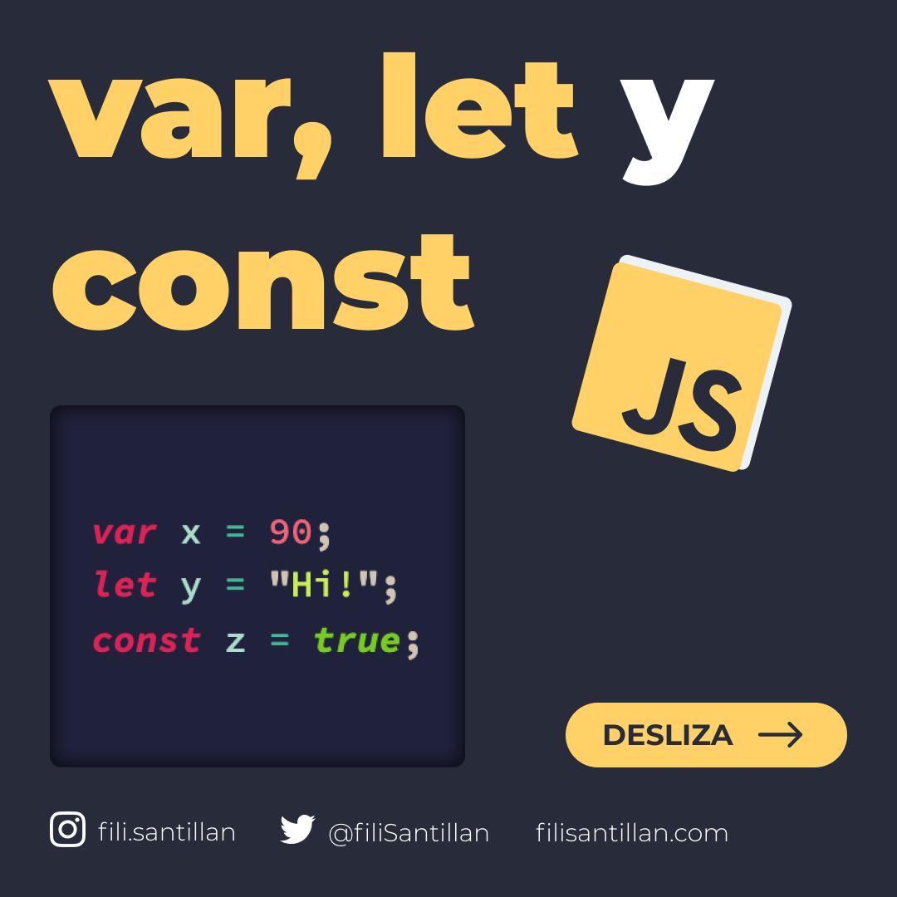
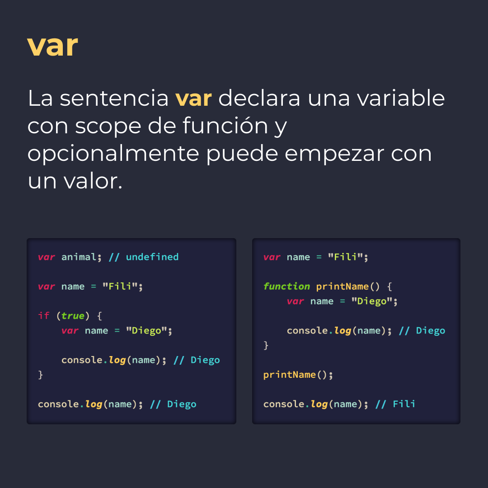
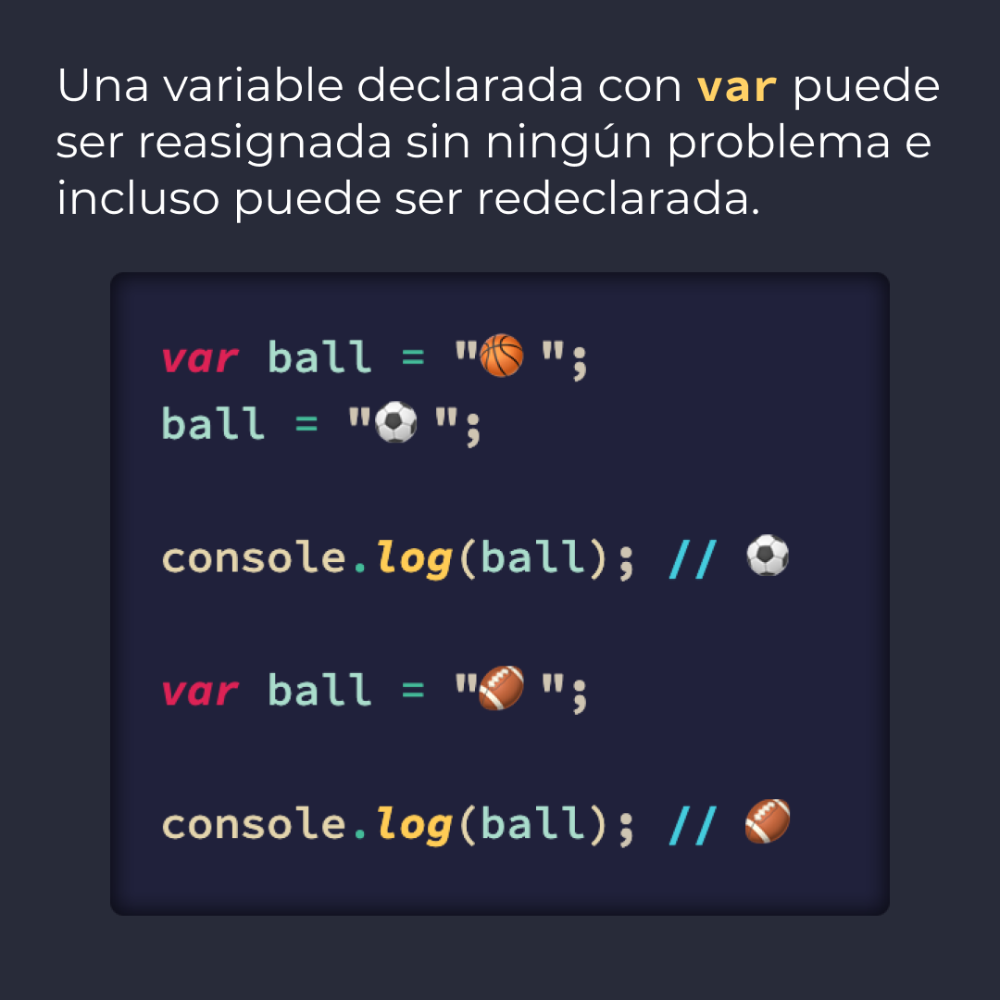
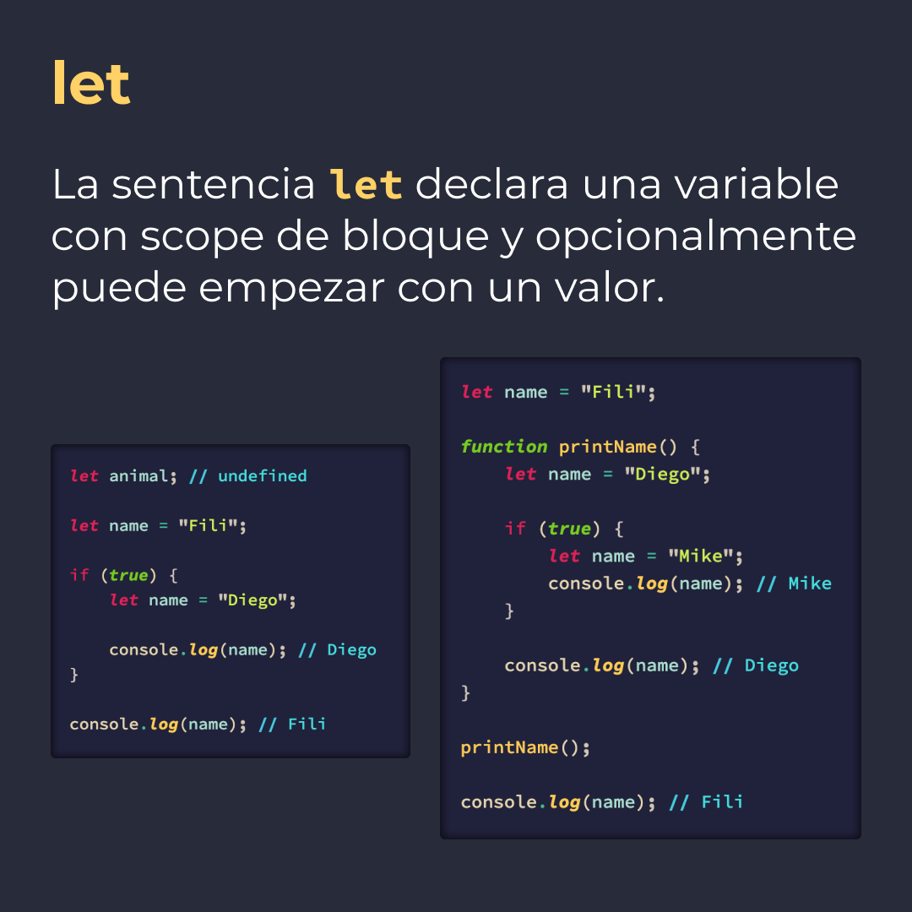
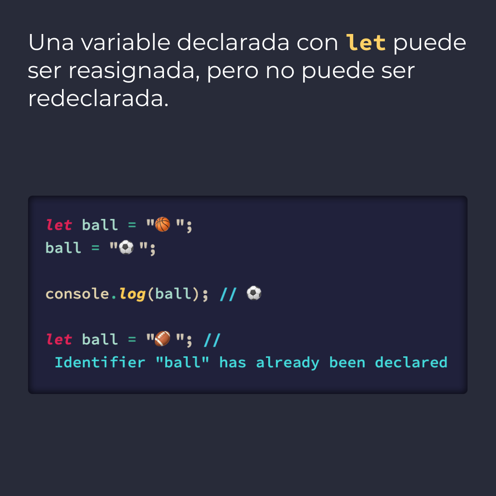
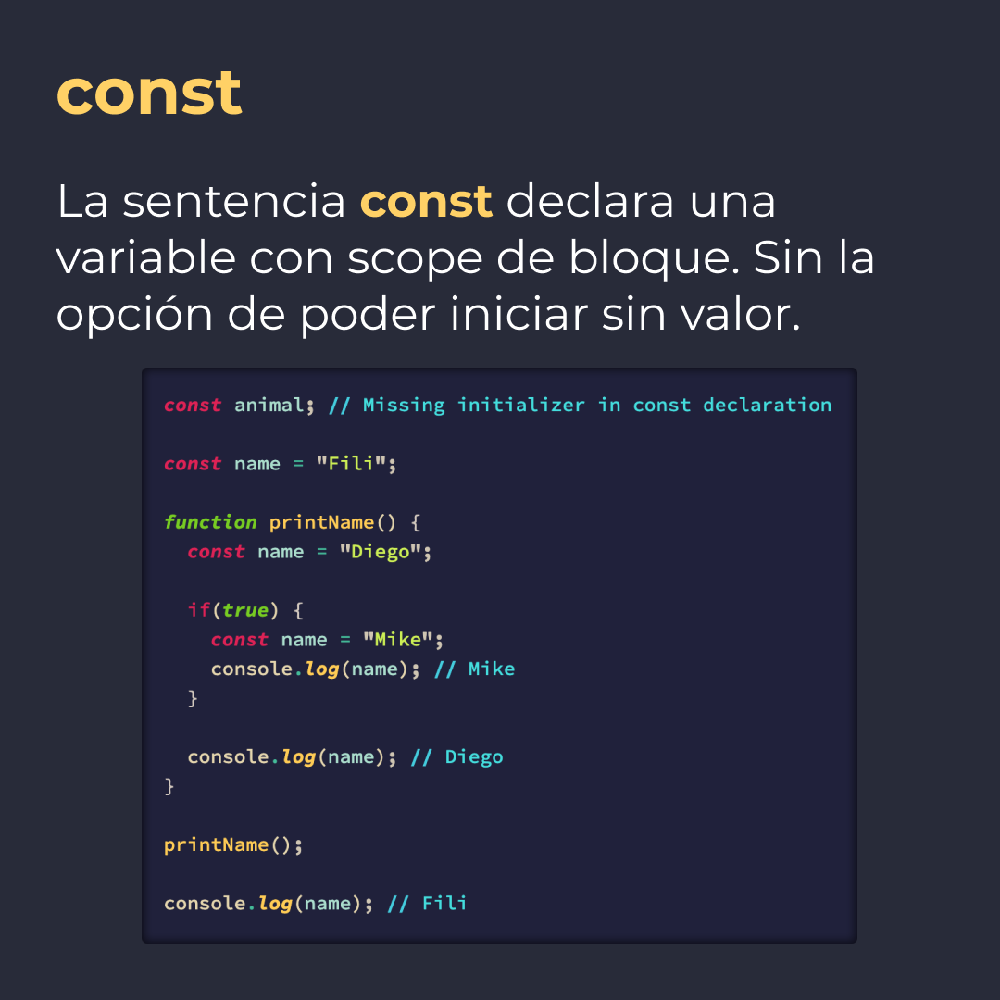
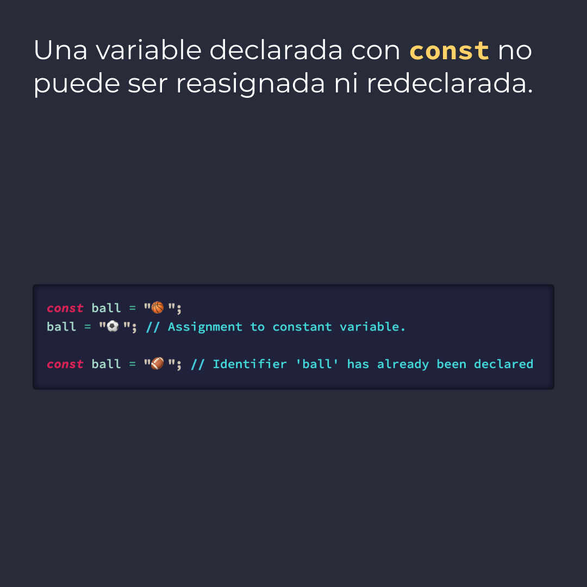

# `var`, `let` y `const`

La sentencia `var` declara una variable con scope de función y opcionalmente puede empezar con un valor.

La sentencia `let` declara una variable con scope de bloque y opcionalmente puede empezar con un valor.

La sentencia `const` declara una variable con scope de bloque. Sin la opción de poder iniciar sin valor.

> Código utilizado en los ejemplos: [let-var-const.js](/BitSnack/var-let-const/var-let-const.js)

## 🤓 Aprende algo nuevo hoy

> Comparto **bits** al menos una vez por semana.

Instagram: [@fili.santillan](https://www.instagram.com/fili.santillan/)  
Twitter: [@FiliSantillan](https://twitter.com/FiliSantillan)  
Facebook: [Fili Santillán](https://www.facebook.com/FiliSantillan96/)  
Sitio web: https://filisantillan.com

## 📚 Recursos

-   [MDN var](https://developer.mozilla.org/en-US/docs/Web/JavaScript/Reference/Statements/var)
-   [MDN let](https://developer.mozilla.org/en-US/docs/Web/JavaScript/Reference/Statements/let)
-   [MDN const](https://developer.mozilla.org/en-US/docs/Web/JavaScript/Reference/Statements/const)
-   [Var vs LET vs CONST](https://www.youtube.com/watch?v=ojrvxYcKeYg)
