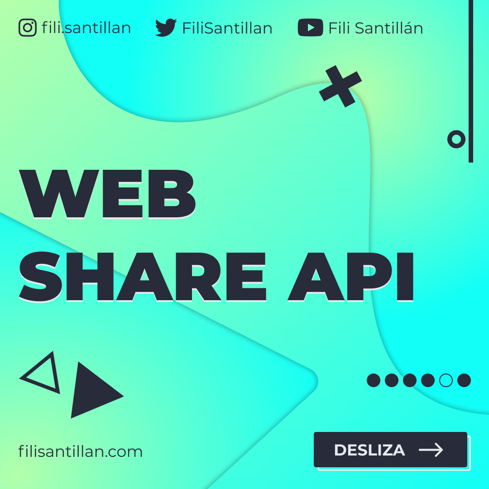
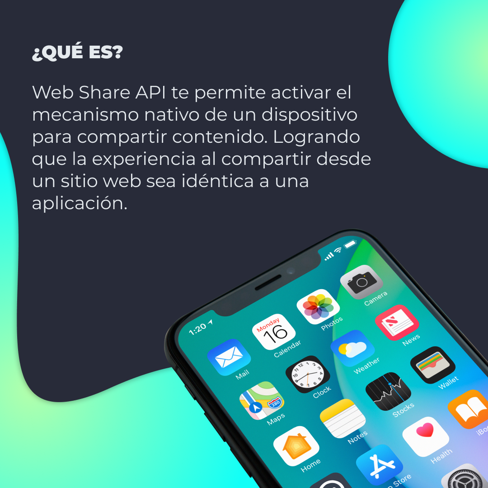
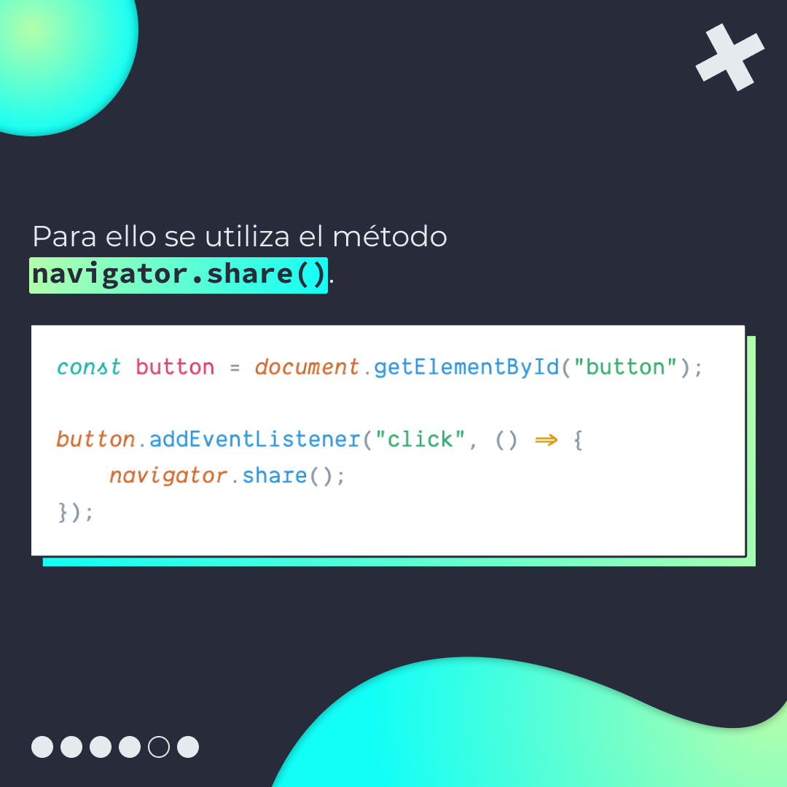
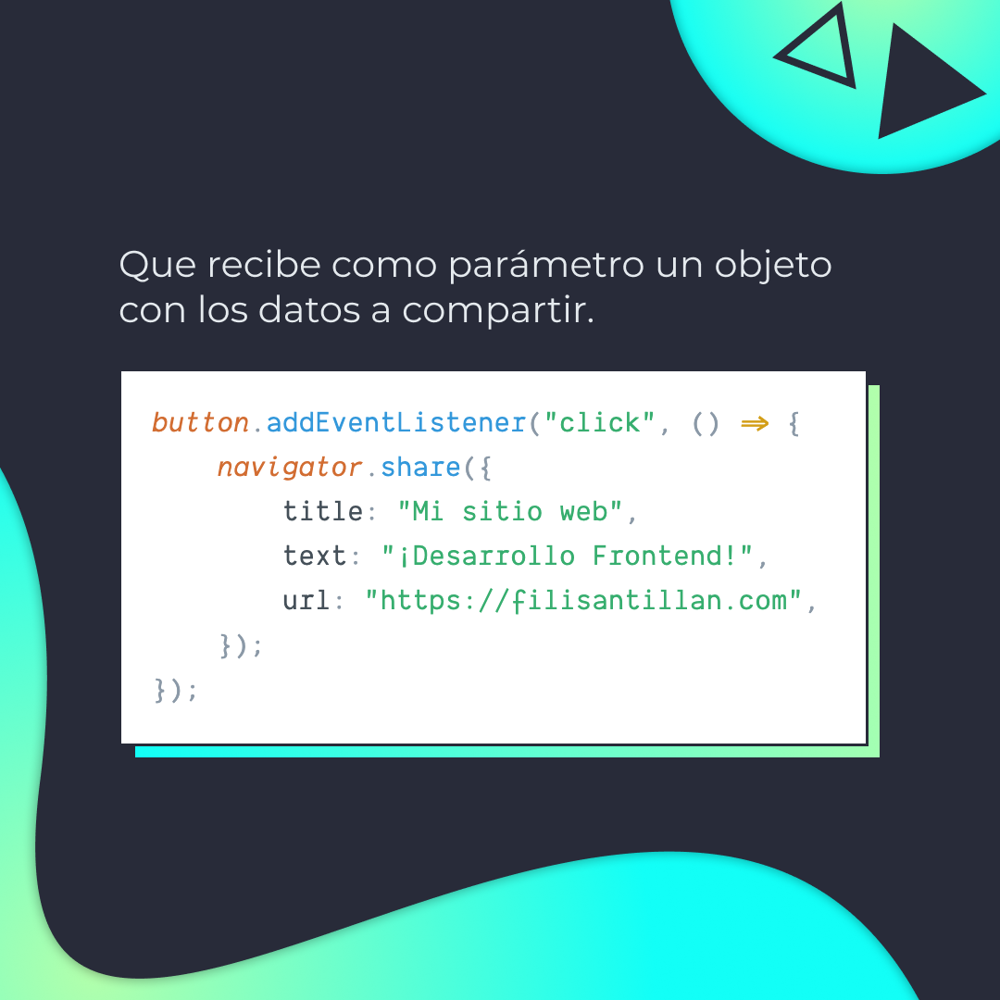
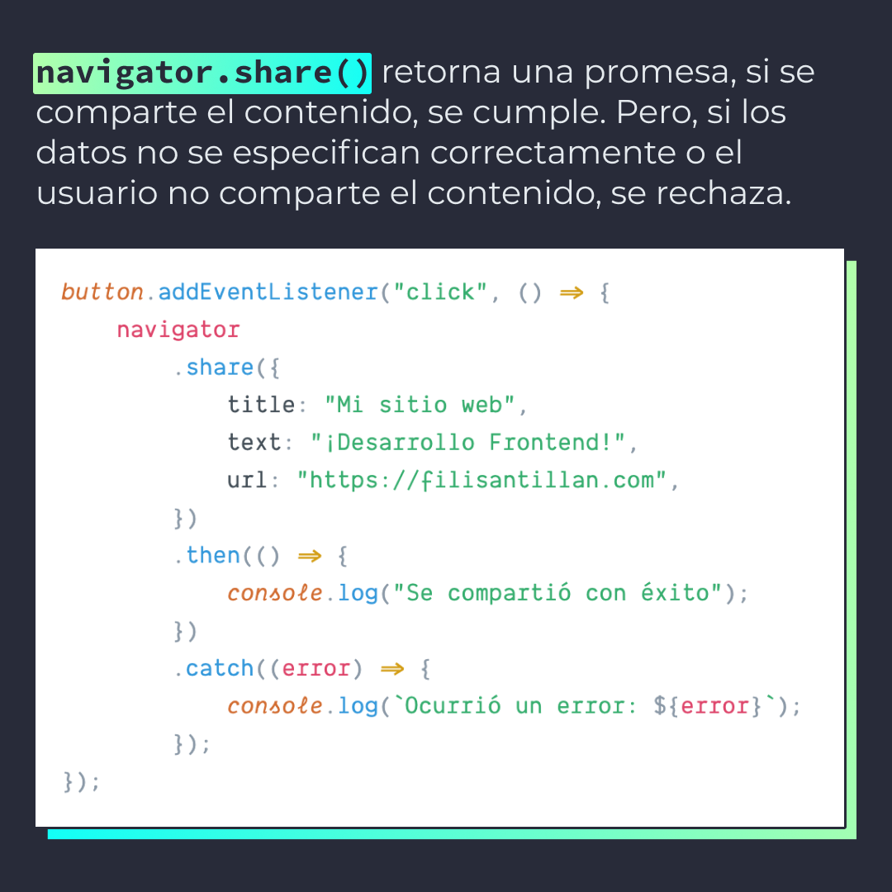
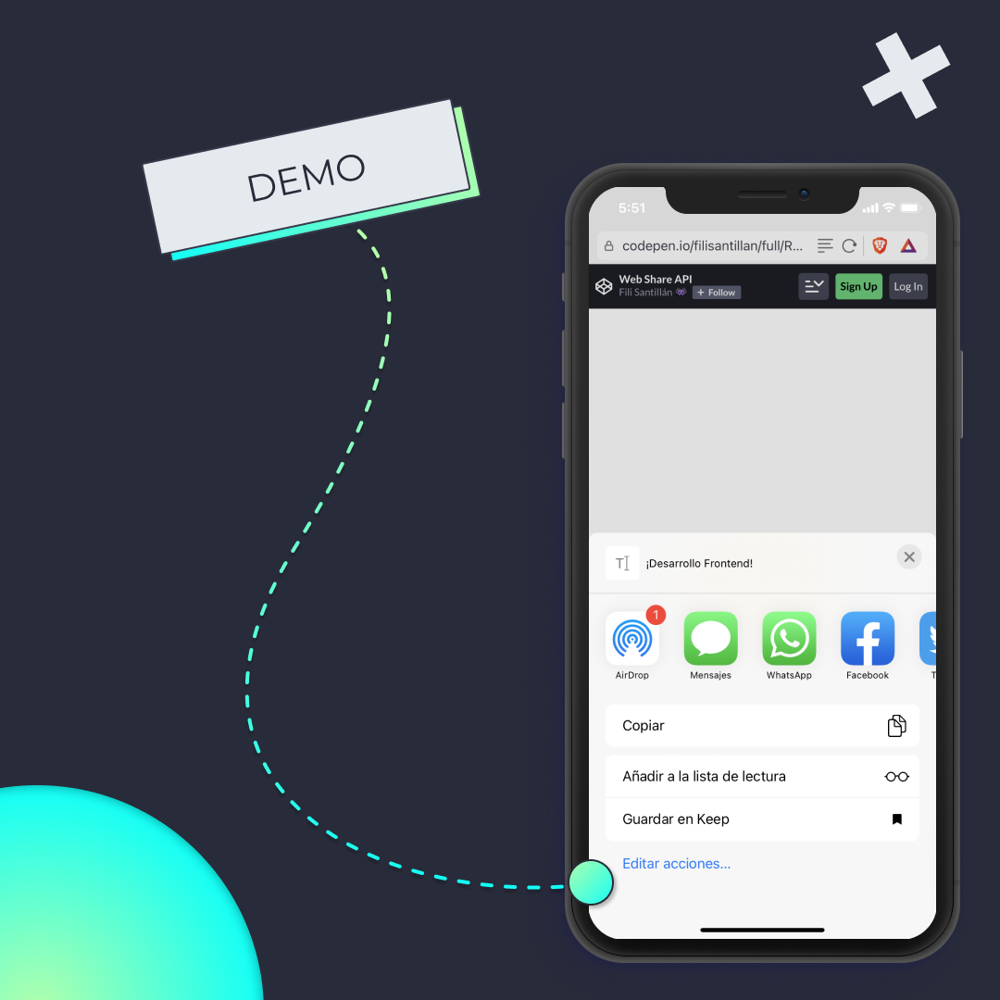
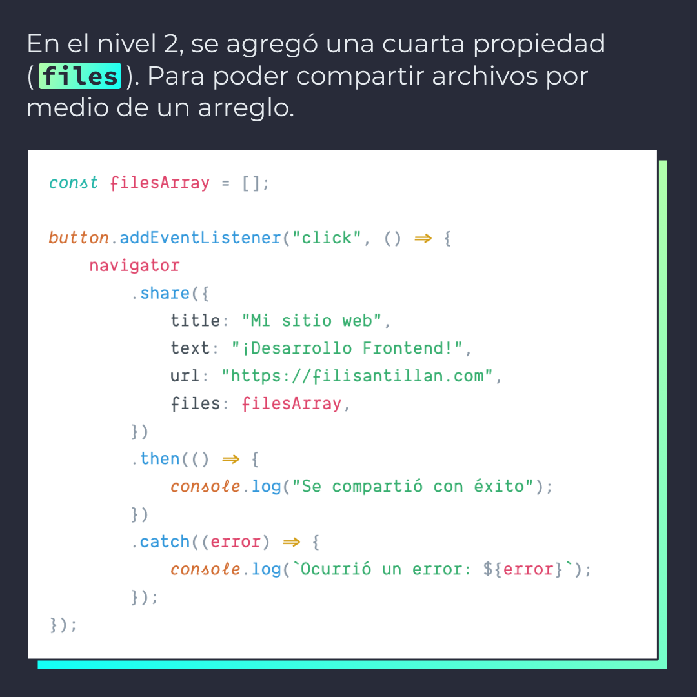
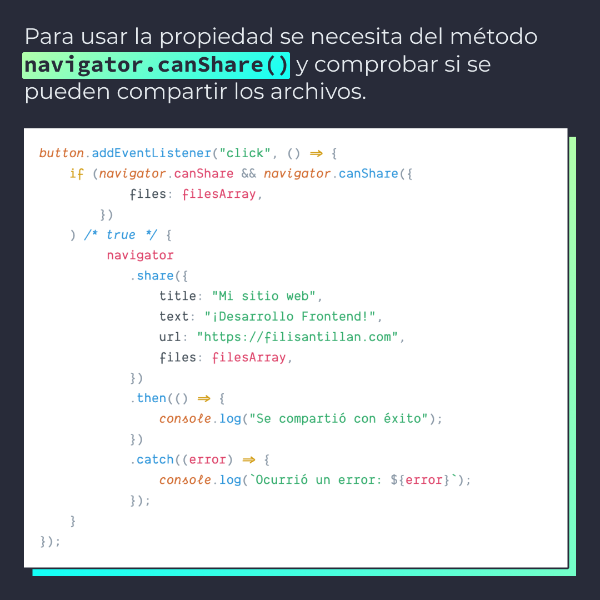
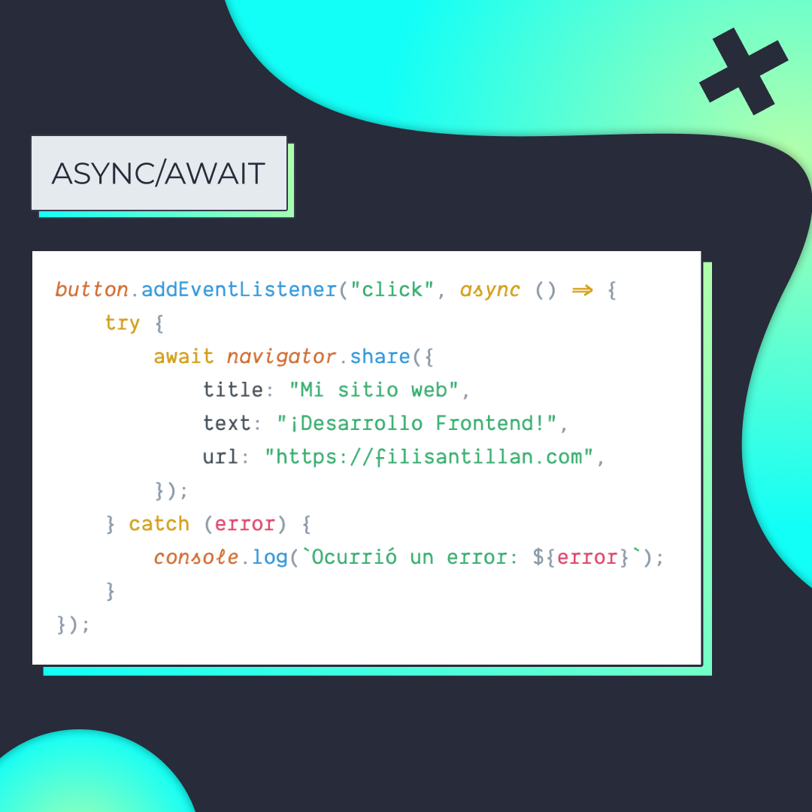

# Web Share

Web Share te permite activar el mecanismo nativo de un dispositivo para compartir contenido desde un sitio web, idéntico a una aplicación.

> Código utilizado en los ejemplos: [web-share.js](./web-share.js)

## 🤓 Aprende algo nuevo hoy

> Comparto los **bits** al menos una vez por semana.

Instagram: [@fili.santillan](https://www.instagram.com/fili.santillan/)  
Twitter: [@FiliSantillan](https://twitter.com/FiliSantillan)  
Facebook: [Fili Santillán](https://www.facebook.com/FiliSantillan96/)  
Sitio web: http://filisantillan.com

## Recursos

- [Web Share - Comparte un sitio web, como si fuera una app nativa](https://filisantillan.com/blog/web-share-comparte-un-sitio-web-como-si-fuera-una-app-nativa/)
- [Navigator.share()](https://developer.mozilla.org/en-US/docs/Web/API/Navigator/share)
